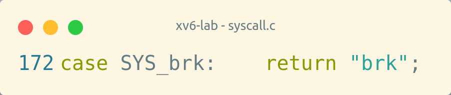
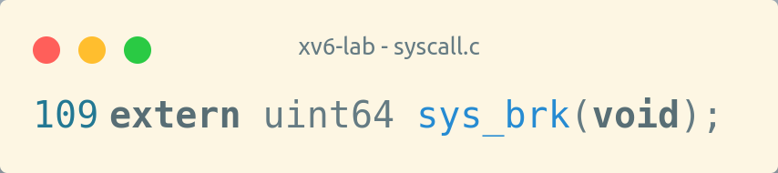
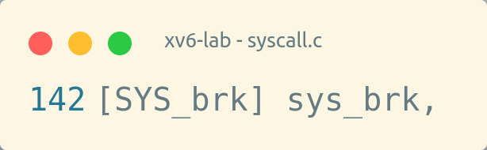
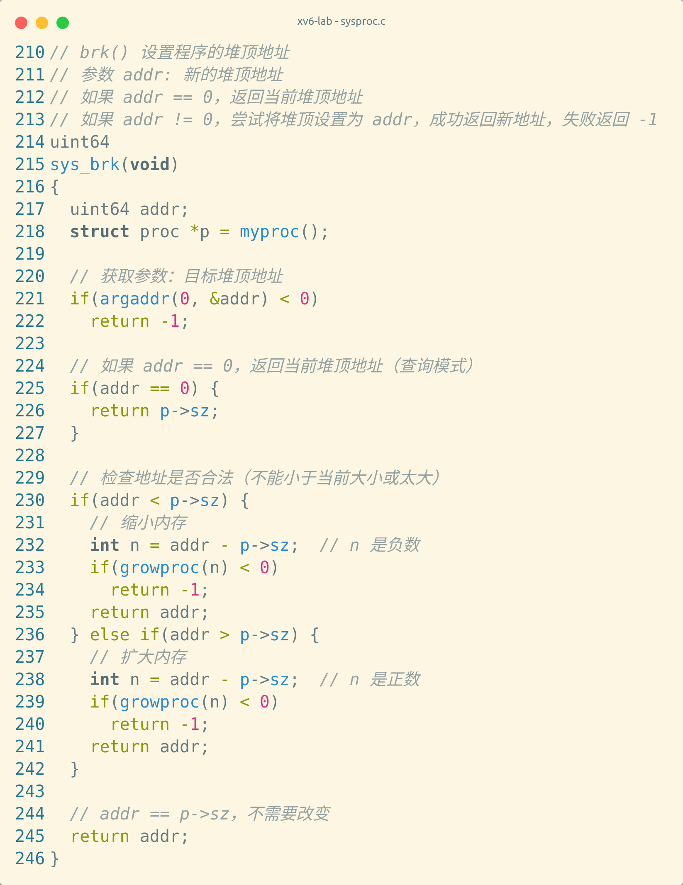
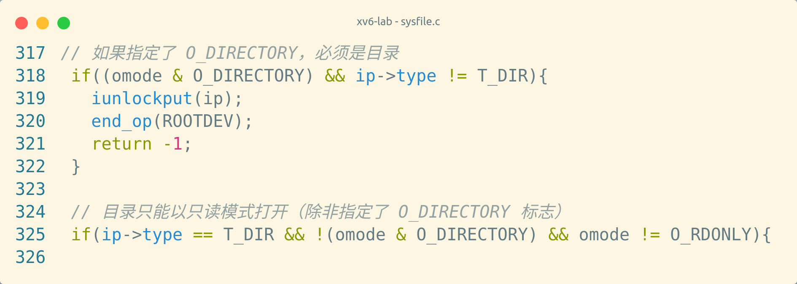
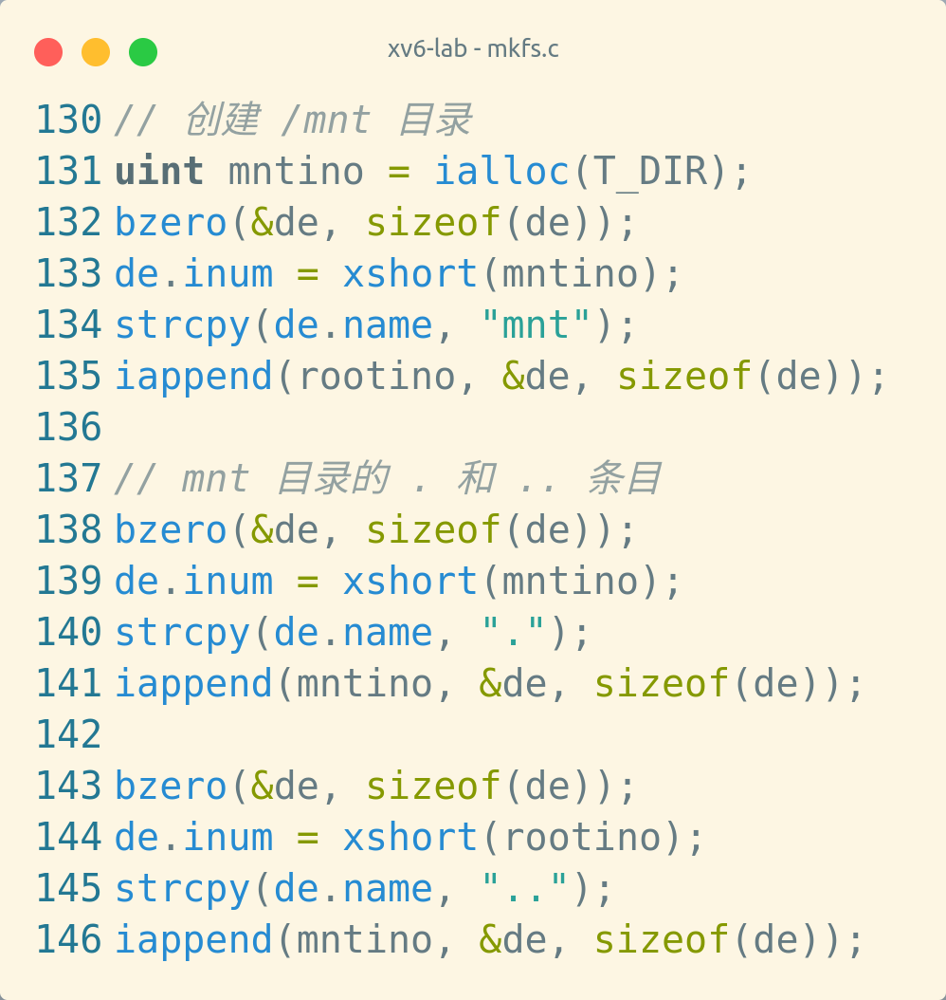
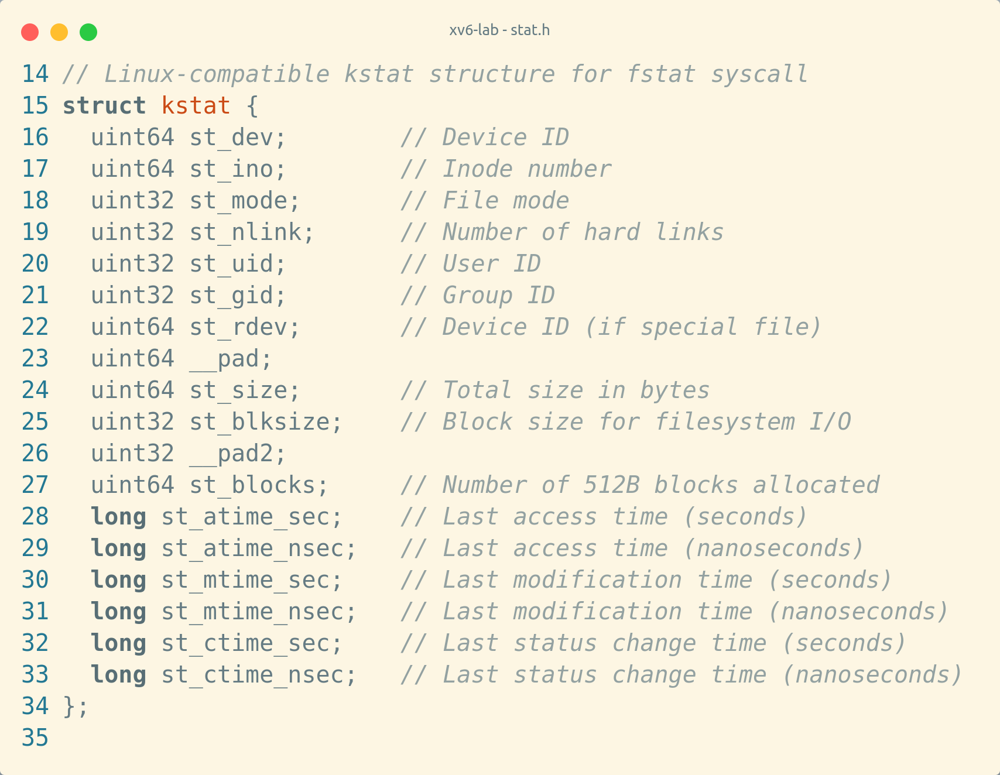
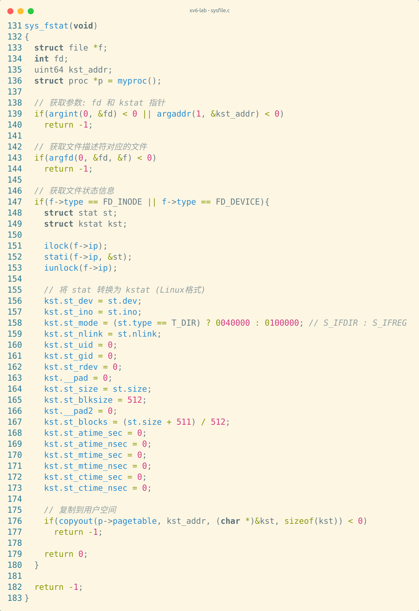

## **内存管理相关测试**

### **`brk`**

- 测试 `brk` 系统调用，用于调整进程数据段大小（堆内存分配）

#### test.py:

```python
   from test_base import TestBase
   import re


   class brk_test(TestBase):
       def __init__(self):
           super().__init__("brk", 3)

       def test(self, data):
           self.assert_ge(len(data), 3)
           p1 = "Before alloc,heap pos: (.+)"
           p2 = "After alloc,heap pos: (.+)"
           p3 = "Alloc again,heap pos: (.+)"
           line1 = re.findall(p1, data[0])
           line2 = re.findall(p2, data[1])
           line3 = re.findall(p3, data[2])
           if line1 == [] or line2 == [] or line3 == []:
               return
           a1 = int(line1[0], 10)
           a2 = int(line2[0], 10)
           a3 = int(line3[0], 10)
           self.assert_equal(a1 + 64, a2)
           self.assert_equal(a2 + 64, a3)
```

预期：

第一次调用应该返回初始堆位置（例如某个具体地址）
第二次分配64字节后，堆位置应该增加64
第三次再分配64字节后，堆位置再增加64
a1 + 64 = a2 且 a2 + 64 = a3

#### output first time:

```
   ========== START test_brk ==========
   2 brk: unknown sys call 214
   Before alloc,heap pos: -1
   2 brk: unknown sys call 214
   2 brk: unknown sys call 214
   After alloc,heap pos: -1
   2 brk: unknown sys call 214
   2 brk: unknown sys call 214
   Alloc again,heap pos: -1
   ========== END test_brk ==========
```

##### 失败原因

系统调用未注册： 虽然在 syscall.h 中定义了 SYS_brk = 214，但在 syscall.c 的 syscalls[] 数组中没有注册这个系统调用处理函数。

系统调用未实现： 没有找到 sys_brk() 函数的实现。

结果： 当测试程序调用 brk() 时：

系统调用号214被传入
syscall_handler() 在数组中找不到对应的处理函数
打印 "unknown sys call 214"
返回 -1（失败）
需要做的工作：
实现 sys_brk() 函数（可能需要参考已有的 sys_sbrk()）
在 syscall.c 中注册该系统调用：
`[SYS_brk] sys_brk,`
在 syscall.c 中添加函数声明：
`extern uint64 sys_brk(void);`

##### 修改








#### output second time

```bash
========== START test_brk ==========
Before alloc,heap pos: 16384
After alloc,heap pos: 16448
Alloc again,heap pos: 16512
========== END test_brk ==========
```

### **`mmap`**

- 测试内存映射系统调用，将文件或设备映射到内存

#### 测试逻辑和test.py

```c
#include "unistd.h"
#include "string.h"
#include "stdio.h"
#include "stdlib.h"

/*
 * 测试成功时输出：
 * "  Hello, mmap success"
 * 测试失败时输出：
 * "mmap error."
 */
static struct kstat kst;
void test_mmap(void){
    TEST_START(__func__);
    char *array;
    const char *str = "  Hello, mmap successfully!";
    int fd;

    fd = open("test_mmap.txt", O_RDWR | O_CREATE);
    write(fd, str, strlen(str));
    fstat(fd, &kst);
    printf("file len: %d\n", kst.st_size);
    array = mmap(NULL, kst.st_size, PROT_WRITE | PROT_READ, MAP_FILE | MAP_SHARED, fd, 0);
    //printf("return array: %x\n", array);

    if (array == MAP_FAILED) {
	printf("mmap error.\n");
    }else{
	printf("mmap content: %s\n", array);
	//printf("%s\n", str);

	munmap(array, kst.st_size);
    }

    close(fd);

    TEST_END(__func__);
}

int main(void){
    test_mmap();
    return 0;
}
```

```python
from test_base import TestBase
import re


class mmap_test(TestBase):
    def __init__(self):
        super().__init__("mmap", 3)

    def test(self, data):
        self.assert_ge(len(data), 2)
        r = re.findall(r"file len: (\d+)", data[0])
        if r:
            self.assert_ge(int(r[0]), 27)
        self.assert_equal("mmap content:   Hello, mmap successfully!", data[1])

```

#### 实现过程

**修改内容：**

1. **添加mmap相关常量** (`src/fcntl.h`)
   - 保护标志：PROT_NONE, PROT_READ, PROT_WRITE, PROT_EXEC
   - 映射标志：MAP_SHARED, MAP_PRIVATE, MAP_ANONYMOUS, MAP_FILE, MAP_FIXED
   - 失败返回值：MAP_FAILED

2. **实现sys_mmap** (`src/syscall/sysproc.c`)
   - 在进程地址空间末尾分配新的虚拟内存
   - 使用readi从文件读取内容到映射区域
   - 返回映射的起始地址

3. **实现sys_munmap** (`src/syscall/sysproc.c`)
   - 解除指定地址范围的内存映射
   - **关键**：如果解除的是进程末尾的映射，需要调整p->sz避免double-free

4. **注册系统调用** (`src/syscall/syscall.c`)
   - 添加sys_munmap声明和系统调用表项

5. **修复FAT32文件系统的日志系统** (`src/fs/log.c`, `src/fs/fat32.c`)
   - **问题**：log_write函数被完全注释掉，导致writei写入的数据没有被提交
   - **解决**：恢复log_write的实现，确保数据能正确写入buffer cache
   - **额外修复**：在fat32_init中初始化log系统（创建虚拟superblock），否则log.size=0导致"too big a transaction"错误

6. **实现FAT32的writei** (`src/fs/fs.c`, `src/fs/fat32.c`)
   - **根本问题**：writei没有FAT32分支，写入直接到xv6 block cache
   - **而readi有FAT32分支**，读取从FAT32簇读取
   - **结果**：写入和读取使用不同的底层存储，导致数据不一致
   - **解决**：
     - 在writei开头添加FAT32检查：`if(fat32_mode && ip && ip->major == FAT32_INODE_TAG) return fat32_writei(...);`
     - 实现fat32_writei函数，参考fat32_readi的逻辑，通过write_sector512写入FAT32簇

**问题排查过程：**

1. **初始症状**：mmap映射的内存内容为空
   - write系统调用成功，fstat显示文件大小正确（27字节）
   - 但mmap后读取内容为空字符串

2. **第一次调试**：怀疑是用户空间访问问题
   - 在内核中用kernel buffer测试readi，发现内核也读不到数据
   - 排除了用户空间权限问题

3. **第二次调试**：发现log_write被注释
   - writei调用log_write将修改标记到日志，但log_write是空函数
   - 恢复log_write后，出现"panic: too big a transaction"

4. **第三次调试**：发现log.size=0
   - FAT32模式下，fat32_init没有调用initlog初始化日志系统
   - 添加虚拟superblock初始化log，log系统开始工作

5. **最终发现**：writei/readi路径不匹配
   - 通过添加debug发现：writei写入block 536（xv6格式）
   - 但readi通过fat32_readi读取FAT32簇
   - 两者完全不同的存储位置，导致数据无法读取
   - **解决**：在writei添加FAT32分支，使其调用fat32_writei

**first time**

```python
========== START test_mmap ==========
2 mmap: unknown sys call 56
[ERROR] argfd: fd -1 invalid
[ERROR] myproc()->ofile[fd] is 0x0000000000000000
[ERROR] sys_write f is 0x0000000080226678, n is 0, p is 0x0000000080206522
2 mmap: unknown sys call 80
file len: 0
mmap content: usertrap(): unexpected scause 0x000000000000000d pid=2
            sepc=0x0000000000001968 stval=0x0000000080226678
```

即SYS_openat（56）和SYS_fstat(80)还未实现
先测openat

##### 最终输出
```bash
========== START test_mmap ==========
file len: 27
mmap content:   Hello, mmap successfully!
========== END test_mmap ==========
```
### openat

#### 测试逻辑和test.py

```c
#include "unistd.h"
#include "stdio.h"
#include "stdlib.h"

void test_openat(void) {
    TEST_START(__func__);
    //int fd_dir = open(".", O_RDONLY | O_CREATE);
    int fd_dir = open("./mnt", O_DIRECTORY);
    printf("open dir fd: %d\n", fd_dir);
    int fd = openat(fd_dir, "test_openat.txt", O_CREATE | O_RDWR);
    printf("openat fd: %d\n", fd);
    assert(fd > 0);
    printf("openat success.\n");

    /*(
    char buf[256] = "openat text file";
    write(fd, buf, strlen(buf));
    int size = read(fd, buf, 256);
    if (size > 0) printf("  openat success.\n");
    else printf("  openat error.\n");
    */
    close(fd);

    TEST_END(__func__);
}

int main(void) {
    test_openat();
    return 0;
}
```

```python
from test_base import TestBase
import re


class openat_test(TestBase):
    def __init__(self):
        super().__init__("openat", 4)

    def test(self, data):
        self.assert_ge(len(data), 3)
        r = re.findall(r"open dir fd: (\d+)", data[0])
        if r:
            self.assert_great(int(r[0]), 1)
        r1 = re.findall(r"openat fd: (\d+)", data[1])
        if r1:
            self.assert_great(int(r1[0]), int(r[0]))
        self.assert_equal(data[2], "openat success.")
```

#### first time

```bash
========== START test_openat ==========
open dir fd: -1
openat fd: -1
 --- Assert Fatal ! ---
```

修改




### fstat

#### 测试逻辑和test.py

```c
#include "unistd.h"
#include "stdio.h"
#include "stdlib.h"
#include "stddef.h"

#define AT_FDCWD (-100) //相对路径

//Stat *kst;
static struct kstat kst;
void test_fstat() {
	TEST_START(__func__);
	int fd = open("./text.txt", 0);
	int ret = fstat(fd, &kst);
	printf("fstat ret: %d\n", ret);
	assert(ret >= 0);

	printf("fstat: dev: %d, inode: %d, mode: %d, nlink: %d, size: %d, atime: %d, mtime: %d, ctime: %d\n",
	      kst.st_dev, kst.st_ino, kst.st_mode, kst.st_nlink, kst.st_size, kst.st_atime_sec, kst.st_mtime_sec, kst.st_ctime_sec);

	TEST_END(__func__);
}

int main(void) {
	test_fstat();
	return 0;
}
```

```python
from test_base import TestBase
import re


class fstat_test(TestBase):
    def __init__(self):
        super().__init__("fstat", 3)

    def test(self, data):
        self.assert_ge(len(data), 2)
        res = re.findall("fstat ret: (\d+)", data[0])
        if res:
            self.assert_equal(res[0], "0")
        res = re.findall(r"fstat: dev: \d+, inode: \d+, mode: (\d+), nlink: (\d+), size: \d+, atime: \d+, mtime: \d+, ctime: \d+", data[1])
        if res:
            self.assert_equal(res[0][1], "1")
```


### **`munmap`**

- 测试解除内存映射
