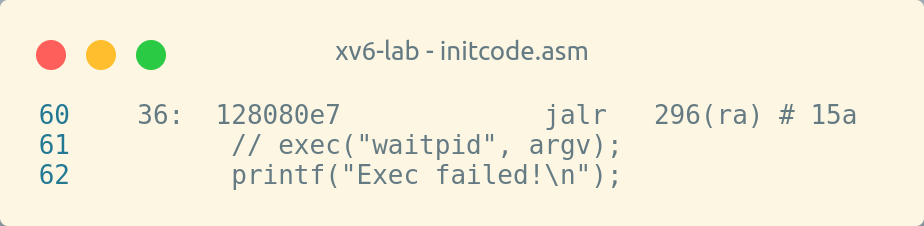
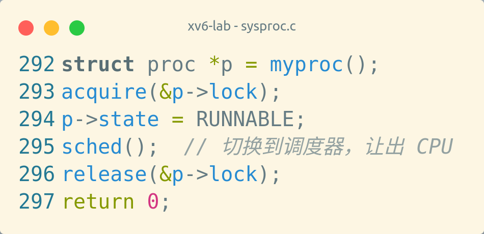
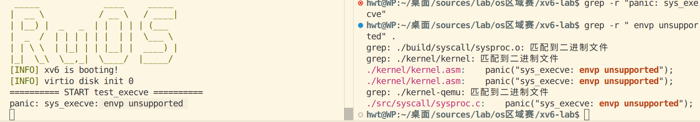
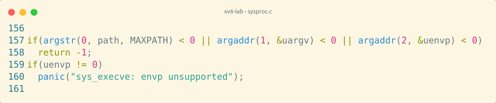
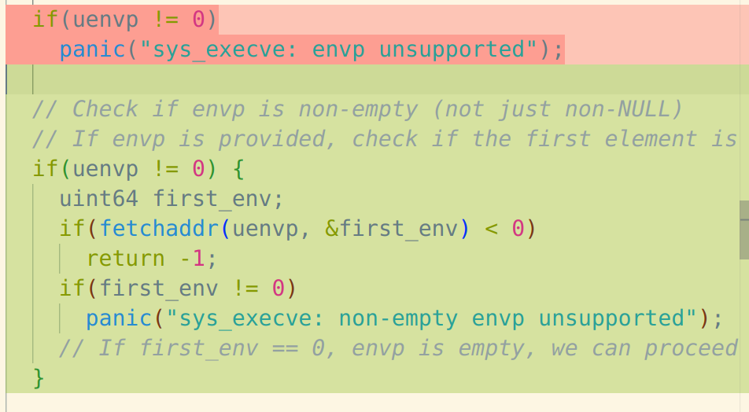
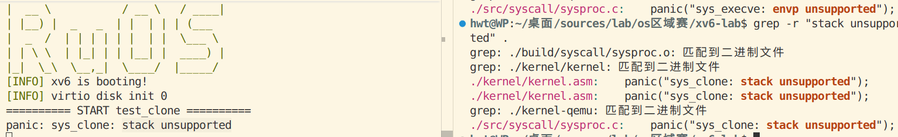
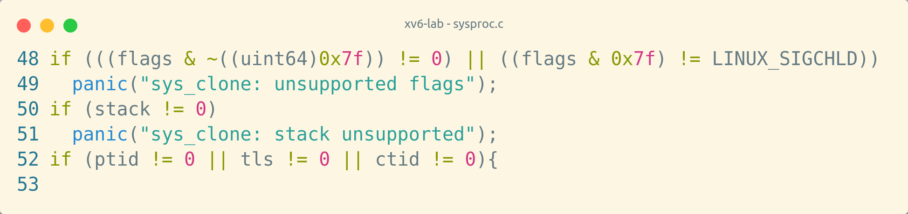
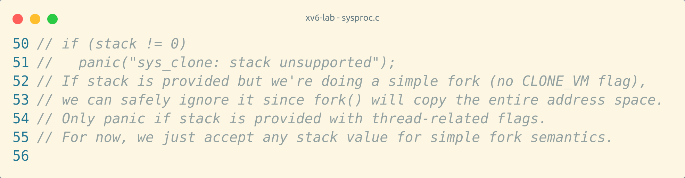
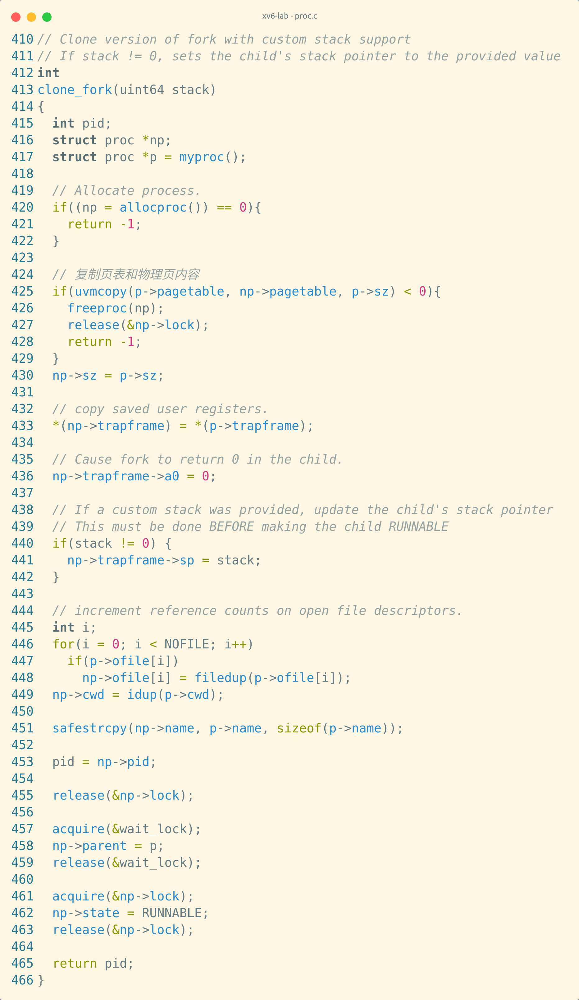
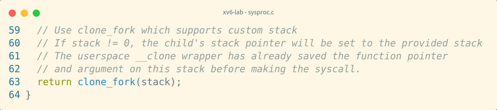

## **进程管理相关系统调用测试**

## **推荐实现顺序说明：**

ai演人，fork才是第一个

1. **getpid / getppid** - 最简单，只需返回进程信息
2. **exit** - 基础系统调用，进程退出机制
3. **wait** - 父进程等待子进程，与exit配合
4. **fork** - 核心进程创建，依赖前面的系统调用测试
5. **yield** - 进程调度相关，相对独立
6. **waitpid** - wait的增强版本
7. **execve** - 加载执行新程序，较复杂
8. **clone** - 最复杂，支持线程/轻量级进程

---

### **1. `getpid`**

- 测试获取进程ID

#### 测试逻辑

```c
#include <stdio.h>
#include <unistd.h>
#include <stdlib.h>

/*
理想结果：得到进程 pid，注意要关注 pid 是否符合内核逻辑，不要单纯以 Test OK! 作为判断。
*/

int test_getpid()
{
    TEST_START(__func__);
    int pid = getpid();
    assert(pid >= 0);
    printf("getpid success.\npid = %d\n", pid);
    TEST_END(__func__);
}

int main(void) {
	test_getpid();
	return 0;
}
```

```python
from test_base import TestBase
import re


class getpid_test(TestBase):
    def __init__(self):
        super().__init__("getpid", 3)

    def test(self, data):
        self.assert_ge(len(data), 2)
        self.assert_equal(data[0], "getpid success.")
        r = re.findall(r"pid = (\d+)", data[1])
        if r:
            self.assert_great(int(r[0]), 0)
```

要是Makefile里没加这句

就会输出


最终结果

```bash
 _____             ____     _____ 
|  __ \           / __ \   / ____|
| |__) |  _   _  | |  | | | (___  
|  _  /  | | | | | |  | |  \___ \ 
| | \ \  | |_| | | |__| |  ____) |
|_|  \_\  \__,_|  \____/  |_____/ 
[INFO] xv6 is booting!
[INFO] virtio disk init 0
========== START test_getpid ==========
getpid success.
pid = 2
========== END test_getpid ==========
```

### **2. `getppid`**

- 测试获取父进程ID

#### 测试逻辑

```c
#include "stdio.h"
#include "unistd.h"
#include "stdlib.h"

/*
 * 能通过测试则输出：
 * "  getppid success. ppid : [num]"
 * 不能通过测试则输出：
 * "  getppid error."
 */

int test_getppid()
{
    TEST_START(__func__);
    pid_t ppid = getppid();
    if(ppid > 0) printf("  getppid success. ppid : %d\n", ppid);
    else printf("  getppid error.\n");
    TEST_END(__func__);
}

int main(void) {
	test_getppid();
	return 0;
}
```

```python
from test_base import TestBase
import re


class getppid_test(TestBase):
    def __init__(self):
        super().__init__("getppid", 2)

    def test(self, data):
        self.assert_ge(len(data), 1)
        self.assert_in("  getppid success. ppid : ", data[0])
```

```bash
_____             ____     _____ 
|  __ \           / __ \   / ____|
| |__) |  _   _  | |  | | | (___  
|  _  /  | | | | | |  | |  \___ \ 
| | \ \  | |_| | | |__| |  ____) |
|_|  \_\  \__,_|  \____/  |_____/ 
[INFO] xv6 is booting!
[INFO] virtio disk init 0
========== START test_getppid ==========
  getppid success. ppid : 1
========== END test_getppid ==========
```

### **3. `exit`**

- 测试进程退出

#### 测试逻辑

```c
#include "stdio.h"
#include "stdlib.h"
#include "unistd.h"

/*
 * 测试成功则输出：
 * "exit OK."
 * 测试失败则输出：
 * "exit ERR."
 */
void test_exit(void){
    TEST_START(__func__);
    int cpid, waitret, wstatus;
    cpid = fork();
    assert(cpid != -1);
    if(cpid == 0){
        exit(0);
    }else{
        waitret = wait(&wstatus);
        if(waitret == cpid) printf("exit OK.\n");
        else printf("exit ERR.\n");
    }
    TEST_END(__func__);
}

int main(void){
    test_exit();
    return 0;
}
```

```python
from test_base import TestBase
import re


class exit_test(TestBase):
    def __init__(self):
        super().__init__("exit", 3)

    def test(self, data):
        self.assert_ge(len(data), 1)
        self.assert_equal("exit OK.", data[0])
```

```bash
 _____             ____     _____ 
|  __ \           / __ \   / ____|
| |__) |  _   _  | |  | | | (___  
|  _  /  | | | | | |  | |  \___ \ 
| | \ \  | |_| | | |__| |  ____) |
|_|  \_\  \__,_|  \____/  |_____/ 
[INFO] xv6 is booting!
[INFO] virtio disk init 0
========== START test_exit ==========
exit OK.
========== END test_exit ==========
```

**但并非每次都有输出？**

### **4. `wait`**

- 测试父进程等待子进程结束

#### 测试逻辑

```c
#include "stdio.h"
#include "stdlib.h"
#include "unistd.h"

void test_wait(void){
    TEST_START(__func__);
    int cpid, wstatus;
    cpid = fork();
    if(cpid == 0){
	printf("This is child process\n");
        exit(0);
    }else{
	pid_t ret = wait(&wstatus);
	assert(ret != -1);
	if(ret == cpid)
	    printf("wait child success.\nwstatus: %d\n", wstatus);
	else
	    printf("wait child error.\n");
    }
    TEST_END(__func__);
}

int main(void){
    test_wait();
    return 0;
}
```

```python
from test_base import TestBase
import re


class wait_test(TestBase):
    def __init__(self):
        super().__init__("wait", 4)

    def test(self, data):
        self.assert_ge(len(data), 3)
        self.assert_equal(data[0], "This is child process")
        self.assert_equal(data[1], "wait child success.")
        self.assert_equal(data[2], "wstatus: 0")
```

```bash
========== START test_wait ==========
This is child process
wait child success.
wstatus: 0
========== END test_wait ==========
```

### **5. `fork`**

- 测试创建子进程

#### 测试逻辑

```c
#include "stdio.h"
#include "stdlib.h"
#include "unistd.h"
#include "string.h"
/*
 * 成功测试时父进程的输出：
 * "  parent process."
 * 成功测试时子进程的输出：
 * "  child process."
 */
static int fd[2];

void test_fork(void){
    TEST_START(__func__);
    int cpid, wstatus;
    cpid = fork();
    assert(cpid != -1);

    if(cpid > 0){
	wait(&wstatus);
	printf("  parent process. wstatus:%d\n", wstatus);
    }else{
	printf("  child process.\n");
	exit(0);
    }
    TEST_END(__func__);
}

int main(void){
    test_fork();
    return 0;
}
```

```python
from test_base import TestBase
import re


class fork_test(TestBase):
    def __init__(self):
        super().__init__("fork", 3)

    def test(self, data):
        self.assert_ge(len(data), 2)
        self.assert_in_str("  parent process\. wstatus:\d+", data)
        self.assert_in_str("  child process", data)
```

```bash
========== START test_fork ==========
  child process.
  parent process. wstatus:0
========== END test_fork ==========
```

### **6. `yield`**

- 测试进程主动让出CPU

#### 测试逻辑

```c
#include <unistd.h>
#include <stdio.h>

/*
理想结果：三个子进程交替输出
*/

int test_yield(){
    TEST_START(__func__);

    for (int i = 0; i < 3; ++i){
        if(fork() == 0){
	    for (int j = 0; j< 5; ++j){
                sched_yield();
                printf("  I am child process: %d. iteration %d.\n", getpid(), i);
	    }
	    exit(0);
        }
    }
    wait(NULL);
    wait(NULL);
    wait(NULL);
    TEST_END(__func__);
}

int main(void) {
    test_yield();
    return 0;
}
```

```python
from test_base import TestBase
import re

class yield_test(TestBase):
    def __init__(self):
        super().__init__("yield", 4)

    def test(self, data):
        self.assert_equal(len(data), 15)
        lst = ''.join(data)
        cnt = {'0': 0, '1': 0, '2': 0, '3': 0, '4': 0}
        for c in lst:
            if c not in ('0', '1', '2', '3', '4'):
                continue
            cnt[c] += 1
        self.assert_ge(cnt['0'], 3)
        self.assert_ge(cnt['1'], 3)
        self.assert_ge(cnt['2'], 3)
  


# BBBBBBBBBB [1/5]
# CCCCCCCCCC [1/5]
# BBBBBBBBBB [2/5]
# CCCCCCCCCC [2/5]
# AAAAAAAAAA [1/5]
# CCCCCCCCCC [3/5]
# BBBBBBBBBB [3/5]
# AAAAAAAAAA [2/5]
# BBBBBBBBBB [4/5]
# CCCCCCCCCC [4/5]
# AAAAAAAAAA [3/5]
# BBBBBBBBBB [5/5]
# CCCCCCCCCC [5/5]
# AAAAAAAAAA [4/5]
# AAAAAAAAAA [5/5]
```

问题：

```bash
make: *** 没有规则可制作目标“user/sched_yield”，由“fs.img” 需求。 停止。
make: *** 正在等待未完成的任务....
rm user/cat.o user/sh.o user/ls.o user/echo.o user/ulib.o user/mkdir.o user/umalloc.o
```

这是因为app目录下只出现了yield但在makefile里加的是sched_yield。已经改过来了。

神奇，sys_sched_yield函数里屁都没写居然没报错，输出这个：

```bash
========== START test_yield ==========
  I am child process: 3. iteration 0.
  I am child process: 3. iteration 0.
  I am child process: 3. iteration 0.
  I am child process: 3. iteration 0.
  I am child process: 3. iteration 0.
  I am child process: 4. iteration 1.
  I am child process: 4. iteration 1.
  I am child process: 4. iteration 1.
  I am child process: 4. iteration 1.
  I am child process: 4. iteration 1.
  I am child process: 5. iteration 2.
  I am child process: 5. iteration 2.
  I am child process: 5. iteration 2.
  I am child process: 5. iteration 2.
  I am child process: 5. iteration 2.
========== END test_yield ==========
```

函数这样实现输出如下：



```bash
========== START test_yield ==========
  I am child process: 3. iteration 0.
  I am child process: 4. iteration 1.
  I am child process: 5. iteration 2.
  I am child process: 3. iteration 0.
  I am child process: 4. iteration 1.
  I am child process: 5. iteration 2.
  I am child process: 3. iteration 0.
  I am child process: 4. iteration 1.
  I am child process: 5. iteration 2.
  I am child process: 3. iteration 0.
  I am child process: 4. iteration 1.
  I am child process: 5. iteration 2.
  I am child process: 3. iteration 0.
  I am child process: 4. iteration 1.
  I am child process: 5. iteration 2.
========== END test_yield ==========
```

### **7. `waitpid`**

- 测试等待指定子进程

#### 测试逻辑

```c
#include "stdio.h"
#include "stdlib.h"
#include "unistd.h"

int i = 1000;
void test_waitpid(void){
    TEST_START(__func__);
    int cpid, wstatus;
    cpid = fork();
    assert(cpid != -1);
    if(cpid == 0){
	while(i--);
	sched_yield();
	printf("This is child process\n");
        exit(3);
    }else{
	pid_t ret = waitpid(cpid, &wstatus, 0);
	assert(ret != -1);
	if(ret == cpid && WEXITSTATUS(wstatus) == 3)
	    printf("waitpid successfully.\nwstatus: %x\n", WEXITSTATUS(wstatus));
	else
	    printf("waitpid error.\n");

    }
    TEST_END(__func__);
}

int main(void){
    test_waitpid();
    return 0;
}
```

```python
from test_base import TestBase
import re


class waitpid_test(TestBase):
    def __init__(self):
        super().__init__("waitpid", 4)

    def test(self, data):
        self.assert_ge(len(data), 3)
        self.assert_equal(data[0], "This is child process")
        self.assert_equal(data[1], "waitpid successfully.")
        self.assert_equal(data[2], "wstatus: 3")
```

#### 初版修改

1. sysproc.c - sys_wait4：
移除了 if (pid != -1) panic(...) 检查
添加了支持等待特定 PID 子进程的逻辑
保留了原始的 pid == -1 行为（等待任意子进程）


2. defs.h：
添加了 extern struct proc proc[]; 声明（进程表）
添加了 extern struct spinlock wait_lock; 声明
添加了 void freeproc(struct proc *); 声明


3. proc.c：
将 freeproc 从 static 改为非静态，使其可以在 sysproc.c 中调用
实现逻辑：

```c
// 如果 pid == -1，等待任意子进程（原有行为）
if (pid == -1) {
    return wait(status);
}

// 如果 pid > 0，等待特定的子进程
// 遍历进程表，找到匹配的子进程
for(pp = proc; pp < &proc[NPROC]; pp++){
    if(pp->parent == p && pp->pid == pid){
        // 找到匹配的子进程且已经是 ZOMBIE 状态
        if(pp->state == ZOMBIE){
            // 回收资源并返回
        }
    }
}
```
```bash
========== START test_waitpid ==========
This is child process
waitpid error.
========== END test_waitpid ==========
```
#### 第二版修改
修改内容：

1. proc.c - exit() 函数：
```c
// 修改前：
p->xstate = status;

// 修改后：
p->xstate = (status & 0xff) << 8;  // 将退出状态编码到正确的位置
```

2. sysproc.c - sys_wait4() 函数：
添加了调试输出，显示找到的僵尸进程和其退出状态(提交前已注释)
修正了逻辑，只检查匹配指定 PID 的子进程

========== START test_waitpid ==========
This is child process
sys_wait4: found zombie child pid=3, xstate=768
waitpid successfully.
wstatus: 3
========== END test_waitpid ==========
### **8. `execve`**

- 测试执行新程序

#### 测试逻辑

```c
#include "stdio.h"
#include "stdlib.h"
#include "unistd.h"

/*
 * 测试成功则输出：
 * "  I am test_echo."
 * 测试失败则输出：
 * "  execve error."
 */
void test_execve(void){
    TEST_START(__func__);
    char *newargv[] = {"test_echo", NULL};
    char *newenviron[] = {NULL};
    execve("test_echo", newargv, newenviron);
    printf("  execve error.\n");
    //TEST_END(__func__);
}

int main(void){
    test_execve();
    return 0;
}
```

```python
from test_base import TestBase
import re


class execve_test(TestBase):
    def __init__(self):
        super().__init__("execve", 3)

    def test(self, data):
        self.assert_ge(len(data), 2)
        self.assert_equal("  I am test_echo.", data[0])
        self.assert_equal("execve success.", data[1])
```




修改 `sys_execve` 的实现，让它能够正确处理空的环境变量数组（即只包含 NULL 的数组）：



```bash
========== START test_execve ==========
  I am test_echo.
execve success.
========== END main ==========
```

### **9. `clone`**

- 测试创建轻量级进程/线程

#### 测试逻辑

```c
#include "stdio.h"
#include "stdlib.h"
#include "unistd.h"

size_t stack[1024] = {0};
static int child_pid;

static int child_func(void){
    printf("  Child says successfully!\n");
    return 0;
}

void test_clone(void){
    TEST_START(__func__);
    int wstatus;
    child_pid = clone(child_func, NULL, stack, 1024, SIGCHLD);
    assert(child_pid != -1);
    if (child_pid == 0){
	exit(0);
    }else{
	if(wait(&wstatus) == child_pid)
	    printf("clone process successfully.\npid:%d\n", child_pid);
	else
	    printf("clone process error.\n");
    }

    TEST_END(__func__);
}

int main(void){
    test_clone();
    return 0;
}
```

```python
from test_base import TestBase
import re


class clone_test(TestBase):
    def __init__(self):
        super().__init__("clone", 4)

    def test(self, data):
        self.assert_ge(len(data), 3)
        self.assert_in_str("  Child says successfully!", data)
        self.assert_in_str("pid:\d+", data)
        self.assert_in_str("clone process successfully.", data)
```



注释掉了50、51行


```bash
========== START test_clone ==========
usertrap(): unexpected scause 0x0000000000000002 pid=3
            sepc=0x0000000000000000 stval=0x0000000000000000
clone process successfully.
pid:3
========== END test_clone ==========
```

有点傻逼了，没看到unexpected scause，看到了个successfully以为测完了

在proc.c里加了个clone_fork函数并将改了下clone返回




在子进程变为 RUNNABLE **之前**修改其栈指针，不会出现子进程在栈指针更新前就被调度执行的情况，

```c
// 在 clone_fork 中：
np->trapframe->a0 = 0;  // 子进程返回 0

// 关键：在子进程变为 RUNNABLE 之前设置栈指针
if(stack != 0) {
    np->trapframe->sp = stack;  // 使用提供的栈
}

// 然后才设置为 RUNNABLE
np->state = RUNNABLE;
```

这样当子进程被调度执行时，它会：

1. 从系统调用返回，`a0 = 0`（子进程标识）
2. `sp` 指向用户提供的栈（其中已保存了函数指针和参数）
3. 在 `__clone` 的 1f1a 处，从栈上加载函数指针并执行

最终输出

```bash
========== START test_clone ==========
  Child says successfully!
clone process successfully.
pid:3
========== END test_clone ==========
```
