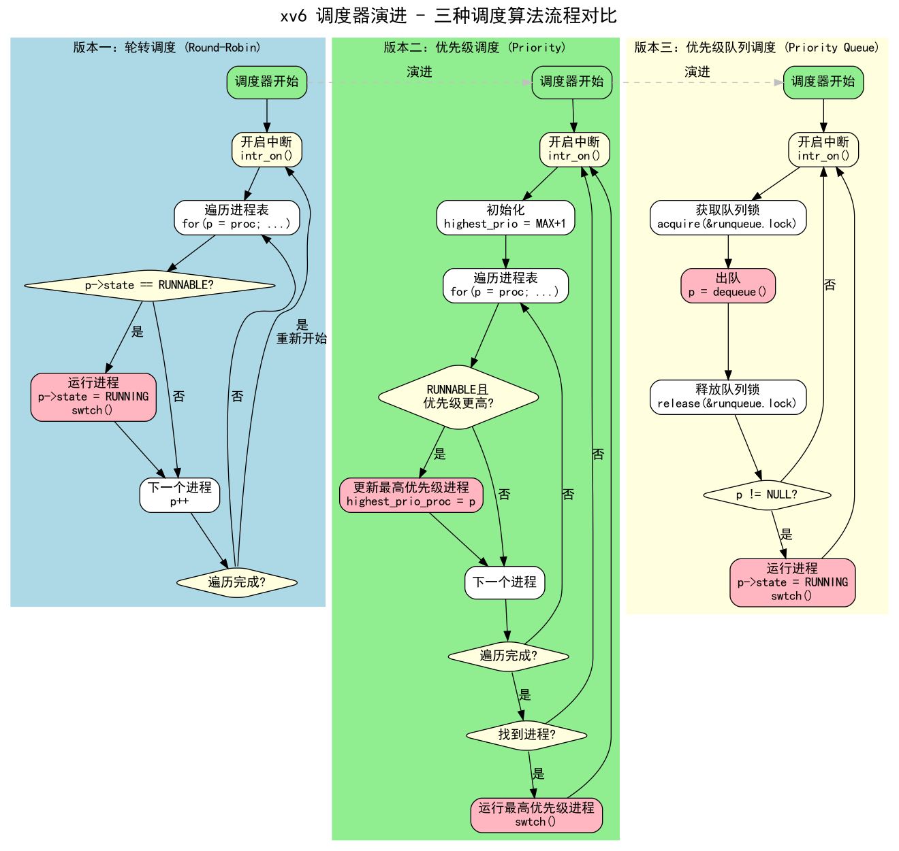
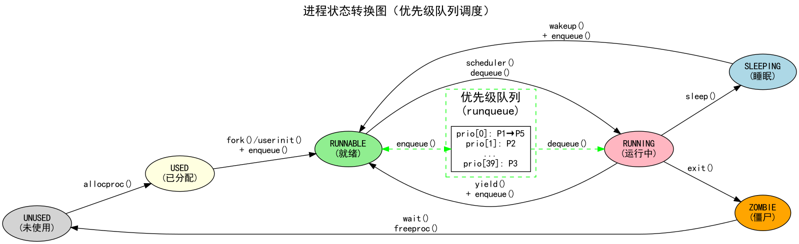
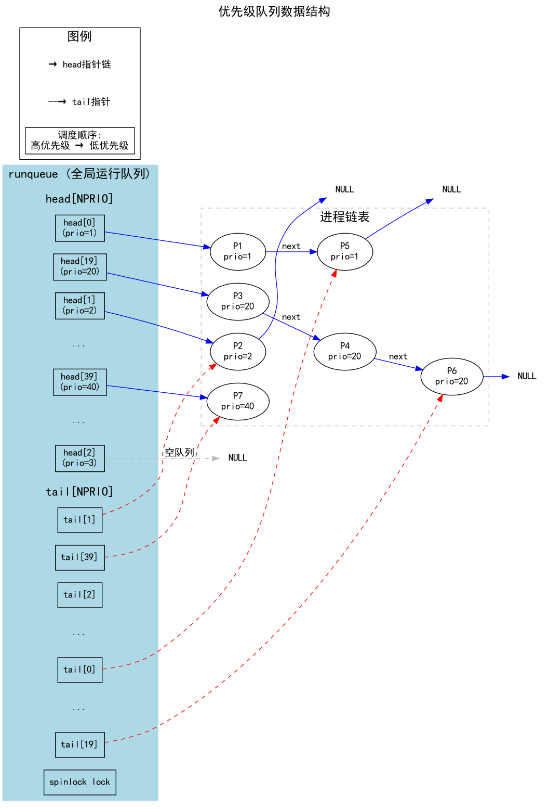
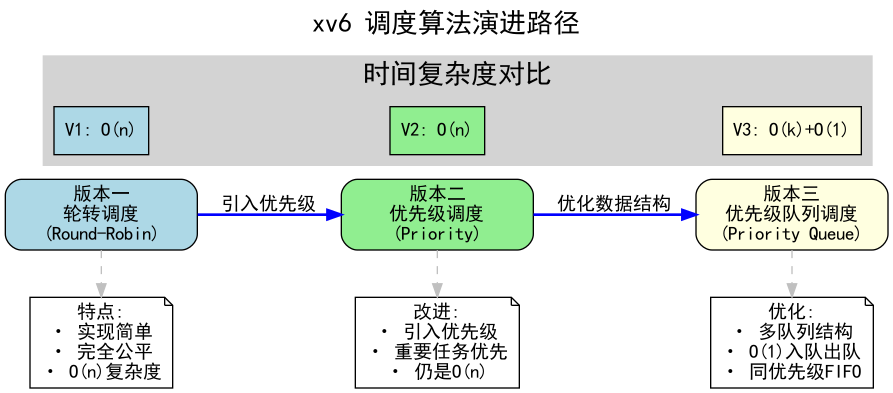

# xv6 调度机制演进

本文档记录了 xv6-lab 项目中调度机制的三次演进：**轮转调度 → 优先级调度 → 优先级队列调度**。

---

## 目录

1. [调度机制概述](#调度机制概述)
2. [版本一：轮转调度 (Round-Robin)](#版本一轮转调度-round-robin)
3. [版本二：优先级调度 (Priority Scheduling)](#版本二优先级调度-priority-scheduling)
4. [版本三：优先级队列调度 (Priority Queue Scheduling)](#版本三优先级队列调度-priority-queue-scheduling)
5. [三种调度算法对比](#三种调度算法对比)
6. [流程图](#流程图)

---

## 调度机制概述

调度器是操作系统的核心组件，负责决定哪个进程获得 CPU 时间。一个好的调度算法需要平衡以下目标：

| 目标 | 描述 |
|------|------|
| **公平性** | 每个进程都应获得合理的 CPU 时间 |
| **响应性** | 交互式进程应快速响应 |
| **吞吐量** | 单位时间内完成尽可能多的任务 |
| **优先级** | 重要任务应优先执行 |

---

## 版本一：轮转调度 (Round-Robin)

### 原理

轮转调度是最简单的调度算法，按照进程在进程表中的顺序依次执行，每个进程获得相同的时间片。

```
进程表: [P1] [P2] [P3] [P4] [P5] ...
         ↓    ↓    ↓    ↓    ↓
执行顺序: P1 → P2 → P3 → P4 → P5 → P1 → P2 → ...
```

### 核心代码

```c
// 轮转调度器
void scheduler(void)
{
  struct proc *p;
  struct cpu *c = mycpu();
  
  c->proc = 0;
  for(;;){
    intr_on();

    // 按顺序遍历进程表
    for(p = proc; p < &proc[NPROC]; p++) {
      acquire(&p->lock);
      if(p->state == RUNNABLE) {
        p->state = RUNNING;
        c->proc = p;
        swtch(&c->context, &p->context);
        c->proc = 0;
      }
      release(&p->lock);
    }
  }
}
```

### 特点

| 优点 | 缺点 |
|------|------|
| ✅ 实现简单 | ❌ 无法区分任务优先级 |
| ✅ 公平性好 | ❌ 重要任务可能等待很久 |
| ✅ 无饥饿问题 | ❌ 不适合实时系统 |

### 时间复杂度

- 选择下一个进程: **O(n)**（最坏情况需要遍历整个进程表）

---

## 版本二：优先级调度 (Priority Scheduling)

### 原理

为每个进程分配一个优先级值，调度器每次选择优先级最高的 RUNNABLE 进程执行。

```
优先级（数值越小优先级越高）:
  P1(prio=5)  P2(prio=20) P3(prio=10) P4(prio=1)  P5(prio=15)
       ↓           ↓           ↓          ↓           ↓
  执行顺序: P4(1) → P1(5) → P3(10) → P5(15) → P2(20)
```

### 数据结构变更

```c
// proc.h 中新增
#define PRIO_MIN      1     // 最高优先级
#define PRIO_MAX      40    // 最低优先级
#define PRIO_DEFAULT  20    // 默认优先级

struct proc {
  ...
  int priority;  // 进程优先级（1-40，数值越小优先级越高）
  ...
};
```

### 核心代码

```c
// 优先级调度器
void scheduler(void)
{
  struct proc *p;
  struct proc *highest_prio_proc;
  struct cpu *c = mycpu();
  
  c->proc = 0;
  for(;;){
    intr_on();

    // 找到优先级最高的 RUNNABLE 进程
    highest_prio_proc = 0;
    int highest_prio = PRIO_MAX + 1;

    for(p = proc; p < &proc[NPROC]; p++) {
      acquire(&p->lock);
      if(p->state == RUNNABLE) {
        if(p->priority < highest_prio) {
          if(highest_prio_proc != 0) {
            release(&highest_prio_proc->lock);
          }
          highest_prio = p->priority;
          highest_prio_proc = p;
        } else {
          release(&p->lock);
        }
      } else {
        release(&p->lock);
      }
    }

    // 运行选中的进程
    if(highest_prio_proc != 0) {
      p = highest_prio_proc;
      p->state = RUNNING;
      c->proc = p;
      swtch(&c->context, &p->context);
      c->proc = 0;
      release(&p->lock);
    }
  }
}
```

### 特点

| 优点 | 缺点 |
|------|------|
| ✅ 重要任务优先执行 | ❌ 可能产生饥饿（低优先级永远无法运行） |
| ✅ 适合区分任务重要性 | ❌ 每次调度都要遍历进程表 O(n) |
| ✅ 可以实现抢占 | ❌ 同优先级进程调度顺序不公平 |

### 时间复杂度

- 选择下一个进程: **O(n)**（需要遍历所有进程找最高优先级）

---

## 版本三：优先级队列调度 (Priority Queue Scheduling)

### 原理

使用多个队列，每个优先级对应一个 FIFO 队列。调度时从最高优先级队列开始查找，取出队首进程执行。

```
优先级队列结构：

  prio=1 队列: [P4] → [P9]              ← 最先调度
  prio=2 队列: [P1] → [P7]
  prio=3 队列: (空)
  ...
  prio=10队列: [P3] → [P6] → [P8]
  ...
  prio=20队列: [P2] → [P5]
  ...
  prio=40队列: [P10]                    ← 最后调度
```

### 数据结构变更

```c
// proc.h 中新增
#define NPRIO  40  // 优先级队列数量

struct proc {
  ...
  int priority;       // 进程优先级
  struct proc *next;  // 优先级队列中的下一个进程
  ...
};

// proc.c 中新增
struct {
  struct spinlock lock;      // 保护队列的锁
  struct proc *head[NPRIO];  // 每个优先级队列的头指针
  struct proc *tail[NPRIO];  // 每个优先级队列的尾指针
} runqueue;
```

### 核心操作函数

```c
// 将进程加入对应优先级队列尾部
static void enqueue(struct proc *p)
{
  int prio = p->priority - 1;  // 优先级1对应索引0
  if(prio < 0) prio = 0;
  if(prio >= NPRIO) prio = NPRIO - 1;
  
  p->next = 0;
  if(runqueue.tail[prio] != 0) {
    runqueue.tail[prio]->next = p;
  } else {
    runqueue.head[prio] = p;
  }
  runqueue.tail[prio] = p;
}

// 从最高优先级队列中取出进程
static struct proc* dequeue(void)
{
  struct proc *p;
  
  // 从最高优先级开始查找（优先级1 = 索引0）
  for(int prio = 0; prio < NPRIO; prio++) {
    if(runqueue.head[prio] != 0) {
      p = runqueue.head[prio];
      runqueue.head[prio] = p->next;
      if(runqueue.head[prio] == 0) {
        runqueue.tail[prio] = 0;
      }
      p->next = 0;
      return p;
    }
  }
  return 0;
}
```

### 调度器代码

```c
// 优先级队列调度器
void scheduler(void)
{
  struct proc *p;
  struct cpu *c = mycpu();
  
  c->proc = 0;
  for(;;){
    intr_on();

    // 从优先级队列中取出最高优先级的进程
    acquire(&runqueue.lock);
    p = dequeue();
    release(&runqueue.lock);
    
    if(p != 0) {
      acquire(&p->lock);
      if(p->state == RUNNABLE) {
        p->state = RUNNING;
        c->proc = p;
        swtch(&c->context, &p->context);
        c->proc = 0;
      }
      release(&p->lock);
    }
  }
}
```

### 进程状态转换时的队列操作

| 场景 | 操作 | 位置 |
|------|------|------|
| 创建进程 | `enqueue(np)` | `fork()`, `clone_fork()` |
| 初始化第一个进程 | `enqueue(p)` | `userinit()` |
| 主动让出 CPU | `enqueue(p)` | `yield()` |
| 唤醒睡眠进程 | `enqueue(p)` | `wakeup()` |
| 杀死进程时唤醒 | `enqueue(p)` | `kill()` |

### 特点

| 优点 | 缺点 |
|------|------|
| ✅ 出队操作 O(1) | ❌ 需要额外的队列空间 |
| ✅ 同优先级进程 FIFO 公平 | ❌ 查找非空队列最坏 O(k)，k=优先级数 |
| ✅ 入队操作 O(1) | ❌ 实现稍复杂 |
| ✅ 可扩展性好 | ❌ 仍可能有饥饿问题 |

### 时间复杂度

- 入队 (enqueue): **O(1)**
- 出队 (dequeue): **O(k)**，k 为优先级数量（最坏情况遍历所有队列）
- 实际情况下接近 **O(1)**（高优先级队列通常非空）

---

## 三种调度算法对比

| 特性 | 轮转调度 | 优先级调度 | 优先级队列调度 |
|------|----------|------------|----------------|
| **数据结构** | 进程数组 | 进程数组 | 多个队列 |
| **选择复杂度** | O(n) | O(n) | O(k) + O(1) |
| **公平性** | 完全公平 | 按优先级 | 同优先级 FIFO |
| **饥饿问题** | 无 | 有 | 有 |
| **适用场景** | 简单系统 | 需要优先级的系统 | 大规模系统 |
| **实现复杂度** | 简单 | 中等 | 较复杂 |

### 性能对比图示

```
调度延迟（选择下一个进程的时间）

轮转调度:       ████████████████████  O(n) 每次都遍历
优先级调度:     ████████████████████  O(n) 每次都遍历
优先级队列:     ████                  O(k) 只遍历队列数
                ^
                |
              更快
```

---

## 流程图

本文档配套以下流程图（使用 Graphviz DOT 语言编写）：

### 1. 调度器流程图

展示三种调度算法的主循环流程对比。



<details>
<summary>生成命令</summary>

```bash
dot -Tpng scheduler_flow.dot -o scheduler_flow.png
```
</details>

### 2. 进程状态转换图

展示进程在各状态间的转换，以及与优先级队列的交互。



<details>
<summary>生成命令</summary>

```bash
dot -Tpng process_state.dot -o process_state.png
```
</details>

### 3. 优先级队列数据结构图

展示 runqueue 的内部结构和进程链表组织方式。



<details>
<summary>生成命令</summary>

```bash
dot -Tpng priority_queue.dot -o priority_queue.png
```
</details>

### 4. 调度算法演进图

展示三个版本调度算法的演进路径和改进点。



<details>
<summary>生成命令</summary>

```bash
dot -Tpng evolution.dot -o evolution.png
```
</details>

### 一键生成所有图片

```bash
cd docs/HWTDocs
for f in *.dot; do dot -Tpng "$f" -o "${f%.dot}.png"; done
```

---

## 系统调用接口

为了支持用户态设置优先级，我们添加了以下系统调用：

| 系统调用 | 调用号 | 描述 |
|----------|--------|------|
| `setpriority(int prio)` | 140 | 设置当前进程优先级 (1-40) |
| `getpriority()` | 141 | 获取当前进程优先级 |

### 使用示例

```c
// 设置高优先级（数值越小优先级越高）
setpriority(5);

// 获取当前优先级
int prio = getpriority();
printf("My priority: %d\n", prio);
```

---

## 总结

| 版本 | 算法 | 主要改进 |
|------|------|----------|
| V1 | 轮转调度 | 基础实现，简单公平 |
| V2 | 优先级调度 | 引入优先级概念，重要任务优先 |
| V3 | 优先级队列 | 使用多队列数据结构，提高调度效率 |

演进路径：
```
简单 → 功能丰富 → 高效
```
