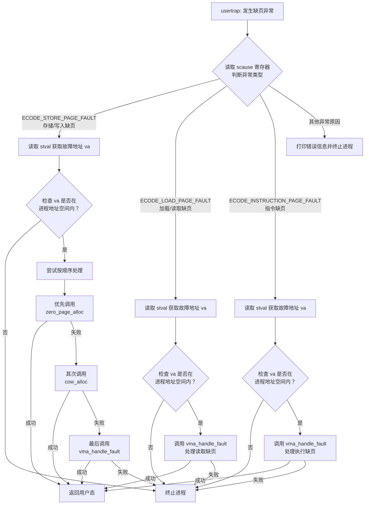

# mmap/VMA 懒加载适配记录（含零页优化与权限语义梳理）

本文记录一次针对 xv6-lab 的内存管理适配过程：目标是把 `mmap/mprotect` 从“直接物理映射并预读文件”的实现，改成 **VMA 元数据驱动 + page fault 延迟映射** 的模型，并与现有的 COW 和零页优化融合。文档覆盖设计背景、改动步骤、关键实现点、验证方式，以及目前仍待改进的部分，便于后续继续迭代。

## 1. 背景与问题定位

在原始实现中，`sys_mmap` 直接分配虚拟内存并读取文件内容到用户地址空间，属于“立即加载”。这带来几个问题：

1. **语义不完整**：`MAP_PRIVATE` 的写时复制语义实际上被“提前拷贝”掩盖了，且读写权限在 mmap 阶段一次性决定，无法精细处理只读映射或后续的 `mprotect` 调整。
2. **无法真正延迟加载**：对于大文件或稀疏映射，依赖 `mmap` 时就触发全部读盘，内存与 I/O 开销过大。
3. **与零页/COW 的融合不完整**：已有 `uvmalloc_lazy` 和零页共享，但 `mmap` 仍然走“立即映射/读取”的路径，导致零页优化无法覆盖文件映射场景。

因此需要引入 VMA（Virtual Memory Area）作为用户地址空间的“语义元数据”，由 page fault 统一驱动实际映射。

## 2. 目标与总体策略

本次适配目标拆成两个阶段：

1. **建立 VMA 元数据并替换 sys_mmap 的“立即加载”**  
   `mmap` 只注册 VMA，不分配物理页。文件的真实页在访问时通过 page fault 加载；匿名映射也只建立零页或写时分配映射。

2. **在 trap 中引入 VMA 驱动的 page fault 处理**  
   读取/写入/执行缺页统一通过 `vma_handle_fault` 处理，以 VMA 的权限与类型决定映射方式（零页、文件页、共享页或私有页）。

同时保持已有的 COW 机制兼容，并利用零页共享减少未写入区域的内存占用。

## 3. 设计原则与关键思路

### 3.1 VMA 记录“语义”，PTE 记录“状态”

借鉴 Chronix 的实现理念：  
VMA 保存 `prot/flags/file/offset/len`，是 **语义来源**；PTE 是 **当前映射状态**。  
因此在 `mprotect` 中需要同时更新 VMA 和已映射页的 PTE，但对于尚未映射的页，仅更新 VMA 即可。

### 3.2 统一的 page fault 分发路径

针对 load/store/exec page fault：

- 先判断是否为 COW 或零页写时分配；
- 若不是，则由 `vma_handle_fault` 查询对应 VMA；
  - 匿名或堆/栈：优先零页映射，写时分配私有页；
  - 文件映射：根据 `MAP_PRIVATE/MAP_SHARED` 区分 private copy 或共享页加载。

### 3.3 兼容现有实现

本仓库已有 `uvmalloc_lazy`、零页共享与 COW 处理逻辑，为避免破坏现有路径：

1. `uvmcopy` 改为允许“未映射页”的存在，跳过缺失 PTE；
2. `uvmunmap` 引入 `uvmunmap_lazy`，允许取消映射时跳过未映射页；
3. `mmap` 对匿名映射继续使用 `uvmalloc_lazy`，但额外登记 VMA，以保证 fault 时语义一致。

## 4. 具体实现过程（步骤化记录）

### 4.1 引入 VMA 数据结构与基础操作

新增 `src/mm/vma.h` / `src/mm/vma.c`，定义 `struct vma`，包括：

- 区间 `[start, end)`
- `prot`、`flags`
- `file`、`offset`、`len`
- 链表 `next`

并提供以下操作：

1. `vma_add()`：插入新 VMA  
2. `vma_find()`：按地址查找  
3. `vma_unmap()`：支持区间删除/裁剪/分裂  
4. `vma_protect()`：支持区间修改权限（必要时拆分 VMA）  
5. `vma_copy()`：fork/clone 时复制 VMA 元数据  
6. `vma_free_all()`：退出/exec 时释放  

同时对 `struct proc` 增加 `struct vma *vma` 指针，并在 `allocproc` 中初始化，在 `freeproc` 中释放。

### 4.2 修改 fork/clone/exec 的 VMA 继承逻辑

由于 VMA 是语义描述，它必须被继承给子进程：

- 在 `fork` 和 `clone_fork` 中新增 `vma_copy(np, p)`。  
  只复制元数据，不复制物理页；真实映射在访问时发生。

- 在 `exec` 中调用 `vma_free_all(p)`，防止旧 VMA 残留导致错误访问。

### 4.3 改造 sys_mmap：从“预读”改为“登记 VMA”

原逻辑是 `uvmalloc` + `readi` 读入文件。现在改为：

1. 对匿名映射：  
   - 仍用 `uvmalloc_lazy` 建立零页映射  
   - 用 `vma_add` 记录 VMA 语义  

2. 对文件映射：  
   - 检查 `offset` 页对齐  
   - 仅登记 VMA（记录 file/offset/len），不做读入  
   - 页面由 fault 时加载  

同时限制 `MAP_FIXED`（暂不支持），保持地址分配策略简单：  
`mmap` 默认使用 `p->sz` 向高地址扩展。

### 4.4 mprotect 语义下沉到 VMA

`sys_mprotect` 现在会：

1. 调用 `vma_protect` 更新 VMA 元数据；
2. 仅对“已映射的页”修改 PTE 权限；
3. 未映射页保持缺失，等触发 fault 时按新权限映射。

这样可避免 `mprotect` 强制创建页，从而保留 lazy 语义。

### 4.5 page fault 中引入 VMA 处理逻辑

在 `usertrap` 中对三类 fault 做分发：

- `ECODE_LOAD_PAGE_FAULT` → `vma_handle_fault(..., VM_FAULT_READ)`  
- `ECODE_STORE_PAGE_FAULT` → 先零页写时分配，再 COW，再 VMA  
- `ECODE_INSTRUCTION_PAGE_FAULT` → `vma_handle_fault(..., VM_FAULT_EXEC)`  

`vma_handle_fault` 根据 VMA 类型与权限，执行以下策略：

1. **匿名/堆/栈**：  
   读 fault → 映射零页；  
   写 fault → 分配私有页并映射可写。

2. **文件映射**：  
   `MAP_SHARED` → 直接映射可写共享页（当前仍是“单页加载”，无真正全局页缓存）  
   `MAP_PRIVATE` → 读 fault 映射只读，写 fault 分配新页并复制内容（近似 COW 语义）。

### 4.6 缺页异常分发逻辑解析（usertrap）

这段代码是内核处理缺页异常的核心逻辑，通常位于 `usertrap()` 中。它根据 RISC-V 架构中 `scause` 寄存器记录的异常原因，对三种主要缺页类型进行分发和处理。整体分发流程如下：

**关键代码解析**

1. **异常原因分发**  
   通过读取 `scause` 寄存器区分缺页类型：
   - `ECODE_STORE_PAGE_FAULT`：写操作触发，处理最复杂，涉及多级处理机制。  
   - `ECODE_LOAD_PAGE_FAULT`：读操作触发，通常由懒分配或 VMA 处理。  
   - `ECODE_INSTRUCTION_PAGE_FAULT`：取指缺页，依赖 VMA/权限检查后映射。

2. **写缺页的三层处理顺序**  
   写缺页体现了内存管理的层次性，采用“优先优化、再兼容”的策略：
   1) **零页处理**：调用 `zero_page_alloc`。当进程写入尚未触及的匿名页时，先通过共享零页节省内存；写入时再分配私有页。  
   2) **写时复制处理**：若不是零页，尝试 `cow_alloc`。该场景多来自 `fork` 后共享只读页，写入时复制。  
   3) **VMA 懒分配**：若前两者都失败，调用 `vma_handle_fault`，根据 VMA 元数据决定是否从文件加载或建立匿名页映射。

3. **安全边界检查**  
   每个分支都先验证 `va < p->sz`，确保故障地址处于进程合法地址范围内，防止非法地址读写破坏内核；越界则直接终止进程。

### 4.7 兼容 lazy 释放与复制

由于 mmap 现在可能只登记 VMA 而未映射 PTE，原 `uvmunmap/uvmcopy` 会 panic：

- `uvmunmap_lazy` 允许跳过缺失页；
- `uvmcopy` 跳过缺失 PTE；
- `uvmfree` / `uvmdealloc` 改为使用 `uvmunmap_lazy`。

## 6. 核心代码变更摘要

- `src/mm/vma.c` / `src/mm/vma.h`：新增 VMA 子系统  
- `src/proc/proc.h`：进程增加 `vma` 字段  
- `src/proc/proc.c`：allocproc/freeproc/fork/clone 维护 VMA  
- `src/proc/exec.c`：exec 时清理 VMA  
- `src/syscall/sysproc.c`：mmap/mprotect/munmap 接入 VMA  
- `src/trap/trap.c`：page fault 走 VMA handler  
- `src/mm/vm.c`：增加 `uvmunmap_lazy`、放宽 `uvmcopy`  

## 7. 验证与观察

本次修改的基本验证方式是：

1. 编译内核：`make kernel`  
2. 使用现有用户态测试（如 `mmap` 相关程序）观察 fault 是否触发正确映射  
3. 对匿名映射写入后检查是否触发零页写时分配  

由于系统缺少完备的 VMA 单元测试，当前验证主要依赖运行时行为与 fault 日志（必要时可在 `vma_handle_fault` 或 `usertrap` 增加调试输出）。

## 8. 待改进与风险点

1. **缺少统一页缓存**  
   `MAP_SHARED` 目前仍是“每次 fault 各自读取一页”，并没有全局共享页缓存；多个进程映射同一文件无法共享物理页。

2. **`msync` 仍为 stub**  
   `sys_msync` 目前直接返回成功，不会回写脏页，shared 映射不完整。

3. **copyin/copyout 的 lazy fault 覆盖不足**  
   内核 `copyin/copyout` 仍依赖现有映射；如果用户未触摸 mmap 区域就作为读写目标，可能仍失败。需要引入 VMA-aware 的 fault 或预热逻辑。

4. **VMA 查找开销与碎片化问题**  
   目前使用线性链表；大量 mmap/munmap 会造成遍历成本高且碎片化严重，后续可考虑区间树或红黑树。

5. **MAP_FIXED / 地址布局控制**  
   当前 mmap 只使用 `p->sz` 作为扩展点，且拒绝 `MAP_FIXED`，这限制了用户态库（如动态链接器）对地址布局的精细控制。

6. **私有映射与 COW 的边界处理**  
   MAP_PRIVATE 的语义实现仍是“读 fault 映射只读页，写 fault 复制”。在部分场景（例如先写后读）还需再验证正确性与性能。

## 9. 结论

本次适配把 `mmap/mprotect` 迁移到 VMA 驱动模型，并与已有零页/COW 机制融合，实现了 **“语义记录在 VMA，状态落地由 fault 决定”** 的基本框架。相比旧实现，新的 mmap 具备更合理的延迟加载能力，也更接近 Chronix 的行为。

不过，仍缺乏页缓存、msync、copyin/out fault 等配套机制。后续若继续对齐 Chronix 或 Linux 语义，需要在 VMA 之上引入更完善的页缓存与脏页回写体系，并补齐 MAP_FIXED / 地址布局等能力。
