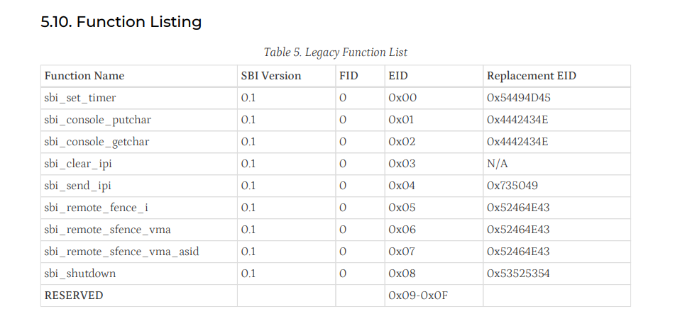

在原来的 2019 版 xv6 中，没有使用 SBI，而是直接与 QEMU 模拟的硬件进行交互。SBI（Supervisor Binary Interface）是 RISC-V 架构中用于在特权级别之间进行调用的接口，主要用于操作系统内核与底层固件之间的通信。 在较新的 RISC-V 系统中，SBI 提供了一种标准化的方法，使得操作系统内核可以调用底层固件提供的服务。本内核使用 SBI 来实现与硬件的交互，例如定时器中断、以及系统重启等功能。

本地环境使用的 v1.0 的 OpenSBI 作为 SBI 固件。Runtime SBI Version 是 0.3

参考 [RISC-V SBI 规范](https://github.com/riscv-non-isa/riscv-sbi-doc/releases/download/v3.0/riscv-sbi.pdf)，我们知道以下调用规则：

- 确定服务：通过 a7寄存器指定扩展ID（EID），标识所需的功能大类（如 0x735049代表IPI扩展）

- 确定功能：通过 a6寄存器指定函数ID（FID），标识具体的功能（如 0x0代表发送IPI）

- 传递参数：通过 a0 到 a5 寄存器传递最多六个参数给 SBI 函数

- 操作系统执行 ecall（Environment Call）指令。这条指令会主动触发一个从S模式到M模式的异常

- CPU 切换到 M 模式，跳转到 SBI 固件的异常处理函数

- SBI 固件根据 a7 和 a6 寄存器的值，确定要执行的具体功能, 并把结果放入 a0, a1 寄存器中返回给操作系统; a0 寄存器返回错误号。


以 `sbi_shutdown` 函数为例，其实现代码如下：

```c
void sbi_shutdown(void)
{
    // 使用 system reset extension
    register uint64 a0 asm("a0") = 0;          // reset type = shutdown
    register uint64 a1 asm("a1") = 0;          // reason = 0
    register uint64 a7 asm("a7") = 0x53525354; // SBI_EXT_SYSTEM_RESET
    register uint64 a6 asm("a6") = 0;          // extension id = 0
    asm volatile("ecall"
                 :
                 : "r"(a0), "r"(a1), "r"(a6), "r"(a7)
                 : "memory");
    __builtin_unreachable();
}
```

在这个函数中，我们通过寄存器传递参数并调用 ecall 指令来请求 SBI 固件执行系统关机操作，这里使用的就是较新的 EID 号 0x53525354（SBI_EXT_SYSTEM_RESET）。



同样的道理，时钟中断的处理也通过 SBI 来实现：

```c
void sbi_set_timer(uint64_t stime)
{
    register uint64_t a0 asm("a0") = stime;
    register uint64_t a6 asm("a6") = 0;          // FID = 0 (SBI_EXT_TIME_SET_TIMER)
    register uint64_t a7 asm("a7") = 0x54494D45; // EID = 0x54494D45 (SBI_EXT_TIME)
    
    asm volatile("ecall"
                 : "+r"(a0) 
                 : "r"(a6), "r"(a7)
                 : "memory");
}

```
