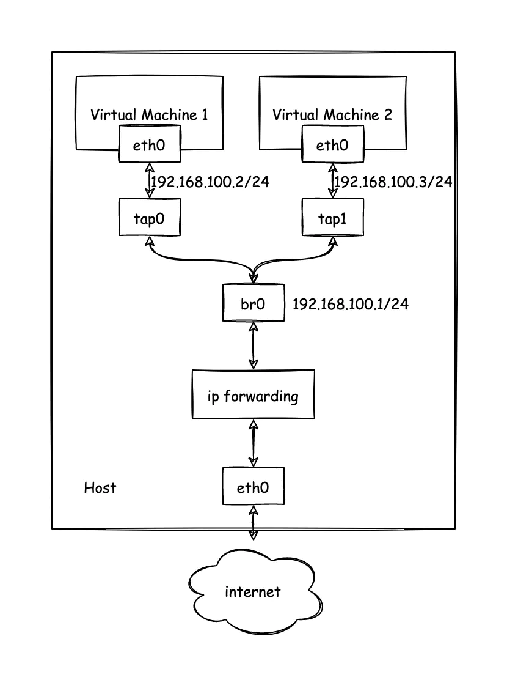

 # TCP host echo 调试记录：link list 问题定位与协议栈验证

本文记录一次 xv6 TCP host echo 调试过程，重点说明如何定位到 **tcp link list 被破坏** 的根因，以及如何验证网络协议栈的正确部分。整体风格与 `udp-loopback-debug-report.md` 保持一致，并补充本次用到的日志/抓包手段与后续改进方向。

## 1. 背景与目标

此前 UDP 回环测试已确认 UDP 发送/接收路径可用，但 TCP host echo 仍卡住：`connect` 一直失败或卡死。为验证 TCP 协议栈与 syscalls 的正确性，本次目标是：

1. 让 xv6 向宿主机 `10.0.2.2:12346` 发起 TCP 连接并完成回显。
2. 覆盖完整链路：`socket → connect → TCP SYN → SYN-ACK → ACK → write → read → close`。
3. 用日志、gdb、netdump 抓包来定位问题。

## 2. 初始现象与问题描述

测试脚本中显示：
- `socket()` 成功，但 `connect()` 卡住或返回 `-EIO`；
- 早期阶段没有看到任何真正的 TCP 包，只看到 `sys_connect` 打印；
- 即便强制使用 tap/bridge，仍无明显进展。

此时怀疑点有三个：
1. **协议栈发送路径**：SYN 是否真正发出？
2. **连接状态机**：SYN-ACK 收到后状态是否更新？
3. **TCP link 管理**：链路结构是否被破坏导致死锁或查找失败？

## 3. 调试手段与分阶段定位

### 3.1 关键日志与打点

为了摆脱 `printf` 锁的影响，增加了 `consputc()` 字符打点，同时在 TCP 发送路径打印关键阶段信息：

- `socket_connect` / `socket_tcp_connect` 入口打点（`X/I/L/G/g/Y/C`）。
- `tcp_send_syn`、`tcp_send_packet`、`ip_send_ext` 关键日志。
- `netif_ip_send` 的 ARP 路由输出。

这些打点揭示：代码路径确实进入了 `socket_tcp_connect`，并且能走到 `tcp_send_syn`、`tcp_send_packet`。

### 3.2 gdb 线程与死锁排查

在 gdb 中观察到：系统大量时间卡在 `thread_one_shot_timer_count()`，而 `tcp_link_get()` 中的 `os_thread_mutex_lock(l_hMtxTcpLinkList)` 无法返回。这提示：

- **定时器线程在遍历 tcp link 列表时持锁不放**；
- `tcp_link_get()` 等待锁导致 connect 停住。

进一步分析 `tcp_link_list_used_get_next()` 可见 bNext 字段异常，出现大量 `bad bNext=255`。

### 3.3 定位“link list 被破坏”的根因

核心原因来自 **CHAR 的有符号性**：
- onps 中链表用 `CHAR bNext` 表示下一个节点索引，`-1` 代表链表尾部；
- RISC-V 环境默认 `char` 为 **unsigned**，`-1` 会被当成 `255`；
- 遍历时 `bNext >= 0` 永远成立，链表无限循环 → 定时器线程死锁持锁。

这就是 connect 卡住与 `bad bNext=255` 的根因。

### 3.4 修复方式

采用 **全局编译选项** 的方式修复：

- 在 `Makefile` 增加 `-fsigned-char`，强制 `char` 为有符号；
- 将 `datatype.h` 中 `CHAR` 维持为 `char`，避免引起大量签名不匹配的编译错误；
- 保留 list/guard 日志用于确认修复是否生效。

修复后 `bad bNext=255` 消失，`tcp_link_get()` 能顺利拿锁并分配链路，connect 不再卡死。

## 4. 网络协议栈正确性的验证

修复后日志表明 TCP 流程完整：

1. **ARP 请求/应答**
   - `tx eth ... type=0x0806` + `rx len=42` 说明 ARP 工作正常。

2. **三次握手**
   - SYN 发出，收到 SYN-ACK（`0x7012`），随后回 ACK。
   - `sys_connect: ok` 证明内核的连接流程已完成。

3. **数据回显**
   - 用户态 `write` → TCP data 包发送；
   - `read` 收到 `"111\n111\n"`，并且宿主 `nc -l 12346 -k` 确认收到 `hello from xv6`。

这说明：
- TCP 发送路径、接收路径、协议状态机和 socket/syscall 层整体是正确的；
- 之前的问题主要是 **link list 逻辑错误导致的死锁**。

## 5. “The tcp link isn't found” 的解释

连接完成后仍出现：

```
The tcp link of 10.0.2.15:59611 isn't found, the packet will be dropped
```

这是因为：
- 关闭 socket 后，宿主机会继续发送 FIN/ACK 或重传包；
- xv6 侧 link 已释放（缺乏完整 TIME_WAIT 保留），收到的迟到包找不到 link 即丢弃。

这不是功能错误，而是 **关闭阶段的正常表现**。需要 TIME_WAIT 或延迟 close 才能消除该输出。

## 6. netdump 与包级验证

虽然日志已经足够定位，但为了更“硬证据”的验证，也使用了 netdump（pcap）抓包：

- 发现 ARP、SYN、SYN-ACK、ACK、DATA、FIN 的完整序列；
- 可以和 onps 日志一一对应；
- 对比宿主 `nc` 输出确认真实业务可达。

此外，准备支持 `--netforward` 参数，便于测试 host → guest 入站连接。

## 6.1 tap/bridge 网络拓扑说明

当切换到 tap/bridge 模式时，虚拟机不再经过 SLIRP 的用户态 NAT，而是把二层包直接丢给宿主机桥接设备。这样可以观察更真实的 ARP/TCP 行为，也便于做入站连接或更复杂的网络验证。下图是本次调试中使用的 tap/bridge 拓扑示意：



## 7. 后续改进方向

1. **TIME_WAIT 与关闭流程**
   - 建议保留 link 一段时间，避免“link not found”日志。

2. **错误码清理**
   - `err=63`（dns query format wrong）出现在非 DNS 场景，说明错误码未清零，建议改为只在 `ret<0` 时打印。

3. **调试日志开关**
   - 当前打点日志过多，应加宏开关，便于 debug/production 切换。

4. **netforward 参数**
   - `run.sh` 增加 `-netdev user,hostfwd=...`，便于验证 “宿主机主动连 guest”。

5. **单元测试归档**
   - 将 TCP host echo/loopback 作为 `nettests` 或独立用户程序，保证回归测试稳定。

## 8. 结论

本次 TCP host echo 的核心问题并不在协议栈逻辑本身，而是 **tcp link list 因 signed char 语义错误导致死锁**。通过强制 `-fsigned-char` 修复后，TCP 三次握手、数据收发、syscalls 路径均验证正确。后续需要补齐关闭阶段的 TIME_WAIT，以及完善日志/错误码管理和测试工具链（netdump + netforward）。

这次调试说明：即使网络现象看似复杂，最终也可能落在基础类型语义（char 符号位）上，体现了底层系统调试的“链路追踪与分层验证”的重要性。
