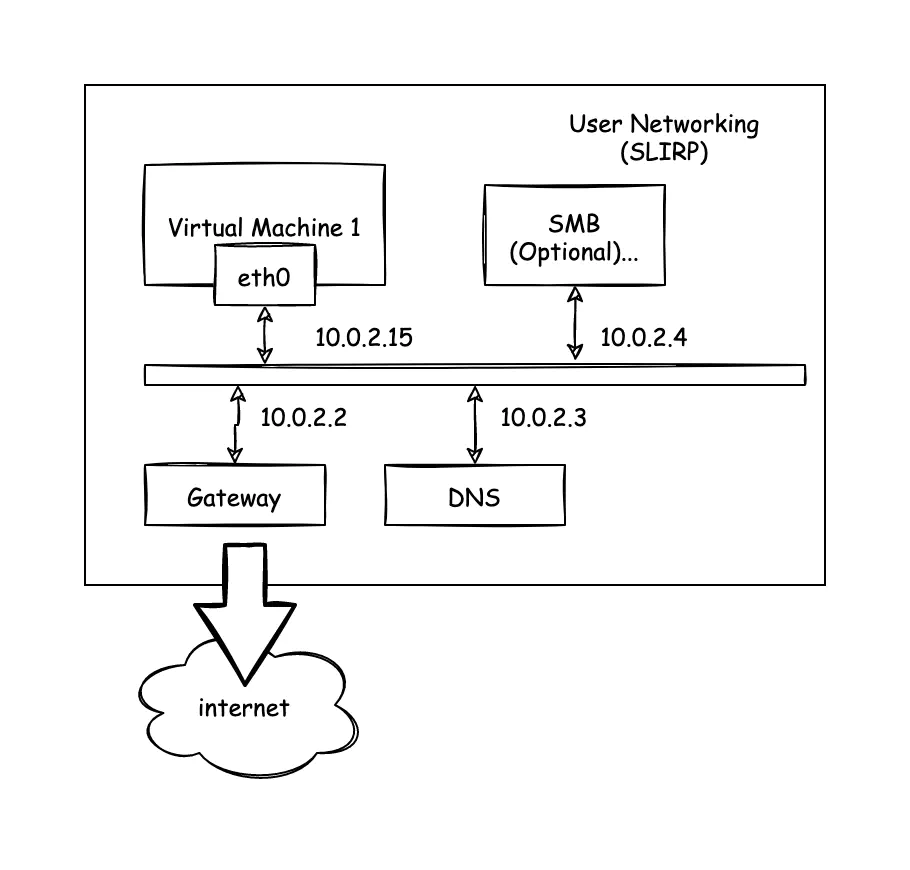

# UDP 回环测试切换与网络问题定位记录（含 QEMU User Networking 说明）

本文记录一次针对 xv6 网络栈的调试过程：为什么从“对宿主机的 UDP 发包测试”转向“xv6 内部 UDP 回环测试”，问题如何逐步定位，以及后续改进方向。同时补充 QEMU 的 User Networking（SLIRP）模型与限制，并结合本仓库的启动参数说明可观察到的行为。

## 1. 背景与现象

最初的测试方式是在 xv6 用户态中创建 UDP socket，向宿主机 `10.0.2.2:12345` 发送数据，并期待从宿主机回包。这类测试看起来“最接近真实网络”，但在 QEMU User Networking（SLIRP）模式下会遇到几个典型问题：

- 宿主机并不会自动监听目标端口，发送 UDP 到 `10.0.2.2:12345` 会触发宿主端的“Host unreachable”日志。
- 即使发送成功，回包也依赖宿主机有对应服务，这属于外部依赖，不能证明 xv6 协议栈本身是否正确。
- 在 SLIRP 模式中，缺省没有端口转发配置，外部主机无法主动访问虚拟机；因此“外部服务回包”的路径更容易受限。

因此需要一个“只依赖虚拟机自身”的测试，最小化外部因素，才能定位协议栈或驱动的问题。

## 2. 为什么转向 UDP 回环测试

选择“xv6 内部 UDP 回环（echo）”测试的核心目标是：

1. **最小化外部依赖**：不需要宿主机启动任何服务，也不依赖外部网络配置。
2. **验证关键路径**：走完整的 socket → UDP → IP → 网卡发送 → 网卡接收 → 协议栈上报 → 用户态收包流程。
3. **可控性更强**：如果失败，可以直接在 xv6 内核/协议栈中加日志，明确出错层级。

具体策略：在 xv6 中 fork 两个进程，一个 UDP server 绑定本机地址与端口，另一个 UDP client 发送测试数据，server 收到后回包给 client。这样既验证发送也验证接收，同时保证测试行为完全可复现。

## 3. 问题定位的分阶段过程

下面按时间顺序整理关键问题与排查过程，反映“为什么测试会失败以及如何一步步缩小范围”。

### 3.1 初始症状：Host unreachable

最早的行为是：

- `sendto()` 返回成功
- 宿主机提示 `Host unreachable` 或 UDP 发送不通
- xv6 端 `recvfrom()` 长时间无数据

这说明“发包路径”不一定完全失败，但宿主机没有对应服务，且 SLIRP 不提供 ICMP/UDP 相关的完整反馈。在这种情况下，不能分辨问题是网络栈还是外部依赖造成的。

### 3.2 DNS 查询测试失败

尝试改为向 SLIRP 内置 DNS 服务器 `10.0.2.3:53` 发送 DNS 请求，理论上能避免宿主机服务缺失。但实际依旧出现 `Host unreachable` 或 `recvfrom` 失败。这个结果说明：

- 不是单纯的“目标端口无人监听”，而是 **发送路径本身存在问题**。
- 需要把问题范围进一步缩小到 xv6 内部。

### 3.3 切换到 UDP 回环测试

实现 xv6 内部的 UDP echo 测试后：

- client `sendto()` 成功
- server `recvfrom()` 成功
- server `sendto()` 失败，返回 `-EIO`

这已经非常接近问题核心：**接收路径正常，回包发送失败**。换句话说，发送路径可能只有“源地址或路由决策”出了问题。

### 3.4 增加内核层错误码输出

为了看清协议栈内部错误原因，在 `sys_sendto` 中加了 onps 的错误码打印：

```
Addressing result does not match
```

这个错误来自 onps 的 `ip_send_ext()`：当源地址与路由模块计算的源地址不一致时，协议栈拒绝发送。

### 3.5 根因定位：源地址为 0

进一步分析 UDP 发送路径（onps）：

- 如果 socket 未绑定本地地址（`0.0.0.0`），`sendto` 会把 `saddr` 设为 0。
- `ip_send_ext()` 会根据路由表计算应当使用的源地址（例如 `10.0.2.15`）。
- 如果 `saddr == 0`，与路由计算结果不一致，触发 `ERRROUTEADDRMATCH`，即 `Addressing result does not match`。

因此，回环测试失败的根因不是网络驱动，而是 **UDP socket 绑定地址为 0，导致协议栈拒绝发送回包**。

### 3.6 修复与验证

将 server 端的 `bind()` 从 `ip = NULL` 改为绑定 `10.0.2.15` 后，回环测试成功：

- server `recvfrom()` 成功
- server `sendto()` 成功
- client `recvfrom()` 成功，打印 `recv 12 bytes: udp loopback`

说明协议栈、驱动和内核 socket 包装层的基础路径均可正常工作。

## 4. QEMU User Networking（SLIRP）说明

**User Networking (SLIRP)** 是 QEMU 的默认网络后端，无需 root 权限即可使用，但存在以下典型限制：

1. **性能较差**：由于 SLIRP 在用户态实现完整 TCP/IP 栈，额外拷贝和转换较多，吞吐/延迟不如 tap/bridge。
2. **默认不允许 ICMP**：不特殊配置时无法发送或接收 ICMP，因此 ping 通常不可用。
3. **外部无法主动访问虚拟机**：缺省没有端口转发（hostfwd），宿主机和外网无法直接连接虚拟机。
4. **NAT 模式**：SLIRP 实现了 NAT 转发，虚拟机访问外部网络是“出站可达”，但“入站默认不可达”。

在当前 QEMU 启动参数下使用的是：

- `-device virtio-net-device,netdev=net,bus=virtio-mmio-bus.1`
- `-netdev user,id=net`

对应的默认网络拓扑为：

- 虚拟机 IP：`10.0.2.15`
- 网关：`10.0.2.2`
- DNS：`10.0.2.3`

该拓扑可以用下面这张图表示：



结合 SLIRP 的限制可以理解：

- 从虚拟机向宿主机发 UDP 包（`10.0.2.2`）可以到达，但如果宿主机没有服务监听，就无法得到回包。
- 直接向外网 ping 可能失败（ICMP 限制）。
- 想让宿主机主动连虚拟机，需要额外设置 `-netdev user,hostfwd=...`。

因此，本次测试选择在虚拟机内部完成 UDP 回环验证，是最稳妥、最不依赖外部的方式。

## 5. 后续改进方向

本次调试揭示了以下改进点：

1. **内核层容错**：当 UDP socket 绑定 `0.0.0.0` 时，可以在 `udp_sendto()` 中将源地址改为路由计算的地址，以避免 `ERRROUTEADDRMATCH`。这是兼容 BSD 行为的常见处理。
2. **内核日志分级**：当前 `sys_sendto/sys_recvfrom` 添加的日志对定位问题很有效，可考虑加编译选项或宏控制，避免正常运行时过多输出。
3. **网络测试用例固化**：将 UDP 回环测试独立成用户态程序（例如 `nettests`），与 `initcode` 解耦，便于回归。
4. **拓展外部网络测试**：如果需要验证“出站访问”，可在宿主机启动一个 UDP/TCP 服务器，并用 `hostfwd` 或 tap/bridge 模式进行测试，以消除 SLIRP 限制。
5. **ICMP 测试策略**：由于 SLIRP 不支持 ICMP，可考虑协议栈内置 ICMP 单元测试或在 tap 模式下做真实 ping 验证。

## 6. 结论

通过把测试从“依赖宿主机/外部网络”的 UDP 发送切换为“虚拟机内部 UDP 回环”，成功缩小问题范围，最终定位到 **socket 绑定地址为 0 导致协议栈拒绝发送**。修复后回环测试通过，说明 xv6 的 socket → UDP → IP → 驱动 → 收包路径基本可用。

同时，结合 QEMU User Networking（SLIRP）的特性，可以解释最初测试失败的外部因素，为后续的更真实网络测试（hostfwd/tap/bridge）提供方向。
