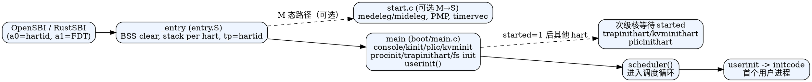

## 启动链路总览

```
QEMU/RustSBI(OpenSBI) 固件
        │
        │ a0=hartid, a1=FDT，跳转至 0x80200000 (_entry)
        ▼
src/boot/entry.S           ← 链接脚本 src/linker/kernel.ld 将 _entry 放在 0x80200000
        │ ① hart0 清零 .bss
        │ ② 所有 hart 配栈 & 记录 tp=hartid
        │ ③ 直接调用 C 入口 main()
        ▼
src/boot/main.c
        │ hart0: 设备/内存/进程表/文件系统初始化 → userinit() → started=1
        │ 其他 hart: 自旋等待 started，再初始化本地中断/页表
        ▼
调度器 scheduler() 启动
        ▼
user/initcode.* 生成的初始用户进程成为第一个可运行实体
```

- 固件阶段：`src/bootloader/` 提供预编译的 RustSBI/OpenSBI 镜像，QEMU 启动时加载并以 S 模式跳转到 `_entry`。
- 布局：`src/linker/kernel.ld` 将内核映射到物理地址 `0x80200000`，并强制 trampoline 占用 1 页，导出 `_bss_start/_bss_end` 等符号供启动代码使用。

## 汇编入口：src/boot/entry.S

核心任务是为每个 hart（CPU）准备执行环境，然后进入 C 代码：

```
_entry:
  if (hartid == 0) 清零 .bss
  sp = stack0 + (hartid+1)*4096   // 为每个 hart 预留 4 KiB 栈
  tp = hartid                     // cpuid() 通过 tp 取 hartid
  call main
```

- `.bss` 仅由 hart0 清零，避免多核重复覆盖；符号由链接脚本提供。
- 栈：`stack0` 声明在 `src/boot/start.c`，长度 `4096 * NCPU`，在汇编入口按 hartid 切片；+1 让每个 hart 使用独立页并避开 0 地址。
- 特权模式：当前实现假设固件已将 CPU 留在 S 模式，因此不再读取机器态 CSR，而是直接跳入 C。旧的 M 态路径已被注释保留。
- 保护：若 `main` 返回，代码进入无限自旋，防止落入未定义区域。

## M→S 切换与定时器准备：src/boot/start.c

虽然入口已直接进入 S 模式，但 `start.c` 仍保留完整的 M 模式引导逻辑，可作为独立链路的参考或在需要时复用：

- `setup_supervisor_mode()`：设置 `mstatus.MPP = S`，`mepc = main`，关闭分页，确保 `mret` 跳入内核 C 入口。
- `setup_interrupt_delegation()`：将全部中断与异常委托给 S 模式（`medeleg/mideleg`），并开启 `mcounteren` 允许 S 模式访问计数器。
- `setup_memory_protection()`：配置 PMP 全开（`pmpaddr0=0x3fffffffffffff`, `pmpcfg0=0xf`），为简化实验环境的内存访问控制。
- `timer_init()`：为每个 hart 设置 CLINT 定时器下一触发时间，布置 `timer_scratch`（保存返回地址、`mtimecmp` 地址和间隔）并将 `mtvec` 指向 `timervec`，打开机器态定时器中断。
- `w_tp(r_mhartid())` 在退出前将 hartid 写入 `tp`，供 S 态 cpuid 读取。

> 若在某些平台上需要从 M 态启动，可在 `_entry` 中改为调用 `start()`，再由 `mret` 进入 `main()`。

## C 入口与多核同步：src/boot/main.c

`main()` 是所有 hart 的第一站，逻辑分为 “引导核 hart0” 与 “次级核” 两条路径：

- `started` 作为原子标志，确保 hart0 初始化完成后其他核才继续。
- hart0 初始化顺序：
  1. `consoleinit()` → UART/控制台；`printfinit()` 建立输出。
  2. `kinit()` 建立物理页分配器；`log_info` 输出启动标记。
  3. `plicinit()` + `plicinithart()` 完成全局与本地 PLIC 配置。
  4. `kvminit()` 创建内核页表，`kvminithart()` 开启分页。
  5. `procinit()` 准备进程表；`trapinithart()` 设置 S 态陷阱向量。
  6. 文件系统/缓存：`binit()`、`iinit()`、`fileinit()`。
  7. `virtio_disk_init()` 启动块设备驱动。
  8. 使能 S 态中断（`SIE_SEIE | SIE_STIE | SIE_SSIE`），调用 `intr_on()`。
  9. `userinit()` 创建首个用户进程（加载 `user/initcode.*`），随后 `started = 1`。
- 次级核流程：
  - 自旋等待 `started`，随后依次 `trapinithart()`、`kvminithart()`、`plicinithart()`，打开 S 态中断。
- 所有核最后进入 `scheduler()`，从进程就绪队列中取出可运行实体。

### 启动内存与栈布局（示意）

```
0x80200000 ──┐  text   (_entry, kernel text)
            │
            ├─ trampsec (1 页 trampoline, S/U 切换用)
            │
            ├─ rodata / data
            │
            └─ bss …… _bss_end
                 │
                 └─ stack0[NCPU][4096]  // 各 hart 向上增长的独立栈页
```

### 首个用户进程链路

```
userinit()
  └─ 分配进程表项/页表
  └─ 将 user/initcode.bin 映射到用户空间入口
  └─ 设置 trapframe 返回到用户态
  └─ 就绪，等待 scheduler() 运行
```

## 设计要点与扩展位点

- **多核安全**：仅 hart0 做一次性全局初始化；`started` 同步次级核，避免资源重复配置。
- **特权切换策略**：以 OpenSBI 已在 S 态的假设简化入口；如需 M 态过渡，可恢复 `start()` 路径并调整 `_entry`。
- **定时器路径**：`timervec` 由 `start.c` 设置，实际陷阱处理逻辑在 `src/trap/`；修改定时器频率可调整 `timer_interval`。
- **链接与映射**：若修改内核加载地址或分页布局，需要同步更新 `src/linker/kernel.ld` 与 `memlayout.h`。

## 进一步阅读建议

- 中断/异常与系统调用细节：见 `os-docs/trap-and-syscall.md`。
- 内核分页与物理内存管理：见 `os-docs/memory-management.md`。
- 初始用户态程序与系统调用封装：见 `os-docs/userland.md`。

## DOT 图（启动链路）


