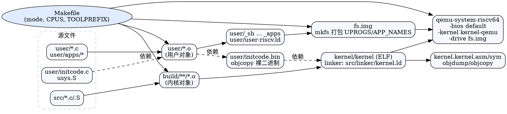

## 构建与工具链概览

```
源码 (src/, user/)           辅助资源 (src/bootloader/*.bin)
       │                                  │
       ├─ GNU make (Makefile) ────────┐   │
       │                              │   │
       ▼                              ▼   ▼
  build/*.o, user/*.o          内核链接脚本  user 链接脚本
       │                              │
       ├─ LD → kernel/kernel (ELF)    ├─ LD → user/initcode (ELF)
       │                              │
       ├─ OBJDUMP → kernel.asm/sym    └─ OBJCOPY → user/initcode.bin
       │
       ├─ mkfs → fs.img (含 UPROGS)
       │
       └─ QEMU 启动：-kernel kernel/kernel + virtio-blk=fs.img
```

- 工具链：默认前缀 `riscv64-unknown-elf-`，Makefile 会尝试 auto-detect；主机工具使用系统 `gcc`（仅用于 `src/mkfs/mkfs`）。
- 入口脚本：`run.sh` 结合 `make clean && make all` 后直接调用 QEMU，使用 `-bios default`（OpenSBI）。
- 目录：中间文件在 `build/`，最终内核 ELF/反汇编在 `kernel/`；用户程序位于 `user/_*`。

## 关键构建目标拆解（Makefile）

### 变量与模式
- `mode={release,debug}` 控制日志宏：`debug` 时定义 `LOG_*_ENABLE`。
- `NPROC := $(shell nproc)` 并行编译；`CPUS` 默认 2，传入 QEMU `-smp`。
- `SRC_DIRS` 列举子目录以生成 `build/<dir>/`，`INCLUDES` 自动包含子目录头文件。

### 内核对象生成
- 源搜集：`find src -name *.c/*.S`，过滤 `mkfs.c` 和特殊入口。
- `build/%.o` 规则对 C/汇编统一处理；`boot/initcode.o` 依赖 `user/initcode`，保证用户 init 二进制就绪。
- `ENTRY_OBJ := build/boot/entry.o`，链接时置于最前（满足 `_entry` 入口）。

### 内核链接与符号导出
- 目标 `$K/kernel`（`kernel/kernel`）链接顺序：`ENTRY_OBJ` + 其余对象，脚本 `src/linker/kernel.ld`。
- 产物：
  - `kernel/kernel.asm`：`objdump -S` 反汇编。
  - `kernel/kernel.sym`：符号表裁剪，便于查符号地址。

### 用户程序构建
- 系统调用封装：`user/usys.pl` → `usys.S` → `usys.o`。
- `user/initcode`：`entry.o` + `initcode.o` + `usys.o` + `printf.o` 链接脚本 `user/user-riscv.ld`，再 `objcopy` 得到 `initcode.bin`，供内核加载。
- 通用用户程序：`_%` 规则将 `main` 链接到地址 0，生成 `user/_sh`、`_cat` 等基础 UPROGS。
- `APP_NAMES`：从 `user/apps/<name>` 复制到 `user/_<name>`，便于 mkfs 打包更多测试程序。

### 文件系统镜像
- `src/mkfs/mkfs`：用主机 gcc 构建镜像制作工具。
- 目标 `fs.img`：执行 `mkfs` 打包 `README`、`$(UPROGS)` 与 `$(APP_NAMES)`，最终形成 virtio 块设备镜像。

### 调试与清理
- `qemu`：以 `-bios none` 运行（使用内置 SBI），挂载 `fs.img`；`qemu-gdb`/`fat32-gdb` 打开 GDB stub。
- `clean`：清除内核、用户、镜像、中间文件与 `build/` 目录。
- `debug`：相当于 `mode=debug all`，重建生成 debug 版本。

## 链接脚本速览

### 内核：src/linker/kernel.ld

```
0x80200000:
  .text
    trampsec (1 页，断言大小==4KiB)
  .rodata (页对齐)
  .data   (页对齐)
  .bss -> _bss_start/_bss_end
end -> 提供符号
```

- 通过 `ENTRY(_entry)` 指定启动入口；`ASSERT` 确保 trampoline 不溢出 1 页。
- 对齐策略（`. = ALIGN(0x1000)`）确保分页映射简洁，与 `memlayout.h` 一致。

### 用户：user/user-riscv.ld
- 从地址 0 链接：`.text.entry` 先于 `.text.*`，确保 `_start` 在最前。
- 丢弃段：`.note*`、`.comment`、`.riscv.attributes`，避免无用元数据占空间。
- 输出符号 `end`，供用户程序运行时引用。

## 运行脚本与 QEMU 配置

### run.sh
- 流程：`make clean && make all` → `qemu-system-riscv64 ...`
- 参数要点：
  - `-machine virt -smp 2 -m 128M -nographic`
  - `-bios default`（OpenSBI 提供 S 模式入口）
  - `-kernel kernel-qemu`（由 `make run` 将 `kernel/kernel` 复制得到）
  - virtio 块：`-drive file=sdcard.img,...`（可替换为 `fs.img` 或 `test.fat32`）
  - virtio net：`-device virtio-net-device` 配合 `-netdev user`

### 常用目标小抄

```
make            # 默认 mode=release，生成 kernel/ 与 fs.img
make mode=debug # 开启调试日志
make qemu       # 使用 fs.img 直接起 qemu
make qemu-gdb   # 启动并开启 gdb stub (tcp::1234)
make fs.img     # 仅重新生成镜像
make clean      # 清理所有构建产物
```

## 产物与目录结构（示意）

```
kernel/
  kernel         内核 ELF
  kernel.asm     反汇编
  kernel.sym     符号表
build/
  boot/*.o ...   中间目标（按源目录分层）
user/
  _sh/_cat/...   链接后的用户程序
  initcode       首个用户 ELF
  initcode.bin   供内核嵌入的裸二进制
fs.img           mkfs 生成的文件系统镜像
test.fat32       可选 FAT32 镜像（qemu-fat32 目标）
kernel-qemu      run 目标使用的 ELF 拷贝
```

## 调优与扩展提示
- 更换工具链：在命令行传入 `TOOLPREFIX=riscv64-linux-gnu-`，或修改 Makefile 对应变量。
- 增加用户程序：把源码放入 `user/apps/<name>/`，`make apps` 复制到 `user/<name>`，被 `fs.img` 打包。
- 修改内核加载地址或分页布局时，需同步更新 `src/linker/kernel.ld` 与 `memlayout.h`，并检查 `boot/entry.S` 的跳转地址假设。
- 调整 QEMU SMP/内存：`make CPUS=4 qemu` 或在 `run.sh` 中修改 `-smp/-m` 参数。

## DOT 图（构建流水线）


