## 设备与驱动概览

```
用户态 read/write
        │
  文件描述符 -> devsw[CONSOLE]/[VIRTIO]
        │
  console.c      virtio_disk.c
    │  ▲             │   ▲
    │  │             │   │
  uart.c ──(PLIC IRQ)─┴───┘
    │
  UART0 MMIO
```

- 内核通过 `devsw[]` 将字符设备（控制台）与块设备（VirtIO 磁盘）抽象为 `read/write` 回调，供 VFS/文件表调用。
- 外设中断统一经 PLIC 分发，陷阱处理在 `trap.c` 中调用 `plic_claim()`/`plic_complete()` 后交给具体驱动（UART→`consoleintr`，VirtIO→`virtio_disk_intr`）。

## 中断控制器：src/devs/plic.c

### 初始化路径
- `plicinit()`：设置 UART/VirtIO IRQ 优先级为 1（非 0 即启用）。
- `plicinithart()`：每个 hart 设置 `PLIC_SENABLE(hart)` 使能 UART0/VIRTIO0，`PLIC_SPRIORITY(hart)=0` 接受所有优先级中断。

### 运行时接口
- `plic_claim()`：读取 `PLIC_SCLAIM(hart)`，获得待处理 IRQ 号。
- `plic_complete(irq)`：写回同一寄存器，通知 PLIC 完成。

> 流程：trap handler -> `plic_claim()` -> switch IRQ -> 处理 -> `plic_complete()`。遗漏 complete 会导致中断无法再次触发。

## 串口与控制台：src/devs/uart.c + console.c

### UART 发送/接收
- MMIO 基址 `UART0`（见 `memlayout.h`），寄存器偏移定义在 `uart.c`。
- 发送路径：
  - `uart_write()`/`uartputc_sync()` 加锁写 FIFO，轮询 `LSR.TX_IDLE` 再写 `THR`。
  - `printf`/`log_*` 最终调用 `uartputc_sync`，`panicked` 时自旋防止继续输出。
- 接收路径：
  - `uartintr()` 轮询 `LSR` 接收位，读取 `RHR`，交给 `consoleintr(c)`。
  - 中断由 PLIC 转发，前提：`uartinit()` 使能 `IER_RX_ENABLE/IER_TX_ENABLE`。

### Console 输入缓冲
```
cons.buf[128] 环形缓冲
  r -> 已读位置
  w -> 可读上界
  e -> 编辑上界（处理退格/回车）
```
- `consoleintr()`：处理中断输入（CR→LF、Backspace、Ctrl-D EOF 协议），唤醒等待 `cons.r` 的读者。
- `consoleread()`：睡眠等待输入，逐字节拷贝到用户缓冲；遇到 `'\n'` 或 EOF 结束。
- `consolewrite()`：对用户写入逐字节输出到 UART。
- `consoleinit()`：初始化锁、UART，并注册到 `devsw[CONSOLE]`。

> 设计要点：环形缓冲与 `sleep(&cons.r)` 配合，避免忙等；退格处理用 `BACKSPACE` 发送 `\b \b` 覆盖终端。

## VirtIO 磁盘：src/virtIO/virtio_disk.c + virtio.h

### 初始化
1) 读取并验证 MMIO 魔数/设备 ID/厂商 ID；设置 `VIRTIO_MMIO_STATUS` 状态机：`ACKNOWLEDGE`→`DRIVER`→协商特性→`FEATURES_OK`→`DRIVER_OK`。  
2) 关闭不支持/不需要的特性：只读、SCSI、WCE、多队列、任意布局、事件索引、间接描述符。  
3) 选择队列 0，配置队列大小 `NUM=8`，分配连续两页 `pages` 作为 vring：
   - `desc[NUM]` 描述符数组
   - `avail` 可用环（放在 pages + sizeof(desc)）
   - `used` 已用环（放在 pages + 4096）
4) 将 `QUEUE_PFN` 指向物理页号，并标记 `disk[n].init=1`。

ASCII 布局（单队列）：
```
pages (2*PGSIZE)
┌──────────┬───────────────┬───────────────┐
│ desc[NUM]│ avail ring    │   padding     │
│          │ flags|idx|... │               │
├──────────┴───────────────┴───────────────┤
│ used ring (flags|id|elems[NUM])           │ <- +4096
└───────────────────────────────────────────┘
```

### 读写提交流程 virtio_disk_rw(n, buf, write)
1) 锁 `vdisk_lock`，计算块号 `sector = blockno * (BSIZE/512)`。  
2) 分配 3 个描述符（header/data/status），不足则 `sleep(&free[0])` 等待释放。  
3) 填写 `virtio_blk_outhdr`（type: IN/OUT, sector），映射地址到物理（`kvmpa`）。  
4) 组链：
   - desc0：指向 header，`NEXT -> desc1`
   - desc1：指向数据，读/写标志取决于方向，`NEXT -> desc2`
   - desc2：指向 1 字节 status，标志 WRITE，终止
   - `info[idx0].b = buf`，`buf->disk=1` 记录在飞请求
5) 将链表头 idx0 写入 `avail[2 + (avail[1]%NUM)]`，递增 `avail[1]`，`QUEUE_NOTIFY=0` 通知设备。  
6) 阻塞：`while (b->disk) sleep(b, &vdisk_lock);` 等待中断唤醒。  
7) 请求完成：释放描述符链，解锁。

### 完成中断 virtio_disk_intr(n)
```
used_idx vs used->id
  └─ 遍历已完成条目
       id = used->elems[used_idx].id  // 对应 desc 链头
       if status!=0 panic
       info[id].b->disk = 0; wakeup(buf)
       used_idx++
```
- 由陷阱处理器在收到 `VIRTIO0_IRQ` 后调用；调用后应 `plic_complete(VIRTIO0_IRQ)`。
- 若未及时处理 `used` 环或未唤醒 buf，会导致提交阻塞。

## 设备层与 VFS 的衔接

```
sys_read/sys_write
        │
    file.c: fileread/filewrite
        │
    devsw[major]
   ├── CONSOLE -> consoleread/consolewrite -> UART
   └── VIRTIO  -> virtio_disk_rw (通过 buf 层，bio.c 调度)
```

- 控制台作为字符设备直接操作 UART；块设备通过 buffer cache（`struct buf`）与文件系统接口隔离，依赖 `bio.c` 的睡眠锁与缓存淘汰。
- PLIC 中断会唤醒陷阱路径；console 使用 `sleep/wakeup` 在缓冲与用户读之间同步。

## 配置与扩展提示
- 新增设备 IRQ：在 `plicinit()` 设置优先级并在 `plicinithart()` 使能；在 trap handler 中增加分发分支并 `plic_complete()`。
- VirtIO 多盘/多队列：当前 `NDISK` 支持多实例，可拓展 `QEMU` 启动参数增加 mmio 设备，再调用 `virtio_disk_init(n)`。
- 串口改用轮询：若在无中断环境（如早期启动），可显式调用 `uartgetc()` 轮询输入，但需避免阻塞其他 hart。

## DOT 图（设备栈与中断）

```dot
digraph devices {
  rankdir=LR;
  node [shape=box, style="rounded,filled", fillcolor="#f6fbff"];

  subgraph cluster_user {
    label="用户态";
    style="dashed";
    app [label="read/write\nsyscall"];
  }

  subgraph cluster_fs {
    label="内核 VFS";
    style="rounded,dashed";
    file [label="file.c\nfileread/filewrite"];
    devsw [label="devsw[]\nmajor->ops", shape=ellipse, fillcolor="#e0ecff"];
  }

  console [label="console.c\nconsoleread/write\n环形缓冲"];
  uart [label="uart.c\nMMIO UART0\nIER/LSR/RHR/THR"];
  virtio [label="virtio_disk.c\nvring desc/avail/used\nvirtio_disk_rw"];
  bio [label="bio.c\nbcache + buf\nsleeplock"];
  fs [label="fs.c\nblock cache"];
  plic [label="PLIC\nclaim/complete"];
  trap [label="trap.c: devintr\nclockintr/uartintr\nvirtio_disk_intr", shape=ellipse, fillcolor="#e0ecff"];

  app -> file -> devsw;
  devsw -> console [label="CONSOLE"];
  devsw -> bio [label="VIRTIO block"];
  bio -> virtio;
  virtio -> bio [style=dashed, label="完成唤醒"];
  console -> uart;

  uart -> plic [label="IRQ UART0"];
  virtio -> plic [label="IRQ VIRTIO0"];
  plic -> trap -> {console virtio} [style=dashed, label="中断分发"];
}
```


