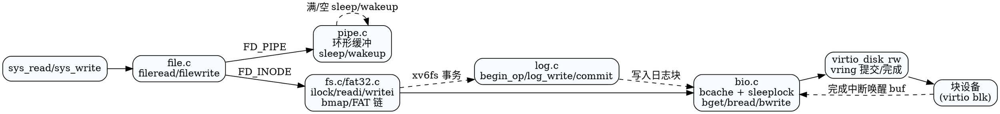

## 存储与文件系统概览

```
块设备 (VirtIO) ──> bio 缓冲层 (LRU + sleeplock)
      │                    │
      │                    ├─ log (redo 日志，事务提交)
      │                    │
      │                    └─ 文件系统抽象
      │                        ├─ xv6fs: inode/目录/bitmap/块分配
      │                        └─ FAT32: 兼容 FAT 镜像的读写实现
      │
      └─ devsw[major] -> virtio_disk_rw
```

- 块缓存：`src/fs/bio.c`，负责块读写复用与并发控制。
- 日志：`src/fs/log.c`，物理重做日志保障 xv6fs 崩溃一致性。
- VFS：`src/fs/fs.c` 管理 inode、目录、路径解析，并在 `fat32_mode` 下转发到 FAT32 实现。
- 设备：`src/virtIO/virtio_disk.c` 块 I/O；`src/mkfs/mkfs.c` 生成 xv6fs 镜像。

## 块缓存（bio.c）

### 结构
- `bcache.head` 维护双向链表（MRU 在头），`buf[NBUF]` 常驻。
- 每个 `buf`：`dev/blockno/valid/refcnt` + `sleep lock`，数据区 `BSIZE`。

### 流程
- `bread(dev, blockno)`：`bget` 查找缓存；未命中从 MRU 尾回收 `refcnt==0` 的 buf，若 `valid=0` 调用 `virtio_disk_rw(..., read)` 取数。
- `bwrite(buf)`：需持锁，调用块设备写。
- `brelse(buf)`：释放锁，`refcnt--`，若 0 移到 MRU 头。
- `bpin/bunpin`：调整 `refcnt`，供日志防止回收。

> 缓存提供互斥与命中复用，避免并发直接打到驱动。

## 日志（log.c）

### 目的
- 将多系统调用的更新串成事务，崩溃后可重做；提交点在写入 header。

### 关键字段
- `log[dev]`：按设备；`start/nlog` 来源于超级块；`outstanding` 活跃操作计数；`committing` 防并发提交；`lh` 记录本次事务涉及的块号。

### 操作
- `begin_op(dev)`：日志空间不足或正在提交则睡眠；否则 `outstanding++`。
- `log_write(buf)`：把 `buf->blockno` 放入 `lh.block[]`（去重），标记需要刷写。
- `end_op(dev)`：`outstanding--`，若降为 0 触发 `commit()`。
- `commit()`：`write_log` 将缓存块写入日志区 → `write_head` 原子提交 → `install_trans` 把日志块拷回原位 → 清空头。
- `recover_from_log`：启动时加载日志头、安装、清空，恢复崩溃事务。

> 所有修改磁盘的路径必须包裹在 `begin_op`/`end_op` 事务内并调用 `log_write`。

## xv6fs（经典 inode 文件系统，fs.c）

### 布局（简图）
```
块0   引导/空
块1   superblock (sb)
后续  日志区 (sb.logstart ... sb.logstart+nlog-1)
后续  inode 区
后续  位图区
后续  数据区
```

### 超级块
- 内存副本 `struct superblock sb`：`size/ninodes/nlog/logstart/startinode/bmapstart`。
- `readsb()` 读取块 1；`fsinit()` 校验 `FSMAGIC` 并 `initlog`，若魔数错误尝试 FAT32 fallback。

### 块分配/释放
- 位图从 `bmapstart` 开始：`balloc(dev)` 扫描 bit=0→置 1→`bzero` 数据块；`bfree(dev,b)` 清 0。
- `bmap(ip, bn)`：返回第 `bn` 数据块，必要时分配直接块 `addrs[0..NDIRECT-1]` 或单级间接块 `addrs[NDIRECT]`。

### inode 缓存与锁
- `icache`：`inode[NINODE]` + 自旋锁；`ip->lock` 为睡眠锁。
- `iget(dev,inum)`：查/分配缓存项，`ref++`，`valid=0`。
- `ilock(ip)`：加睡眠锁，若 `valid==0` 则从磁盘读 dinode 填元数据与地址，`valid=1`。
- `iupdate/iput/itrunc`：写回元数据、截断/释放数据块；`iput` 在 `nlink==0 && ref==1` 时回收。

### 读写与目录
- `readi/writei`：持 `ip->lock`，通过 `bmap` 定位块，`bread/bwrite` + `either_copy*` 与用户/内核搬运，更新 `ip->size` 后 `iupdate`。
- `dirlookup/dirlink`：目录内容是 `struct dirent` 列表（`name[DIRSIZ], inum`）。
- 路径解析 `namex`：绝对/相对路径逐层 `dirlookup`；`namei/nameiat` 为入口。

## FAT32 支持（fat32.c / fat32.h）

### 模式切换
- `fat32_mode`：`fsinit(dev)` 先 `fat32_init(dev)`，成功则启用 FAT32 路径；否则回退 xv6fs。VFS 入口在 FAT32 模式下转发到 `fat32_*`。
- FAT32 inode 以 `ip->major == FAT32_INODE_TAG` 识别；`ilock` 在 FAT32 时仅加锁、不访问 xv6fs 磁盘。

### 差异要点
- 元数据与块链遵循 FAT32 BPB/目录项格式；`fat32_readi/writei/namei/nameiat` 等实现单独维护 FAT 表与目录结构。
- 块分配使用 FAT 链，非位图；仍复用 bio/virtio 块 I/O。
- FAT32 无 journaling，`log.c` 仅保护 xv6fs；FAT32 写入需自行保证顺序与一致性。

### 场景
- 适配 `test.fat32` 等镜像；QEMU 通过 `-drive file=test.fat32 ...` 挂载，`fsinit` 自动选择 FAT32。

## 文件抽象与管道（file.c / pipe.c）

- `struct file`：`FD_NONE/FD_PIPE/FD_INODE`，含 `ref/readable/writable/off` 与 `ip/pipe`。
- `fileread/filewrite`：分派到 `piperead/pipewrite` 或 inode 的 `readi/writei`（xv6fs 或 FAT32）。
- 管道：环形缓冲 + 睡眠锁，空/满时 `sleep`/`wakeup`；关闭一端唤醒另一端结束。

## 代码/数据路径示意

```
sys_read/sys_write
   └─ fileread/filewrite
        ├─ FD_PIPE  -> piperead/pipewrite
        └─ FD_INODE -> ilock/readi/writei/iunlock (fs.c | fat32.c)
              └─ bmap + bio (xv6fs) / FAT 链 + bio (FAT32)
                    └─ virtio_disk_rw -> 磁盘
```

## 镜像与工具

- `src/mkfs/mkfs.c`：主机侧生成 `fs.img`（位图 + inode + 日志）；打包 `UPROGS`。
- FAT32 镜像：`make test.fat32` 使用 `dd+mkfs.fat` 生成 100MiB 空镜像；`qemu-fat32` 目标直接加载。

## 一致性与并发要点

- xv6fs：所有元数据更新须在 `begin_op/end_op` 事务内，修改过的缓冲块需 `log_write`；日志提交时复制整块。
- 锁粒度：`icache.lock` 管理缓存分配，`ip->lock` 保护 inode 元数据/内容，`bcache.lock` 管理缓冲链表与 `refcnt`。
- FAT32：无日志，注意写入顺序；可考虑后续引入简易事务或刷新策略。

## 扩展与调试提示

- FAT32 增强：可引入日志或写缓存，或支持长文件名/LFN。
- 大文件支持：扩展 `bmap`（多级间接）与 `MAXFILE`，调整 dinode 格式。
- 性能：增大 `NBUF` 或采用其他缓存替换策略；优化 `balloc` 线性扫描。
- 调试：在 `readi/writei/namex` 打印路径与块号；使用 `kernel.sym` 配合反汇编定位日志/块分配流程。

## DOT 图（存储栈与事务）


