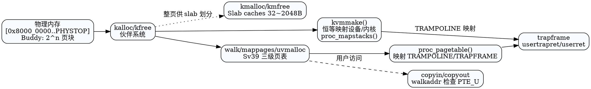

## 内存管理总览

```
物理内存 (0x8000_0000..PHYSTOP)
   │  kalloc -> Buddy allocator -> 提供 2^n 页块
   │  kmalloc -> Slab caches -> 提供小对象
   ▼
内核页表 kernel_pagetable (Sv39)
   ├─ 设备恒等映射：UART/PLIC/VIRTIO/TEST_DEVICE
   ├─ 内核 text/rodata/data/bss/堆 1:1 映射
   ├─ TRAMPOLINE (trampoline.S 一页)
   └─ 每核内核栈：KSTACK(i) 两页（含 guard）
用户页表 (每进程)
   ├─ 代码/数据/栈/堆 映射到物理页
   ├─ TRAPFRAME (最高一页，U 不可访问)
   └─ TRAMPOLINE (共享，用户可执行)
```

- 物理地址空间与设备基址定义：`src/memlayout.h`。
- 页表与权限宏：`src/riscv.h`；全局参数（NCPU、PHYSTOP 等）：`src/param.h`。
- 关键模块：物理页分配器 `src/mm/kalloc.c`，页表/映射与用户空间管理 `src/mm/vm.c`，高位 trampoline 代码 `src/trap/trampoline.S`。

## 物理内存与分配器（src/mm/kalloc.c）

### 继承关系与迁移背景

- 早期实现：`struct run` 单链表维护 4KiB 页，简单但存在“易碎片化 + 无法提供连续页 + 小对象浪费整页”的问题。
- 新实现：引入 **Buddy + Slab** 组合策略，先将 `[end, PHYSTOP)` 页面挂入按阶次分组的伙伴链表，再由 kmalloc/slab 在页内切片供热路径结构体使用。
- 迁移思路：
  1. 替换 `kmem.freelist` 为 `buddy_free_areas[order]`，每个节点记录自身 `order`、`index` 与 `slab` 占用标记。
  2. 保留 `kalloc/kfree` 接口语义（外部仍按页使用）；内部 `kalloc` 改为 `buddy_alloc_pages_internal(0)`，`kfree` 则执行伙伴合并。
  3. 新增 `kmalloc/kmfree` 供管道等小对象使用。示例：`struct pipe` 由 `kalloc` 改为 `kmalloc(sizeof(*pi))`，释放时走 `kmfree`，避免浪费整页。
  4. 所有元数据（buddy page table + slab_page_pool）在 `kinit()` 初始化，不改变 `vm.c`、`proc.c` 中的 `kalloc` 调用。

### Buddy 分配器

- **初始化**：`buddy_init()` 计算受管页面数量、可用阶数（MAX_BUDDY_ORDER=15），并将 `buddy_pages[idx]` 与物理页双向绑定。
- **分配**：`buddy_alloc_pages_internal(order)` 会在当前或更高阶链表上寻找块，必要时不断拆分更大块并将拆下的兄弟页重新挂回链表。
- **释放**：`buddy_free_pages_internal(pa, order)` 会根据页号找到伙伴，若对方同阶且空闲则合并递归提高阶数，直至无法合并或达到最大阶。
- **安全性**：释放路径检查页对齐、范围、重复释放；若页被 slab 持有，则禁止直接 `kfree`。

### Slab 分配器 & kmalloc

- **缓存分级**：预设 32~2048 字节 7 个 size class，`slab_cache[i]` 各自维护 `partial/full/empty` 链表。
- **页元数据**：`slab_page` 记录所在 cache、对象大小、bitmap、order；buddy 页表反向指向 slab，`kmfree` 可据此定位。
- **分配流程**：`kmalloc(size)` 做 8 字节对齐，若命中 slab 级别：
  - 优先复用 partial slab；
  - 若只剩 empty slab 则拉入 partial；
  - 缓存完全空缺时向 buddy 申请整页并切分。
- **释放流程**：`kmfree(addr)` 通过页信息回溯到 slab，清空 bitmap 并根据 free_count 将页面转移到 empty/partial/full，必要时将多余 empty slab 归还 buddy。
- **大块 kmalloc**：超出 2048 字节时落回 buddy，多页块前面带 `kmalloc_large_header` 记住 order，释放时据此合并。

> 当前内核大量仍使用 `kalloc`，kmalloc 先用于管道、后续对象按需迁移，可逐步减少小对象浪费的整页开销。

## 物理/虚拟布局（memlayout.h）

```
物理地址
0x0000_1000    QEMU boot ROM
0x0200_0000    CLINT (mtime/mtimecmp)
0x0C00_0000    PLIC
0x1000_0000    UART0
0x1000_1000    VIRTIO0 (磁盘)
0x8000_0000    内核加载物理基址 KERNBASE
...            物理内存持续到 PHYSTOP=KERNBASE+128MiB
```

高地址保留：
- `TRAMPOLINE = MAXVA - PGSIZE`：共享一页，用于 S/U 切换。
- `TRAPFRAME = TRAMPOLINE - PGSIZE`：每进程 trapframe 虚拟页，PTE_U=0 防用户访问。
- `KSTACK(i) = TRAMPOLINE - (i+1)*2*PGSIZE`：每核两页，低页为 guard（无效），高页为栈。

## 内核页表与直接映射（src/mm/vm.c）

### 构建：`kvmmake()`
- 新分配顶级页表，清零。
- 恒等映射设备：`TEST_DEVICE`、`UART0`、`VIRTIO0`、`PLIC`（4MiB）。
- 代码段映射：`[KERNBASE, etext)` -> `PTE_R|PTE_X` 只读可执行。
- 数据/堆映射：`[etext, PHYSTOP)` -> `PTE_R|PTE_W`。
- TRAMPOLINE：映射至物理 `trampoline`（或同址调试），权限 `R|X`。
- `proc_mapstacks()`：为每个 hart 分配一页栈并映射到 `KSTACK(i)+PGSIZE`，留下 guard page 防止溢出。

### 切换：`kvminithart()`
- `w_satp(MAKE_SATP(kernel_pagetable))` 写 satp，前后 `sfence_vma` 刷新 TLB。

### 内核地址助手
- `kvmpa(va)`：把内核直映虚拟地址转回物理地址（用于传递给设备，如 VirtIO 的 header 位于内核栈）。

## 页表基元与映射

- `walk(pagetable, va, alloc)`：Sv39 三级遍历，必要时分配中间页表（`kalloc` + 清零）；返回叶子级 PTE 指针，`va>=MAXVA` panic。
- `mappages(pagetable, va, size, pa, perm)`：按页循环写叶子 PTE，禁止重映射已有 PTE_V。
- `uvmunmap(pagetable, va, npages, do_free)`：解除映射，可选择释放物理页；要求页对齐且存在映射。
- `freewalk()`：递归释放页表层级，禁止残留叶子。

PTE 判定：
- 叶子页：`PTE_R|PTE_W|PTE_X` 任一置位；非叶子只置 `PTE_V`。
- 用户访问检查：`PTE_U`。

## 用户地址空间生命周期

### 创建与初始加载
- `uvmcreate()`：分配空页表。
- `uvmfirst(pagetable, src, sz)`：为 initcode 生成地址空间：
  - `prog_pages = ceil(sz/PGSIZE)`，再分配同样数量的栈页（只 RW）。
  - 程序段映射 `PTE_R|W|X|U`，逐页拷贝 `src`。
  - 返回总大小（代码+栈），供 `userinit()` 设置 `sz` 与栈指针。

### 扩缩容
- `uvmalloc(pagetable, oldsz, newsz, xperm)`：向上扩展，逐页 `kalloc` 并映射，失败回滚。
- `uvmdealloc(pagetable, oldsz, newsz)`：向下收缩，超出部分 `uvmunmap(..., do_free=1)`。
- `uvmfree(pagetable, sz)`：释放进程全部物理页并递归释放页表。

### 复制与清理
- `uvmcopy(old, new, sz)`：遍历父页表拷贝每页数据（无 COW），保持原权限；失败清理已映射部分。
- `uvmclear(pagetable, va)`：清除用户访问位，用于在 `exec` 时保护栈顶页面（返回路径使用）。

### 用户态映射结构（示意）

```
低地址
┌───────────────┐
│ text/data/bss │  PTE_U|R/W/X
├───────────────┤
│ user stack    │  PTE_U|R/W   (固定大小，uvmfirst 分配)
├───────────────┤
│ heap (brk)    │  PTE_U|R/W   (uvmalloc 扩展)
│ ...           │
├───────────────┤
│ TRAPFRAME     │  PTE_R/W, !U (陷阱保存区)
├───────────────┤
│ TRAMPOLINE    │  PTE_R/X, U  (共享陷阱入口)
└───────────────┘
高地址
```

## 复制/访问助手

- `walkaddr(pagetable, va)`：仅用于用户页，需 `PTE_U` 且 `PTE_V`，返回物理地址或 0。
- `copyin(pagetable, dst, srcva, len)` / `copyout(pagetable, dstva, src, len)`：跨页搬运，逐页校验映射。
- `copyinstr(...)`：拷贝以 '\0' 结尾的字符串，防越界/缺页。

## 内存管理与其他子系统的衔接

## DOT 图（页表与分配链路）



- **陷阱与上下文切换**：`TRAMPOLINE` 与 `TRAPFRAME` 用于 S/U 切换；`trap.c` 设置 `stvec=TRAMPOLINE`，`usertrapret` 通过 `satp` 切换到用户页表。
- **进程栈**：`proc_mapstacks()` 为每核内核栈加入 guard page；用户栈由 `uvmfirst`/`exec` 分配，`uvmclear` 去除顶页用户访问。
- **I/O 缓冲**：`bio`/`pipe` 等通过 `kalloc/kfree` 获取页做缓存；VirtIO header 需 `kvmpa` 获得物理地址。

## 调试与扩展提示

- 开启 `PAGE_TABLE_DEBUG` 可打印 walk/mappages 特定地址的调试信息。
- 若引入写时拷贝，可在 `uvmcopy` 中共享物理页并设置 `PTE_W`→清除、增加引用计数，缺页时复制。
- 调整物理内存上限或映射布局需同步 `PHYSTOP`、`kernel.ld`、`memlayout.h`，并考虑 TRAMPOLINE/KSTACK 位置。
- Buddy + Slab 未来改进方向：
  - 扩展 kmalloc 覆盖更多热路径结构体（`struct file` / inode / cache entry），降低页级碎片。
  - 为 buddy/slab 增加统计接口（空闲页、各 size class 使用率）及调试命令，便于压力测试定位碎片问题。
  - 研究 NUMA/多核优化（per-CPU slab or magazine）降低自旋锁争用，必要时引入对象 constructor/destructor 钩子。
