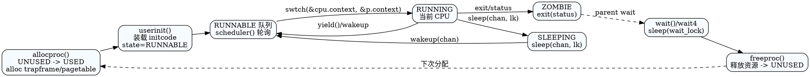

## 进程与调度总览

```
CPU(hart)
  ├─ struct cpu { proc*, context, noff, intena }
  │                 ▲
  │                 │ swtch(&cpu.context, &p.context)
  ▼                 │
调度器循环 scheduler()  <───┘
  │  轮询 RUNNABLE
  ▼
struct proc 表项 (NPROC)
  state ∈ {UNUSED, USED, SLEEPING, RUNNABLE, RUNNING, ZOMBIE}
  ├─ 受 p->lock 保护：state/chan/killed/xstate/parent 等
  ├─ 地址空间：pagetable，sz，trapframe
  ├─ 内核栈：kernel_stack=KSTACK(i)+PGSIZE，保存 context
  └─ 文件/目录：ofile[]，cwd，cwdpath
```

- 关键文件：`src/proc/proc.h`（结构/状态）、`src/proc/proc.c`（生命周期与调度）、`src/proc/swtch.S`（上下文切换）、`src/proc/exec.c`（装载 ELF）。
- 相关支撑：`os-docs/memory-management.md` 描述页表/栈布局，`trap-and-syscall` 描述陷阱返回与 `usertrapret`。

## 数据结构与内存布局

- `struct cpu`：每核常驻，`proc*` 指向当前运行进程，`context` 用于返回调度器（保存 s0-s11/ra/sp），`noff/intena` 跟踪关中断嵌套。
- `struct proc`：
  - 并发域：`lock` 保护 `state/chan/killed/xstate/parent` 等；等待关系由全局 `wait_lock` 保护防止 wait/exit 竞争。
  - 地址空间：`pagetable`（含 TRAPFRAME/TRAMPOLINE 映射）、`sz` 进程内存大小、`trapframe`（陷阱保存区，位于内核分配页）。
  - 栈：`kernel_stack` 指向该进程的内核栈顶（虚拟地址，单页），并在其上下文中设置 `sp`。
  - 文件系统：`ofile[NOFILE]`、`cwd`、`cwdpath`。
- 状态机：`UNUSED→USED→RUNNABLE→RUNNING→(SLEEPING|RUNNABLE)→ZOMBIE→UNUSED`。

内核栈与 guard 页（虚拟高地址示意，`KSTACK(i)` 由 `memlayout.h` 定义）：
```
KSTACK(i)          : guard page (PTE 无效)
KSTACK(i)+PGSIZE   : 进程 i 内核栈顶 (向低地址生长)
```

## 进程创建与初始化

### allocproc()
1) 遍历 `proc[]` 找 `UNUSED`，上锁后标记 `USED`，分配 `pid`（`pid_lock` 序列）。
2) 分配 `trapframe`（`kalloc`），创建用户页表 `proc_pagetable()`：
   - 映射 `TRAMPOLINE`（R|X）
   - 映射 `TRAPFRAME`（R|W，非 U）
3) 置零 `context`，将 `ra=forkret`，`sp=kernel_stack+PGSIZE`，为调度器切换做好准备。

### userinit()
- 以 `allocproc()` 获取首进程 `initproc`。
- `uvmfirst()` 将 `user/initcode.bin` 装入用户空间，设置 `sz` 与 `trapframe->epc=0`，`sp=alloc_size`。
- 设置根目录 `"/"`，命名 `zeroproc`，标记 `RUNNABLE`，释放锁。

### exec(path, argv)
1) 读取 ELF 头与 Program Headers（`readi`），校验 magic。
2) 新建页表 `proc_pagetable(p)`，遍历 `ph`：`uvmalloc` 段空间→`loadseg` 按文件内容拷贝，权限由 `flags2perm` 映射 R/W/X。
3) 为用户栈分配两页，顶页清除 `PTE_U` 作为 guard（`uvmclear`），栈指针对齐 16 字节，拷贝参数字符串与 argv[] 数组，`trapframe->a1=argv_ptr`。
4) 提交：替换进程页表与 `sz`，`epc=elf.entry`，`sp` 更新；旧页表释放。

## 上下文切换与调度

### swtch.S
- 保存当前 `ra/sp/s0-s11` 至 `old`（调度器或进程 context），再从 `new` 恢复寄存器，`ret` 跳转。
- 调度器切入进程：`swtch(&cpu.context, &p.context)`；进程返回调度器：`swtch(&p.context, &cpu.context)`。

上下文切换栈结构（进程 -> 调度器）：
```
进程内核栈 (p->context.sp 指向栈顶)
   ┌───────────────┐
   │   ...         │
   │ p->context    │  ← swtch 保存 ra/sp/s0-s11
   └───────────────┘
调度器 context 保存在 cpu.context（常驻内存）
```

### scheduler()
- 在每核循环：`intr_on()` 允许设备中断 → 遍历 `proc[]`，若 `RUNNABLE`：
  1) `p->state=RUNNING`，`c->proc=p`
  2) `swtch(&c->context, &p->context)`
  3) 进程让出后返回，重置 `c->proc=0`
- 进程在返回前必须已把 `state` 改为 `SLEEPING/RUNNABLE/ZOMBIE` 之一。

### yield/sched
- `yield()`：进程自愿让出，持有 `p->lock` 将状态置 `RUNNABLE`，调用 `sched()`。
- `sched()`：断言持有 `p->lock`、当前非 `RUNNING` 且关中断，保存 `intena`，`swtch` 到调度器，返回后恢复 `intena`。

## 同步：sleep/wakeup 与 killed

### sleep(chan, lk)
1) 获取 `p->lock`，释放外部锁 `lk`。
2) 设置 `chan`、`state=SLEEPING`，调用 `sched()`。
3) 被唤醒后清除 `chan`，释放 `p->lock`，再重新获取 `lk`。
> 持锁次序：先 p->lock 后释放 lk，唤醒方亦持 p->lock，保证不会错过 wakeup。

### wakeup(chan)
- 遍历进程表（跳过 `myproc()`），找到 `state==SLEEPING && p->chan==chan` 的进程，置 `RUNNABLE`。

### killed / kill
- `kill(pid)`：标记目标 `p->killed=1`，若在 `SLEEPING` 则置 `RUNNABLE` 以便尽快返回用户态检查。
- `killed(p)`：在返回用户态或系统调用路径检查，决定中断执行。

## 进程退出与回收

### exit(status)
- 禁止 init 退出；持 `wait_lock` 重新收养子进程给 `initproc`（`reparent`），唤醒父进程。
- 上锁自身，将 `xstate`（Linux wait 编码，高字节为 exit code，低字节 signal）写入，状态置 `ZOMBIE`，`sched()` 跳转调度器不再返回。

### wait(addr)
- 持 `wait_lock` 循环扫描子进程：
  - 若发现 `ZOMBIE`：拷贝 `xstate` 到 `addr`（可选），`freeproc` 释放资源，返回 pid。
  - 若存在子进程但未退出：`sleep(p, &wait_lock)`。
  - 无子进程或被 killed：返回 -1。

### freeproc / proc_freepagetable
- 释放 `trapframe`、用户页表（先 unmap TRAMPOLINE/TRAPFRAME，再 `uvmfree` 用户空间），清零字段并置 `UNUSED`。

## fork 与 clone_fork

- 共用 `allocproc()` 创建子进程，`uvmcopy` 逐页复制父页（无 COW），复制 `trapframe` 并设置子 `a0=0` 让 `fork` 返回 0。
- 复制文件描述符引用计数、当前工作目录与路径名，`parent` 由 `wait_lock` 保护设置。
- `clone_fork(stack)` 支持自定义子栈指针（若非 0 则覆盖 `trapframe->sp`），便于线程/协程实验。
- 子进程设为 `RUNNABLE` 后由调度器调度。

## 地址空间与陷阱返回

- `proc_pagetable()` 为每个进程挂载专属 TRAPFRAME 与共享 TRAMPOLINE，确保 S/U 切换路径有效。
- `forkret()`：调度器切回新进程首次运行时的入口：
  1) 释放 `p->lock`
  2) 首次调用时执行 `fsinit()`（文件系统需进程上下文可 sleep）
  3) 跳转 `usertrapret()`（设置 satp/stvec/sepc 等返回用户态）

陷阱返回链（简化）：
```
user -> trap.S (trampoline) -> usertrap() -> syscalls/interrupts
     -> usertrapret()
         satp 切换到用户页表
         sret 返回用户态，pc=trapframe->epc
```

## 扩展与调试提示

- 添加调度策略：可在 `scheduler()` 中替换为多级队列/时间片轮转，需要在 `proc` 中增加统计字段并调整 `yield`/`sleep` 交互。
- 引入写时拷贝：在 `uvmcopy` 将页面置只读，添加引用计数；缺页中断时复制。
- 栈溢出检测：guard page 已提供基础防护，可在陷阱中对 `stval` 落在 guard 区域时报告。
- 调试上下文切换：在 `PAGE_TABLE_DEBUG` 或自定义日志中打印 `p->context`，结合 `kernel/kernel.sym` 反查地址。

## DOT 图（进程生命周期与调度）


