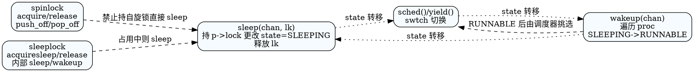

## 同步与锁总览

```
CPU/hart
  ├─ push_off/pop_off 关/开本地中断（可嵌套，记录在 struct cpu.noff/intena）
  ├─ spinlock 自旋锁：短临界区，忙等 + 原子交换，禁止中断避免自抢占
  ├─ sleep/wakeup：进程级阻塞/唤醒，依赖 p->lock 与调度器配合
  └─ sleeplock 睡眠锁：外层 spinlock 保护锁状态，内部用 sleep 避免忙等，适合长 IO
```

- 关键代码：`src/sync/spinlock.[ch]`（自旋锁与关中断封装）、`src/sync/sleeplock.[ch]`（睡眠锁）、`src/proc/proc.c` 中的 `sleep()/wakeup()`（等待/唤醒原语）。
- 典型使用场景：进程表锁 `p->lock`、`wait_lock`、时钟 `tickslock`、缓冲区缓存 `bcache.lock` 与 `buf.lock`、inode 缓存 `icache.lock` 与 `ip->lock`、日志 `log.lock`、文件表 `ftable.lock`、管道 `pipe.lock` 等。

## 自旋锁 spinlock（src/sync/spinlock.c）

`struct spinlock { uint locked; char *name; struct cpu *cpu; }`
- `locked`：是否被持有；`cpu`：记录持有者，用于 `holding()` 和调试；`name` 用于 panic/调试输出。
- 自旋锁依赖硬件原子 `amoswap.w`（GCC 内置 `__sync_lock_test_and_set`）实现忙等，不允许长时间持有。

### initlock()
- 只做结构体清零和名称设置，不分配资源：`locked=0; cpu=0; name=name`。

### acquire() 获取锁（忙等 + 关中断）
1) `push_off()`：关闭本核中断并递增 `cpu->noff`，避免持锁期间被中断处理例程再次请求同一锁而死锁。
2) 若 `holding(lk)` 为真则 panic，禁止同核重入。
3) 自旋等待：`while(__sync_lock_test_and_set(&lk->locked, 1) != 0)`。
4) 内存屏障 `__sync_synchronize()` 确保后续临界区的内存访问不会被重排到锁获取前。
5) 记录持有者 `lk->cpu = mycpu()` 便于调试/检查。

### release() 释放锁
1) 断言当前持有者，否则 panic。
2) 清除 `lk->cpu`，内存屏障保证临界区写入对其他 CPU 可见。
3) `__sync_lock_release(&lk->locked)` 原子清零。
4) `pop_off()`：递减 `cpu->noff`，如退出最外层且原先允许中断，则恢复中断使能。

### holding() / push_off()/pop_off()
- `holding()`：在关中断状态下检查 `locked && cpu==mycpu()`。
- `push_off()/pop_off()` 支持嵌套计数，保持“入口时中断状态”不变：
```
           push_off()                        pop_off()
  intr_get -> intena (保存初态)     ┌─> c->noff-- (>=1 断言)
        c->noff++                  ─┤   若 c->noff==0 且 intena==1 -> intr_on()
        intr_off()                 ─┘
```
> 关中断仅限当前 CPU，仍需自旋锁保证多核互斥；持锁期间避免调用会睡眠的接口。

## 进程级等待：sleep / wakeup（src/proc/proc.c）

`sleep(void *chan, struct spinlock *lk)` 与 `wakeup(void *chan)` 为跨子系统的阻塞/唤醒基元，关键在于“持有 p->lock 时修改状态，避免丢失唤醒”。

### sleep() 步骤
1) `acquire(&p->lock)`：在释放外部锁 `lk` 之前先持有自锁，防止 `wakeup` 竞争。
2) `release(lk)`：释放调用者锁，避免同时持有两把锁导致反序死锁。
3) 设置 `p->chan=chan; p->state=SLEEPING; sched();` 把自己挂到调度器，进入可被唤醒的队列。
4) 被唤醒后清理 `p->chan=0`，`release(&p->lock); acquire(lk);` 再次拿回原锁，回到调用者逻辑。

### wakeup() 步骤
1) 遍历 `proc[]`，跳过 `myproc()`。
2) 逐个 `acquire(&p->lock)`，检查 `p->state==SLEEPING && p->chan==chan` 时置 `RUNNABLE`。
3) 释放 `p->lock`，等待调度器调度目标进程。

睡眠/唤醒配合示意：
```
调用者持锁 lk              其他 CPU / 中断
  acquire(p->lock)
  release(lk)                acquire(p->lock)
  state=SLEEPING             if state==SLEEPING && chan==X:
  sched()   ----切走---->       state=RUNNABLE
  ... 被唤醒返回 ...           release(p->lock)
  chan=0
  release(p->lock)
  acquire(lk)
```
> 规则：进入 `sleep` 前必须持有某种条件锁 `lk`；唤醒时不得持有目标 `p->lock` 以免交叉死锁；长等待请使用能睡眠的锁（如 sleeplock）。

## 长临界区：睡眠锁 sleeplock（src/sync/sleeplock.c）

`struct sleeplock { uint locked; struct spinlock lk; char *name; int pid; }`
- 外层自旋锁 `lk` 保护 `locked/pid` 字段；内部通过 `sleep/wakeup` 阻塞等待，适合磁盘 IO、内存拷贝等长操作。
- `pid` 记录持有者进程，便于 `holdingsleep()` 检查。

### initsleeplock()
- 调用 `initlock(&lk->lk, "sleep lock")` 初始化内部自旋锁，清零 `locked/pid` 并命名。

### acquiresleep()
1) `acquire(&lk->lk)` 进入保护区。
2) 若 `locked` 已被占用，执行 `sleep(lk, &lk->lk)` 阻塞等待，同时让出 CPU；被唤醒后继续检查。
3) 设置 `locked=1; pid=myproc()->pid`，表明自己获得锁。
4) `release(&lk->lk)` 退出保护区。

### releasesleep()
1) `acquire(&lk->lk)`，将 `locked=0; pid=0`。
2) `wakeup(lk)` 唤醒所有等待该 sleeplock 的进程。
3) `release(&lk->lk)`。

### holdingsleep()
- 以自旋锁保护读取 `locked && pid==myproc()->pid`，判断当前进程是否持有。

睡眠锁结构示意：
```
    sleeplock (长临界区)
    ┌────────────────────┐
    │ spinlock lk        │ 保护标志
    │ locked (0/1)       │ 是否有人持有
    │ pid                │ 持有者 PID
    └────────────────────┘
acquiresleep: spinlock -> (locked? sleep) -> 占用 -> 解 spinlock
releasesleep: spinlock -> 清标志 -> wakeup -> 解 spinlock
```
> 与 spinlock 的取舍：sleeplock 允许睡眠，避免忙等浪费 CPU；但上下锁/唤醒开销更高，且持锁期间允许被调度，适合磁盘/文件系统等长操作。

## 典型锁位点与设计取舍

- **进程与调度**：`p->lock` 保护进程状态/chan，`wait_lock` 保护父子关系，`tickslock` 序列化时钟滴答更新与 `ticks` 变量。
- **文件系统**：`bcache.lock`（缓存表）、`buf.lock`（单块数据，睡眠锁，允许 IO 等待）；`icache.lock` 保护 inode 缓存分配，`ip->lock`（睡眠锁）保护 inode 内容；`log.lock`（自旋锁）串行化日志头更新；`ftable.lock` 保护全局文件表；`pipe.lock` 保护管道读写计数/缓冲区。
- **设备**：UART、virtio 磁盘等驱动在中断路径使用自旋锁防止并发访问寄存器。
- **实践建议**：
  - 短而不可睡眠的路径用自旋锁；可能阻塞/等待 IO 的路径用睡眠锁。
  - 避免在持自旋锁时调用 `sleep`/`acquiresleep` 等可阻塞接口。
  - 统一锁顺序（如先 `bcache.lock` 后 `buf.lock`，先 `icache.lock` 后 `ip->lock`）以减小死锁风险。

## 调试与排障提示

- 若出现 `acquire/release` panic，优先检查持锁者与中断状态：自旋锁必须在关中断状态下释放；`pop_off` 次序错误也会触发断言。
- 利用锁名快速定位模块（panic 信息会打印 `lk->name`）；必要时在临界区添加日志观察锁竞争。
- 发生“丢失唤醒”时，确认 `sleep` 进入前是否持有保护条件的锁，并检查唤醒方是否在未持 `p->lock` 的情况下正确设置 `RUNNABLE`。

## DOT 图（锁与睡眠唤醒）


