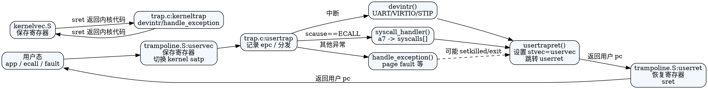

## 陷阱/系统调用总览

```
用户态                共享 TRAMPOLINE            内核态
─────────┬────────────────────────────────┬──────────────────────
 user pc │ ecall/异常/中断 → stvec=uservec │ trap.c:usertrap()
         │                                │   ├─ syscalls        (scause=8)
         │                                │   ├─ devintr/timer   (中断)
         │                                │   └─ handle_exception
         │ userret ← stvec=kernelvec      │ usertrapret()
─────────┴────────────────────────────────┴──────────────────────
```

- 关键文件：`src/trap/trampoline.S`（用户态入口/返回）、`src/trap/kernelvec.S`（内核态入口）、`src/trap/trap.c`（核心逻辑）、`src/syscall/syscall.c`（系统调用分发）、`src/proc/proc.h`（`struct trapframe`）。
- 核心寄存器：`stvec`（陷阱入口）、`sepc`（陷阱返回 PC）、`scause/stval`（陷阱原因/附加值）、`sstatus`（SPP/SPIE/SIE）。
- 时钟：通过 SBI `set_timer` 安排下一次 STIP；`tickslock` 保护全局 `ticks` 并用于 `wakeup(&ticks)`。

## TRAMPOLINE 与 trapframe

高地址布局：
```
TRAPFRAME = TRAMPOLINE - PGSIZE  (每进程一页，PTE_U=0)
TRAMPOLINE = MAXVA - PGSIZE      (共享一页，映射 uservec/userret)
```

`struct trapframe` 字段（偏移同 `trampoline.S` 存取）：
```
0   kernel_satp    内核页表 (satp)
8   kernel_sp      进程内核栈顶
16  kernel_trap    usertrap() 函数指针
24  epc            保存的用户 PC
32  kernel_hartid  保存内核 tp (hartid)
40..280            ra/sp/gp/tp/..../t6 全部通用寄存器
```

> `trapframe` 位于用户地址空间映射，但用户不可访问；用于 user<->kernel 寄存器搬运。

## 用户态陷阱路径（uservec → usertrap）

1. **触发**：用户执行 `ecall`/访问非法地址/外设中断，硬件跳到 `stvec=uservec`，当前仍使用用户页表。
2. **uservec 预处理（trampoline.S）**
   - 用 `sscratch` 暂存用户 `a0`。
   - `a0=TRAPFRAME`，逐个 `sd` 保存所有寄存器到 trapframe（含恢复的 a0）。
   - 设置内核执行环境：`sp=kernel_sp`、`tp=kernel_hartid`、`t0=kernel_trap`。
   - 切换到 `kernel_satp`（内核页表）并 `sfence.vma`。
   - `jr t0` 进入 C 函数 `usertrap()`.
3. **usertrap()（trap.c）**
   - 断言来自用户态，`w_stvec(kernelvec)` 切换后续陷阱入口到内核入口。
   - 记录用户 `sepc -> trapframe->epc`。
   - 根据 `scause` 分发：
     - `scause==8`（ECODE_SYSCALL）：若已被 kill 则退出；手动 `epc+=4` 跳过 `ecall`；开中断 `intr_on()`；调用 `syscall_handler()`.
     - `devintr()!=0`：设备/时钟中断已处理。
     - 其他异常：打印信息并 `setkilled(p)`。
   - 如进程被 kill 则 `exit(-1)`。
   - 若是时钟中断返回 `which_dev==2`，调用 `yield()` 让出 CPU。
   - 调用 `usertrapret()` 准备返回用户态。

### usertrapret() → userret（返回用户态）
1. 关中断 `intr_off()`，`stvec` 指回 `uservec`（下一次用户陷阱入口）。
2. 填充 trapframe 内核字段：`kernel_satp/sp/trap/hartid`。
3. 调整 `sstatus`：清 SPP（返回 U）、置 SPIE（`sret` 时恢复中断使能）。
4. `w_sepc(trapframe->epc)` 恢复用户 PC。
5. 计算 `satp=MAKE_SATP(p->pagetable)`，跳转到 TRAMPOLINE 上的 `userret(satp)`。
6. **userret（trampoline.S）**：切换回用户页表 → 从 trapframe 恢复寄存器（a0 最后恢复） → `sret` 返回用户态。

用户态往返示意：
```
user code --ecall--> uservec
    save regs → switch to kernel pt → jr usertrap
usertrap
    handle syscall/interrupt → maybe yield/exit
    setup trapframe + stvec=uservec
    jump userret(satp_user)
userret
    switch to user pt → restore regs → sret -> user pc
```

## 内核态陷阱路径（kernelvec → kerneltrap）

- `w_stvec(kernelvec)` 时，来自 S 态的异常/中断会进入 `kernelvec`（`kernelvec.S`）。
- `kernelvec`：在当前内核栈上压栈 256B 保存全部寄存器 → `call kerneltrap` → 恢复寄存器 → `sret`。
- `kerneltrap`（trap.c）：
  1. 断言 `SPP=1` 且中断已关。
  2. `devintr()` 处理外设/时钟；若无匹配则调用 `handle_exception(NULL)`（当前实现打印后 panic）。
  3. 若为时钟中断且当前进程 RUNNING，则 `yield()`。
  4. 恢复 `sepc/sstatus`，返回到被中断的内核代码。

> 内核陷阱不经过 trampoline；直接在当前内核栈上保存寄存器。

## 中断分发与计时（devintr / clockintr）

`devintr()` 根据 `scause` 高位判断是否中断：
- **外部中断**：`scause[63]=1 && (scause&0xff)==9`，经 PLIC 获得 `irq`：
  - `UART0_IRQ` → `uartintr()`（处理控制台输入）
  - `VIRTIO0_IRQ` → `virtio_disk_intr(...)`（磁盘）
  - 其他 irq 打印提示；最后 `plic_complete(irq)` 允许再次中断。
  - 返回 1。
- **定时器中断（STIP）**：`(scause&0xff)==5`
  - 仅 CPU0 调用 `clockintr()`：`ticks++`、`wakeup(&ticks)`，`sbi_set_timer(r_time()+TICK_CYCLES)` 预约下一次。
  - 清 sip.STIP 位 `w_sip(r_sip() & ~(1<<5))`；返回 2。
- 未识别返回 0。

计时链路：
```
OpenSBI set_timer -> STIP -> devintr -> clockintr
  tickslock 保护 ticks++ / wakeup(&ticks)
  每次中断后重新 set_timer 形成周期滴答
```

## 系统调用路径（usertrap → syscall_handler）

调用约定：用户态将 syscall 号放入 `a7`，参数依次 `a0..a5`。

`syscall_handler()` 步骤：
1. 从 `p->trapframe->a7` 取 syscall 号，检查 `syscalls[]` 表。
2. 可选轻量跟踪：进程名为 "busybox" 时打印进入/返回。
3. 调用对应 `sys_*`，返回值写回 `p->trapframe->a0`。
4. 未知 syscall 打印错误并返回 -1。

常见系统调用实现散布在 `src/syscall/` 与 `src/fs/`、`src/proc/` 等：
- 进程：`sys_fork/exit/wait/clone`、`sys_sched_yield`
- 内存：`sys_sbrk/brk/mmap/munmap`
- 文件/目录：`sys_read/write/openat/close/fstat/getcwd/chdir/mkdir/unlinkat` 等
- 时间：`sys_nanosleep/gettimeofday/times/uptime`
- 设备：`sys_mount`，以及兼容 xv6/BSD/Linux 编号的别名前缀。

系统调用返回路径与一般用户陷阱共用 `usertrapret()` → `userret`。

### 已实现的系统调用（截至当前代码）

按类别列出 `syscalls[]` 中已注册的处理函数（支持的调用号见 `src/syscall/syscall.h`）：
```
进程/调度
  clone, fork, exit, wait4, execve, getpid, getppid, sched_yield

时间
  gettimeofday, nanosleep, times, uptime(xv6)

内存
  brk, mmap, munmap, sbrk(xv6)

文件 I/O
  read, write, close, fstat, openat, getdents64, mount, getcwd
  dup, dup3, pipe2, chdir, mkdirat, unlinkat, uname
  （兼容 xv6：open/mknod/mkdir/dup/close/fstat）

信号/进程控制
  kill(xv6)

混合兼容层（xv6 调用号 1000+，实现重用 Linux 版本）
  xv6_fork/exit/wait/read/write/kill/getpid/sbrk/sleep/uptime
  xv6_shutdown/xv6_gettimeofday/xv6_open/xv6_mknod/xv6_close
  xv6_dup/xv6_exec/xv6_fstat/xv6_mkdir
```

## 异常处理扩展点（handle_exception）

- 对用户态非系统调用异常，`usertrap()` 会 `setkilled(p)` 并在返回前退出。
- 对内核态异常，`kerneltrap()` 调用 `handle_exception(NULL)`：
  - 已定义的处理器：`handle_instruction_page_fault` / `handle_load_page_fault` / `handle_store_page_fault` / `handle_syscall`（当前均 panic 前打印寄存器）
  - 默认：打印 `cause/sepc/stval` 并 panic。
- 可在此添加缺页恢复、非法访问诊断、补齐错误码等。

## 状态寄存器关键位回顾

- `sstatus.SPP`：陷阱前特权级，`usertrapret` 清零确保 `sret` 返回用户态。
- `sstatus.SPIE`：`sret` 时恢复到 `SIE=SPIE`；进入陷阱后硬件自动清 SIE 置 SPIE。
- `sepc`：保存/设置返回地址；系统调用需要软件 `epc+=4` 跳过 `ecall`。
- `stvec`：陷阱向量入口；用户态返回前指回 `uservec`，内核态使用 `kernelvec`。
- `scause/stval`：异常类型与附加信息（如 fault 地址），调试与缺页处理的重要依据。

## 调试与实践提示

- 确认 `TRAMPOLINE/TRAPFRAME` 映射：`proc_pagetable()` 中固定映射；缺失会导致陷阱不可达。
- 系统调用返回值错误多由参数解码问题引起（`argraw/argint/argaddr/argstr`）。
- 避免在内核持锁区调用可能触发陷阱的函数（如 `copyin/copyout` 可能页 fault 或 sleep）。
- 时钟中断频率由 `TICK_CYCLES` 控制（当前 1ms@10MHz）；调试调度可临时调整。
- 跟踪异常：可在 `handle_exception` 中添加更多 `scause` 分支或日志，结合 `r_stval()` 定位缺页。

## DOT 图（陷阱与系统调用路径）


