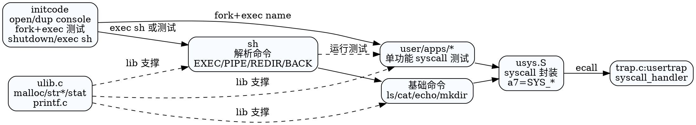

## 用户态概览

```
boot -> kernel userinit()
      -> exec initcode (ELF)
           ├─ sets up FDs/stdin/stdout/stderr
           ├─ 运行内置测试/示例 app
           └─ shutdown() 结束 (或 exec "sh")

用户程序:
  - libc 子集：ulib.c/printf.c/malloc.c
  - 系统调用封装：usys.S + user.h
  - 常用工具：sh/ls/cat/echo/mkdir 等
  - syscall 覆盖性测试：user/apps 下按调用号拆分的小程序
```

- 目录结构：`user/`（核心库与工具）、`user/apps/`（按系统调用划分的最小测试）、`initcode.*`（初始用户态进程）、`user.ld`/`user-riscv.ld`（用户链接脚本）。
- 构建产物：`initcode` 会被编译为二进制 `initcode.bin`，`kernel` 在 `userinit()` 中将其拷贝到用户页表，设置 `p->trapframe->epc=0` 启动。

## 启动链路：initcode 与 shell

1) **userinit() (kernel)**：通过 `allocproc()` 创建第一个进程，映射 TRAMPOLINE/TRAPFRAME，拷贝 `initcode.bin`，设置 `sz` 与用户栈。
2) **initcode/main() (user/initcode.c)**：
   - 确保 `console` 存在：`open` 或 `mknod` + `open`，`dup` 两次得到 fd 0/1/2。
   - 调用 `test_` 运行一组示例应用（如 `open/openat/getcwd/mkdir_/chdir/getdents`），每个测试 `fork` 后在子进程中 `exec(name, argv)`，父进程 `wait`。
   - 最后 `shutdown()` 触发内核关机。可改为 `exec("sh", argv)` 转入交互 shell。
3) **shell (user/sh.c)**：小型解释器，支持：
   - 顺序/管道/后台：`cmd1 | cmd2`，`cmd1 ; cmd2`，`cmd &`
   - 重定向：`<`、`>`、`>>`
   - 内置 `cd`（在父进程执行），其他命令通过 `exec`。
   - 解析器：递归下降，节点类型 EXEC/REDIR/PIPE/LIST/BACK。

交互链路示意：
```
initcode -> (可切到) sh
  输入行解析 -> 构建 AST(cmd)
  runcmd(cmd):
    EXEC: exec(argv)
    REDIR: open()/dup()/close() 后递归 runcmd
    PIPE: pipe() + 双子进程 dup/close
    LIST: fork 运行左，再 wait，执行右
    BACK: fork 后子进程运行子命令
```

## 用户库与系统调用封装

- **user.h**：声明系统调用与常用 libc 接口；`exit` 标记为 `noreturn`。
- **ulib.c**：`malloc/free`（简单堆扩展，依赖 `sbrk`）、`memmove/memset/strcmp/atoi` 等基础函数；`stat` 调用 `fstat` 获取文件信息。
- **printf.c**：精简版 `printf/fprintf`，支持 `%d/%p/%s/%x`，`printfYellow` 提供彩色输出。
- **usys.S**：为每个用户可见的 syscall 生成 `ecall` 包装（使用 `a7=SYS_xxx`，返回值置于 `a0`）；生成自 `usys.pl`。
- **user.ld/user-riscv.ld**：链接脚本把代码放置在低地址，入口 `_main`，栈顶由内核在 `exec` 时设置。

系统调用调用栈：
```
app -> user.h 原型 -> usys.S ecall
     -> uservec/trampoline -> trap.c:usertrap
     -> syscall_handler -> sys_* 实现 -> 返回 a0
     -> usertrapret/userret -> 回到 app
```

## 内置工具与示例程序

基础命令（位于 `user/`）：
- `sh`：交互 shell。
- `ls`：列目录；使用 `open/read` 读取目录项，`printf` 展示。
- `cat`：顺序读取文件/标准输入到标准输出。
- `echo`：打印参数。
- `mkdir`：创建目录。

系统调用/特性验证程序（位于 `user/apps/`，通常单调用号对应一文件，便于逐个测试）：
- 进程/调度：`fork`、`clone`、`yield`、`wait`、`waitpid`。
- 文件/目录：`open`、`openat`、`close`、`dup`/`dup2`、`getdents`、`fstat`、`mkdir_`、`unlink`、`pipe`、`mount/umount`。
- 时间：`sleep`、`gettimeofday`、`times`。
- 内存：`brk`、`mmap`、`munmap`。
- 其他：`chdir`、`getcwd`、`uname`、`write/read` 等。
- 辅助：`run-all.sh` 依次运行测试集合；`text.txt` 供 `cat/open/read` 使用。

> 建议修改/新增 syscall 时，在 `user/apps/` 添加最小 reproducer，方便 `initcode` 或 `run-all.sh` 批量回归。

## 构建与加载要点

- 用户态目标使用独立的链接脚本与 `-nostdlib`，依赖 `ulib/printf/usys` 形成最小运行时。
- `Makefile`/`run.sh` 会将用户程序打包到镜像（或通过 `mkfs`）供内核加载；`initcode.bin` 直接内嵌到内核二进制，被 `userinit()` 拷贝。
- 内核执行 `exec` 时会为每个用户程序创建用户页表，映射 TRAMPOLINE/TRAPFRAME，并设置用户栈（`sz` 顶部）。

## 调试与扩展提示

- 如果新增 syscall：更新 `src/syscall/syscall.h` 调用号、在 `syscall.c` 注册、提供 `sys_*` 实现，并在 `usys.pl`/`user.h` 增加原型，配一个 `user/apps/` 用例。
- 如果用户态崩溃，可在 `trap.c` 中查看 `scause/stval/sepc`；缺页或地址错误多为指针/栈问题。
- 对 shell 扩展：可添加内置命令（直接在 `sh.c` 的主循环识别）或支持环境变量/通配符。
- 对测试集：保持单一职责小程序，便于定位；必要时在 `initcode` 切换要运行的集合或改为 `exec("sh")` 进入交互调试。

## DOT 图（用户态运行时与工具）


