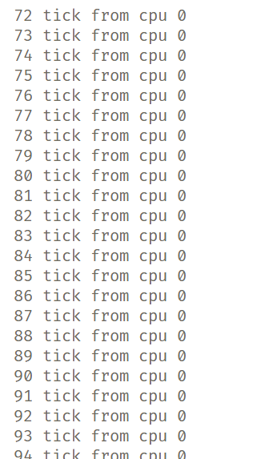
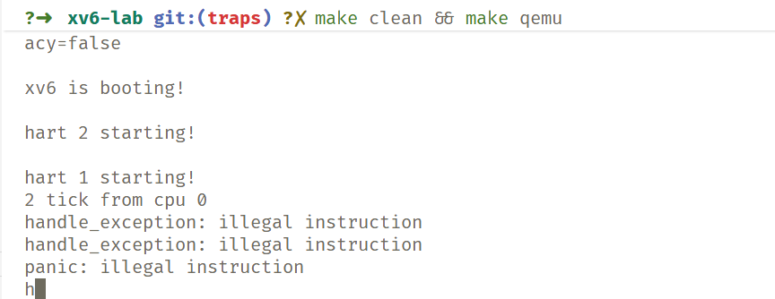

# 阶段 03 实验报告：中断处理与时钟管理

[仓库地址在此处](https://github.com/gan-rui-lin/xv6-lab)

此份报告请执行 `git branch traps` 来查看

## 实验目标

通过分析 **xv6** 的中断处理机制，理解操作系统如何响应硬件事件，实现完整的中断处理框架和时钟中断驱动的任务调度。最终能够正确设置中断向量表、实现上下文保存与恢复，并基于时钟中断驱动调度器运行。

实验要求掌握以下内容：

1. RISC-V **中断机制与特权级委托**；
2. **中断与异常处理流程**；
3. xv6 的中断分发框架（`trap.c`、`kernelvec.S`）；
4. **时钟中断**的设置与调度触发机制；
5. 异常处理机制的设计与实现。

---

## 任务完成情况与问题回答

### 任务 1：理解 RISC-V 中断架构

1. **特权级委托机制**

   * 通过 `mideleg` 和 `medeleg` 控制哪些中断/异常由 M 模式委托至 S 模式处理；

   * xv6 通过以下指令实现时钟中断委托：

     ```c
     w_mideleg(r_mideleg() | (1 << 5)); // 委托时钟中断
     ```

   * 这样允许操作系统在 S 模式直接处理中断事件，提升效率。

2. **中断寄存器组合**

   | 寄存器             | 作用      |
   | --------------- | ------- |
   | `mie/sie`       | 中断使能寄存器 |
   | `mip/sip`       | 中断挂起寄存器 |
   | `mtvec/stvec`   | 中断向量基址  |
   | `mcause/scause` | 中断原因寄存器 |

3. **思考题**

   * 为什么时钟中断在 M 模式产生，却在 S 模式处理？
    > 在 RISC-V 架构中，时钟中断信号（timer interrupt）最初由机器模式（M 模式）的硬件定时器产生。但是，操作系统（如 xv6）运行在 S 模式，并不希望每次中断都陷入机器模式再切换回来，这样会带来额外的开销。所以，RISC-V 提供了中断委托机制。
   * 如何理解“中断是异步的，异常是同步的”？
    > 中断是由外部设备或时钟触发的异步事件，与当前指令无关；异常则是执行指令过程中发生的同步错误事件，如非法指令或页故障。

---

### 任务 2：分析 xv6 的中断处理流程

1. **`start.c` 的中断初始化**

   * 设置 `mtvec` 指向 `timervec`，实现机器模式下的中断入口；
   * 在 `timervec` 中完成下一次时钟中断时间设置后，触发 S 模式中断。
   * S 模式中断统一由 `kernelvec` 去管理，转向相应的中断处理函数。

2. **`kernelvec.S` 的上下文保存**

   * 负责保存被打断进程的寄存器现场；
   * 保存所有寄存器（除`tp`寄存器 以减少性能开销；
   * 使用内核栈进行保存与恢复

3. **`trap.c` 的中断分发**

   * `usertrap()` 与 `kerneltrap()` 分别处理用户态与内核态陷入；
   * `devintr()` 用于识别中断来源并调用对应处理函数。

---

### 任务 3：设计中断处理框架

1. **接口设计**

   ```c
   typedef void (*interrupt_handler_t)(void);

   void trap_init(void);
   void register_interrupt(int irq, interrupt_handler_t h);
   void enable_interrupt(int irq);
   void disable_interrupt(int irq);
   ```

2. **设计目标**

   * 支持中断注册、注销；
   * 可扩展更多中断源；
   * 考虑中断优先级与嵌套支持。
   * 对于

### 任务 4：实现上下文保存与恢复

1. **保存内容**

   * 调用者保存寄存器与被调用者保存寄存器；
   * 临时寄存器与栈指针管理；
   * 确保中断前后上下文一致。

2. **实现策略**

   * 在 `kernelvec.S` 中手动压栈保存；
   * 调用 `kerneltrap` 处理；
   * 返回时弹栈恢复寄存器后执行 `sret`。

   【填写：你的保存/恢复实现及栈管理细节】
   【填写：对性能与正确性的考虑】

---


### 任务 6：异常处理机制

1. **异常分类**

   * 非法指令、页故障、系统调用等；
   * 在 `handle_exception()` 中根据 `scause` 分派。

2. **异常处理函数示例**

   ```c
   void handle_exception(struct trapframe *tf) {
       uint64 cause = r_scause();
       switch (cause) {
           case 8: handle_syscall(tf); break;
           case 13: handle_load_page_fault(tf); break;
           default: panic("Unknown exception");
       }
   }
   ```

---

## 测试与调试结果

1. **时钟中断测试**

   * 使用 `test_timer_interrupt()` 验证中断触发；
   * 检查输出是否符合预期。

   见下图。

   
   

2. **异常测试**

   * 故意触发非法指令或页故障；
   * 验证 `handle_exception()` 是否正确响应。
   如下图所示。

   

---

## 思考题回答

1. **为什么时钟中断需要 M→S 委托？**
    ```plain
    [硬件] CLINT 定时器到期
     ↓
    [M 模式] 进入 timervec
        ├─ 保存寄存器
        ├─ 更新下一次 mtimecmp
        ├─ 设置 sip 触发软件中断
        └─ mret 返回
        ↓
    [S 模式] 检测到软件中断 → 进入 kernelvec
        ├─ 保存上下文
        ├─ 调用 kerneltrap()
        │    └─ devintr() → yield() → scheduler()
        └─ 恢复上下文
        ↓
    [继续执行被中断的任务或下一个进程]
    ```

尽管 timervec 中通过 csrw sip, 2 手动触发了 S 模式软件中断，但若未在 mideleg 中委托该类型中断，硬件仍不会将控制权交给 S 模式。
因此，mideleg 并非可选项，而是决定 S 模式能否响应陷阱的关键机制。
它相当于“授权书”，没有授权，S 模式即使收到信号也无法进入陷阱入口。


---

## 总结

本实验通过实现 **中断处理框架** 和 **时钟中断驱动的调度系统**，深入理解了 RISC-V 的中断委托机制与 xv6 的陷入处理流程。实验重点在于：

* 熟悉中断上下文保存与恢复；
* 掌握时钟中断的触发与调度机制；
* 学会设计可扩展的中断框架；
* 理解中断与异常的区别及其处理逻辑。
