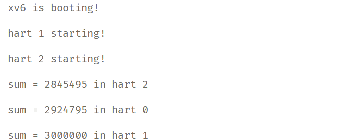

# 阶段 01 实验报告：RISC-V 引导与裸机启动

## 实验目标

本实验旨在通过参考 xv6 的启动机制，理解并实现最小操作系统的引导过程，最终能够在 QEMU 环境中正确输出 `"Hello World!"`。通过实验，要求掌握以下内容：

1. RISC-V 裸机启动流程的基本机制；
2. 启动汇编代码的编写方法；
3. 链接脚本的基本结构与作用；
4. 串口驱动的最小实现；
5. C 主函数与启动流程的衔接。

## 任务完成情况与问题回答

### 任务 1：理解 xv6 启动流程

1. **阅读 `kernel/entry.S`**

   * 为什么第一条指令是设置栈指针？

     > 因为在 `start.c` 中，我们声明了 `stack0` 作为全局的栈数组供 **所有的核** 使用，每个核有着独立的 4096 字节的大小。设置完栈指针之后我们才能找到对应核所对应可用的栈空间。

   * `la sp, stack0` 中的 `stack0` 在哪里定义？

     > 在 `start.c` 中。

   * 为什么要清零 BSS 段？

     > 从规范上来说，BSS 段确实应该均初始化为 0；从实际情况上来说，如果 BSS 段的内容没有被 **未初始化而使用**, 那么 BSS 清零的操作就是没必要的。

   * 如何从汇编跳转到 C 函数？

     > 实际上，通过编译、汇编、链接阶段后，所有的代码都变成了对应架构的汇编指令。从程序的编写者角度，我们从 `entry.S` 部分转向执行 `start.c` 中的 `void start()` 函数，是通过链接器得到 `start` 函数实际在 `kernel/kernel` 这一 ELF 文件的代码段实际地址并使用 `j` 指令进行跳转实现的。

2. **分析 `kernel/kernel.ld`**

   * `ENTRY(_entry)` 的作用是什么？

     > 在 kernel.ld 文件中，ENTRY(_entry) 这一行用于指定程序的入口点（entry point）为 `_entry`，从而让内核从 `entry.S` 处启动。

   * 为什么代码段要放在 `0x80000000`？

     > 因为地址范围 `0x0`-`0x80000000` 包含 I/O 设备，且 `qemu` 运行内核的时候默认从这个指令地址开始。

   * `etext`、`edata`、`end` 符号有什么用途？

    > 是用于后面编程时确定内存布局的几个重要地址分界。举例而言，`end` 标识了 `bss` 段的结束，更高的地址空间就可以用于堆内存分配了。在 `kinit()` 函数里，`freerange(end, (void*)PHYSTOP); ` 的作用是把从 end 到物理内存上限 PHYSTOP 之间的内存区域加入到空闲内存池，供后续分配使用。再比如说这里的代码段通过 `etext` 的分界去确定内存页的读写、执行的权限。

    ```c
    // 映射内核代码段（只读+可执行）
    kvmmap(kpgtbl, KERNBASE, KERNBASE, (uint64)etext-KERNBASE, PTE_R | PTE_X);
   
    // 映射内核数据段和物理内存（可读+可写）
    kvmmap(kpgtbl, (uint64)etext, (uint64)etext, PHYSTOP-(uint64)etext, PTE_R | PTE_W);
    ```

3. **深入思考**

   * xv6 的内存管理很复杂，最小系统需要哪些部分？

     > 可以只管理栈空间的内存并且完全使用物理内存。最小系统不涉及文件管理、中断处理、进程管理，而直接在内核完成所有操作。

### 任务 2：设计最小启动流程

执行 `git checkout 阶段01` 可得到当前阶段代码

1. **启动流程图**
   `entry.S`(分配栈空间) -> `start.c`(通过 uart 打印 hello world)

   ```mermaid
    flowchart TD
        A[QEMU 加载内核镜像] --> B[entry.S  清零 BSS 段； 分配栈空间； 跳转到 C 函数]
        B --> C[start.c初始化 UART 打印  'Hello World!']
        C --> D[程序结束进入死循环]
   ```


2. **内存布局方案**

   ``` 
   0x80000000  ──────── > .text (代码段)
   0x80001000  ──────── > .rodata (只读数据)
   0x80002000  ──────── > .data (已初始化数据)
   0x80002000  ──────── > .bss  (未初始化数据，大小 32 KB)
   0x8000A000+ ──────── > heap
   ```


3. **硬件初始化步骤**

   * 栈应该放在内存的哪个位置？需要多大？

     > 一般放在 BSS 段。一般 `4KB` 大小。

   * 是否需要清零 BSS 段？为什么？

     > 见任务 1 对应回答。

   * 最简单串口输出需要配置哪些寄存器？

     > 最简单串口输出只需要使用轮询方式进行输出。只需要配置 line status register(LSR) 和 transmit holding register (THR) 即可。


### 任务 3：实现启动汇编代码

* 编写了 `src/boot/entry.S`，实现以下功能：

  1. 设置入口点与栈指针；
  2. （可选）清零 BSS 段；
  3. 跳转至 C 主函数；
  4. 在关键位置插入调试字符输出。

验证情况：

见对应代码。


### 任务 4：编写链接脚本

* 基于 xv6 的 `kernel.ld`，简化后完成：

  1. 设置起始地址为 `0x80000000`；
  2. 按顺序组织代码段、数据段、BSS 段；
  3. 定义必要符号供 C 代码使用。

见对应代码。


### 任务 5：实现串口驱动

* 参考 xv6 `uart.c`，实现了最小 UART 输出函数：

  * `void uart_putc(char c);`
  * `void uart_puts(char *s);`

关键点总结：

* UART 基本寄存器地址：

  * `THR (0x10000000)`
  * `LSR (0x10000005)`

验证情况：

见对应代码。

总的启动结果如下：


## 思考题回答

1. **启动栈的设计**

   * 栈大小确定方法：根据程序的调用深度、局部变量使用量、以及中断处理的需要来估算，一般分配几 KB 即可满足最小系统需求。一般分配 `4KB` 大小即可。
   * 栈溢出后果及检测方法：溢出会覆盖全局数据或代码，导致系统异常甚至崩溃。可以在栈边界设置金丝雀值来检测溢出。

2. **BSS 段清零**

   * 全局变量不清零的现象：未初始化的全局/静态变量会包含随机值，导致逻辑错误或不可预期的行为。
   * 省略清零的条件：在极简系统、且保证所有全局变量都手动初始化时，可以省略。

3. **与 xv6 的对比**

   * 简化了哪些部分：去掉了多核支持、分页机制、复杂的内存管理和进程调度，只保留单核裸机启动和最小外设驱动。
   * 简化可能带来的问题：系统缺乏扩展性和健壮性，无法运行多进程程序，也不具备内存保护能力。

4. **错误处理**

   * UART 初始化失败的应对：在最小系统中可以进入死循环，避免系统继续运行导致错误扩散。
   * 最小错误显示机制：通过 UART 输出错误码或固定字符，用于提示硬件或启动失败。


## 额外任务实现：

### 并行加法实验

对应代码和运行效果可执行 `git checkout 并行加法` 运行 `make qemu` 复现。

大致实现思路是在 hart0 去初始化一个 `add_lock`, 并在每次 `sum` 自增 时候去上锁放锁。

**运行截图**



### 并行输出实验


对应代码和运行效果可执行 `git checkout 并行输出` 运行 `make qemu` 复现。
不在 `printf` 级别去等待 `pr` 锁，或者直接使用 `uart_puts` 函数，由于不同核之间没有同步机制，此时的输出是乱序的。

**运行截图**


## 实验总结

本次实验通过实现最小的 RISC-V 裸机引导过程，初步掌握了操作系统启动的核心机制。实验过程中，重点体会到以下几点：

1. 栈的初始化与内存布局的重要性；
2. 链接脚本在系统启动中的关键作用；
3. 硬件最小驱动实现的基本流程；
4. 通过分阶段调试逐步构建系统功能的有效性。