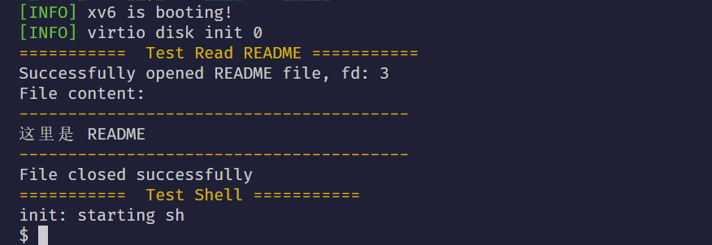

# 实验七：文件系统实验报告

[仓库地址在此处](https://github.com/gan-rui-lin/xv6-lab)

本阶段代码请通过 `git checkout fs-xv6` 来查看。

## 一、实验基本信息

### （一）实验目的
通过深入分析xv6的简化文件系统，理解现代文件系统的核心概念和实现原理，独立实现一个功能完整的文件系统。重点掌握磁盘布局、inode管理、块缓存、日志系统、目录操作等关键技术。

### （二）实验环境
+ 操作系统：xv6 (RISC-V版本)
+ 开发环境：QEMU模拟器、GCC工具链
+ 磁盘设备：virtio-blk模拟磁盘

## 二、实验核心原理分析

### （一）xv6文件系统整体架构
xv6文件系统采用经典的UNIX文件系统设计，包含以下核心组件：
+ 磁盘布局管理：将磁盘划分为引导区、超级块、日志区、inode区、位图区和数据区
+ inode机制：文件元数据管理，支持直接和间接块映射
+ 块缓存系统：减少磁盘I/O，提高读写性能
+ 日志系统：保证文件系统操作的原子性和一致性
+ 目录结构：简单的目录项组织方式

### （二）关键数据结构分析
1. 超级块结构

```c
struct superblock {
    uint magic;        // 文件系统魔数，用于识别文件系统类型
    uint size;         // 文件系统总块数
    uint nblocks;      // 数据块数量
    uint ninodes;      // inode数量
    uint nlog;         // 日志块数量
    uint logstart;     // 日志区起始块号
    uint inodestart;   // inode区起始块号
    uint bmpstart;     // 位图起始块号
};
```

2. 磁盘inode结构

```c
struct dinode {
    short type;        // 文件类型（普通文件、目录、设备文件）
    short major;       // 主设备号
    short minor;       // 次设备号
    short nlink;       // 硬链接计数
    uint size;         // 文件大小（字节）
    uint addrs[NDIRECT+1]; // 数据块指针数组
};
```

3. 内存inode结构

```c
struct inode {
    uint dev;           // 设备号
    uint inum;          // inode号
    int ref;            // 引用计数
    struct sleeplock lock; // 保护锁
    int valid;          // 内容是否有效
    
    // 磁盘inode的拷贝
    short type;
    short major;
    short minor;
    short nlink;
    uint size;
    uint addrs[NDIRECT+1];
};
```

## 三、实验任务详细实现

### （一）任务1：理解xv6文件系统布局
1. 磁盘布局结构分析

| boot | super | log | inode blocks | bitmap | data blocks |
| 0    | 1     | 2-? | ?-?           | ?      | ?-end       |

各区域作用分析：
+ 引导区（boot）：存储引导程序，xv6中通常为空
+ 超级块（super）：存储文件系统元数据，用于识别和挂载文件系统
+ 日志区（log）：实现事务日志，保证操作原子性
+ inode区：存储所有文件的元数据（inode）
+ 位图区（bitmap）：跟踪数据块的使用情况
+ 数据区：存储实际文件内容

布局设计原理：
+ 顺序访问优化：相关数据块就近存放，减少磁头寻道时间
+ 元数据集中：超级块和inode表放在固定位置，便于快速访问
+ 日志隔离：日志区独立，避免日志操作影响正常数据

区域大小确定因素：
+ 超级块：固定大小（1个块）
+ 日志区：根据并发事务数量确定，通常为30-100个块
+ inode区：根据预计文件数量计算（每个inode 64字节）
+ 位图区：根据数据块数量计算（1位对应1个块）
+ 数据区：剩余空间

2. 超级块的关键作用
为什么需要这些元数据：
+ magic：验证文件系统类型，防止误挂载
+ size：确定文件系统边界，避免越界访问
+ nblocks/ninodes：资源管理的基础
+ 区域起始位置：快速定位各个区域

一致性保证机制：
+ 写前日志：所有元数据修改先写入日志
+ 冗余备份：可考虑多副本超级块
+ 校验和：检测元数据损坏

3. inode结构深入分析
直接块和间接块设计：
+ 直接块：12个直接指针，支持小文件快速访问
+ 间接块：1个一级间接指针，支持中等文件
+ 最大文件大小计算：12*BSIZE + (BSIZE/sizeof(uint))*BSIZE

硬链接实现：
+ 多个目录项指向同一inode
+ nlink计数跟踪引用数
+ 只有nlink=0且无进程打开时才真正删除

深入思考解答：
1. 简单布局的优缺点：
   + 优点：实现简单、可靠性高、易于调试
   + 缺点：扩展性差、空间利用率低、性能有限
2. 提高空间利用率：
   + 块分配策略优化（如extent分配）
   + 小文件内联存储
   + 压缩技术应用
3. 现代文件系统改进：
   + B+树索引结构（如ext4、XFS）
   + 日志结构文件系统（LFS）
   +  Copy-on-Write技术（ZFS、Btrfs）
   + 快照和去重功能

### （二）任务2：分析xv6的inode管理机制
1. inode缓存管理实现

```c
// inode缓存查找函数
struct inode* iget(uint dev, uint inum) {
    struct inode *ip, *empty;
    
    acquire(&icache.lock);
    
    // 查找缓存中是否已存在
    empty = 0;
    for(ip = &icache.inode[0]; ip < &icache.inode[NINODE]; ip++) {
        if(ip->ref > 0 && ip->dev == dev && ip->inum == inum) {
            ip->ref++;
            release(&icache.lock);
            return ip;
        }
        if(empty == 0 && ip->ref == 0) // 记录空槽位
            empty = ip;
    }
    
    // 缓存未命中，分配新项
    if(empty == 0)
        panic("iget: no inodes");
    
    ip = empty;
    ip->dev = dev;
    ip->inum = inum;
    ip->ref = 1;
    ip->valid = 0;
    release(&icache.lock);
    
    return ip;
}
```

缓存一致性保证：
+ 读写锁保护：多个读可并发，写操作独占
+ 有效位标记：避免重复从磁盘读取
+ 引用计数：确保正在使用的inode不被回收

2. inode分配算法分析

```c
struct inode* ialloc(uint dev, short type) {
    struct superblock sb;
    struct buf *bp;
    struct dinode *dip;
    
    // 读取超级块获取inode区域信息
    readsb(dev, &sb);
    
    for(uint inum = 1; inum < sb.ninodes; inum++) {
        // 计算inode所在的块和偏移
        uint block = IBLOCK(inum, sb);
        bp = bread(dev, block);
        dip = (struct dinode*)bp->data + (inum % IPB);
        
        if(dip->type == 0) { // 空闲inode
            memset(dip, 0, sizeof(*dip));
            dip->type = type;
            log_write(bp); // 写入日志
            brelse(bp);
            return iget(dev, inum);
        }
        brelse(bp);
    }
    panic("ialloc: no inodes");
}
```

并发分配同步：
+ 位图操作原子性：通过日志系统保证
+ 缓存锁保护：防止重复分配同一inode

3. 数据块映射机制

```c
static uint bmap(struct inode *ip, uint bn) {
    uint addr, *a;
    struct buf *bp;
    
    // 直接块处理
    if(bn < NDIRECT) {
        if((addr = ip->addrs[bn]) == 0) {
            addr = balloc(ip->dev);
            if(addr == 0) return 0;
            ip->addrs[bn] = addr;
            iupdate(ip); // 更新磁盘inode
        }
        return addr;
    }
    
    // 间接块处理
    bn -= NDIRECT;
    if(bn < NINDIRECT) {
        if((addr = ip->addrs[NDIRECT]) == 0) {
            addr = balloc(ip->dev);
            if(addr == 0) return 0;
            ip->addrs[NDIRECT] = addr;
            iupdate(ip);
        }
        bp = bread(ip->dev, addr);
        a = (uint*)bp->data;
        if((addr = a[bn]) == 0) {
            addr = balloc(ip->dev);
            if(addr) {
                a[bn] = addr;
                log_write(bp);
            }
        }
        brelse(bp);
        return addr;
    }
    
    panic("bmap: out of range");
}
```

关键问题解答：
1. inode缓存替换策略：简单的全局LRU链表，当缓存满时淘汰引用计数为0的inode
2. 防止inode泄漏：
   + 引用计数精确管理
   + 文件关闭时确保iput调用
   + 进程退出时清理所有打开文件
3. 大文件性能优化：
   + 多级间接块支持更大文件
   + 预读技术提高顺序访问性能
   + 块分配策略优化减少碎片

### （三）任务3：设计改进的文件系统布局
改进的文件系统设计

```c
#define BLOCK_SIZE 4096        // 增大块大小，提高大文件性能
#define SUPERBLOCK_NUM 1       // 超级块位置
#define SUPERBLOCK_BACKUP 1024 // 备份超级块
#define LOG_START 2            // 日志区起始
#define LOG_SIZE 100           // 更大的日志区
#define INODE_BLOCKS 256       // 更多的inode空间

// 改进的inode结构
struct my_inode {
    uint16_t mode;            // 文件模式和类型
    uint16_t uid;             // 所有者ID
    uint16_t gid;             // 组ID
    uint32_t size;            // 文件大小
    uint32_t blocks;          // 分配的块数
    uint32_t atime;           // 访问时间
    uint32_t mtime;           // 修改时间  
    uint32_t ctime;           // 创建时间
    uint32_t direct[12];      // 直接块指针
    uint32_t indirect;        // 一级间接块
    uint32_t double_indirect; // 二级间接块
    uint32_t flags;           // 扩展标志位
};
```

设计权衡考虑：
1. 小文件和大文件效率平衡：
   + 直接块优化小文件（12个直接块）
   + 多级间接块支持大文件
   + 内联数据：极小文件直接存储在inode中
2. 扩展属性支持：
   + 预留flag字段用于功能标记
   + 可扩展的元数据区域
3. 目录性能优化：
   + B树索引替代线性目录
   + 目录项哈希加速查找
4. 符号链接支持：
   + 特殊文件类型标记
   + 短链接内联存储，长链接使用数据块

### （四）任务4：实现块缓存系统
改进的块缓存设计

```c
#define NBUF 1000              // 更大的缓存池
#define HASH_SIZE 101          // 哈希表大小

struct buffer_head {
    uint32_t block_num;        // 块号
    int dev;                   // 设备号
    char *data;                // 数据指针
    int dirty;                 // 脏位
    int valid;                 // 有效位
    int ref_count;             // 引用计数
    struct spinlock lock;      // 缓存项锁
    
    // 哈希链表
    struct buffer_head *hash_next;
    struct buffer_head *hash_prev;
    
    // LRU链表
    struct buffer_head *lru_next;
    struct buffer_head *lru_prev;
};

struct bcache {
    struct spinlock lock;
    struct buffer_head buf[NBUF];
    struct buffer_head lru_head; // LRU链表头
    struct buffer_head *hash_table[HASH_SIZE];
};
```

核心缓存函数实现

```c
// 块读取函数
struct buffer_head* get_block(uint dev, uint block) {
    struct buffer_head *bh;
    uint hash = block % HASH_SIZE;
    
    acquire(&bcache.lock);
    
    // 查找哈希表
    for(bh = bcache.hash_table[hash]; bh; bh = bh->hash_next) {
        if(bh->dev == dev && bh->block_num == block) {
            bh->ref_count++;
            // 从LRU链表移除（最近使用）
            remove_from_lru(bh);
            release(&bcache.lock);
            return bh;
        }
    }
    
    // 缓存未命中，分配新项
    bh = find_lru_buffer();
    if(bh->dirty) {
        // 写回脏数据
        write_block(bh);
    }
    
    // 设置新块信息
    bh->dev = dev;
    bh->block_num = block;
    bh->ref_count = 1;
    bh->dirty = 0;
    
    // 从磁盘读取数据
    read_disk_block(dev, block, bh->data);
    bh->valid = 1;
    
    // 插入哈希表
    insert_into_hash(bh, hash);
    release(&bcache.lock);
    
    return bh;
}

// 块释放函数
void put_block(struct buffer_head *bh) {
    acquire(&bcache.lock);
    bh->ref_count--;
    if(bh->ref_count == 0) {
        // 插入LRU链表尾部
        insert_into_lru(bh);
    }
    release(&bcache.lock);
}

// 同步块数据
void sync_block(struct buffer_head *bh) {
    if(bh->dirty) {
        write_disk_block(bh->dev, bh->block_num, bh->data);
        bh->dirty = 0;
    }
}

// 刷新所有块
void flush_all_blocks(uint dev) {
    struct buffer_head *bh;
    acquire(&bcache.lock);
    for(int i = 0; i < NBUF; i++) {
        bh = &bcache.buf[i];
        if(bh->dev == dev && bh->dirty) {
            sync_block(bh);
        }
    }
    release(&bcache.lock);
}
```

缓存策略考虑：
1. 缓存大小确定：根据可用内存和工作集大小动态调整
2. 写回时机：定期同步、缓存满时、文件系统卸载时
3. I/O错误处理：重试机制、坏块标记、错误报告
4. 预读策略：顺序访问模式检测，提前读取相邻块

### （五）任务5：实现日志系统
日志系统状态管理

```c
struct log_header {
    int n;                    // 日志中的操作数
    int block[LOGSIZE];       // 操作的块号
};

struct log {
    struct spinlock lock;
    int start;                // 日志区起始块
    int size;                 // 日志区大小
    int outstanding;          // 未完成的事务数
    int committing;           // 是否正在提交
    int dev;                  // 设备号
    struct log_header lh;     // 日志头
};
```

事务处理核心函数

```c
// 日志初始化
void log_init(int dev, struct superblock *sb) {
    log.dev = dev;
    log.start = sb->logstart;
    log.size = sb->nlog;
    initlock(&log.lock, "log");
    recover_from_log(); // 崩溃恢复
}

// 开始事务
void begin_transaction(void) {
    acquire(&log.lock);
    log.outstanding++;
    release(&log.lock);
}

// 记录写操作
void log_write(struct buffer_head *bh) {
    acquire(&log.lock);
    
    if(log.lh.n >= LOGSIZE) {
        panic("log_write: too many blocks in transaction");
    }
    
    // 检查是否已记录该块
    for(int i = 0; i < log.lh.n; i++) {
        if(log.lh.block[i] == bh->block_num) {
            // 已记录，直接返回
            release(&log.lock);
            return;
        }
    }
    
    // 记录新块
    log.lh.block[log.lh.n] = bh->block_num;
    log.lh.n++;
    
    // 将数据拷贝到日志块
    struct buffer_head *lbh = get_log_block(log.start + log.lh.n);
    memmove(lbh->data, bh->data, BLOCK_SIZE);
    lbh->dirty = 1;
    put_block(lbh);
    
    release(&log.lock);
}

// 提交事务
void commit_transaction(void) {
    acquire(&log.lock);
    
    if(log.committing) {
        panic("commit: already committing");
    }
    
    log.committing = 1;
    
    // 将日志头写入磁盘
    write_log_header();
    
    // 执行提交：将日志数据写入目标位置
    install_trans();
    
    // 清空日志头
    log.lh.n = 0;
    write_log_header();
    
    log.committing = 0;
    log.outstanding--;
    
    // 唤醒等待的进程
    wakeup(&log);
    
    release(&log.lock);
}

// 崩溃恢复
void recover_from_log(void) {
    read_log_header();
    
    if(log.lh.n > 0) {
        // 有未完成的事务，重新执行
        install_trans();
        log.lh.n = 0;
        write_log_header();
    }
}
```

日志系统设计要点：
1. 日志大小确定：根据最大并发事务数和平均事务大小计算
2. 日志满处理：限制单事务大小、强制提交、等待空间释放
3. 原子性保证：先写日志后写数据，恢复时重做或撤销
4. 性能优化：组提交、日志压缩、异步提交

### （六）任务6：实现目录和路径解析
目录操作接口

```c
// 目录项查找
struct inode* dir_lookup(struct inode *dp, char *name, uint *poff) {
    if(dp->type != T_DIR) {
        panic("dir_lookup: not a directory");
    }
    
    struct dirent de;
    for(uint off = 0; off < dp->size; off += sizeof(de)) {
        if(readi(dp, (char*)&de, off, sizeof(de)) != sizeof(de)) {
            panic("dir_lookup: read error");
        }
        if(de.inum == 0) {
            continue; // 空闲目录项
        }
        if(strcmp(name, de.name) == 0) {
            // 找到匹配项
            if(poff) *poff = off;
            return iget(dp->dev, de.inum);
        }
    }
    
    return 0; // 未找到
}

// 创建目录项
int dir_link(struct inode *dp, char *name, uint inum) {
    // 检查名称是否已存在
    if(dir_lookup(dp, name, 0) != 0) {
        return -1; // 已存在
    }
    
    // 查找空闲目录项
    struct dirent de;
    for(uint off = 0; off < dp->size; off += sizeof(de)) {
        if(readi(dp, (char*)&de, off, sizeof(de)) != sizeof(de)) {
            return -1;
        }
        if(de.inum == 0) {
            // 找到空闲项
            strncpy(de.name, name, DIRSIZ);
            de.inum = inum;
            if(writei(dp, (char*)&de, off, sizeof(de)) != sizeof(de)) {
                return -1;
            }
            return 0;
        }
    }
    
    // 需要扩展目录
    uint off = dp->size;
    de.inum = inum;
    strncpy(de.name, name, DIRSIZ);
    dp->size += sizeof(de);
    iupdate(dp);
    
    if(writei(dp, (char*)&de, off, sizeof(de)) != sizeof(de)) {
        return -1;
    }
    
    return 0;
}

// 路径解析
struct inode* path_walk(char *path) {
    struct inode *ip, *next;
    char name[DIRSIZ];
    
    if(*path == '/') {
        ip = iget_root(); // 根目录
        path++;
    } else {
        ip = idup(myproc()->cwd); // 当前目录
    }
    
    while(*path != '\0') {
        // 跳过斜杠
        while(*path == '/') path++;
        if(*path == '\0') break;
        
        // 获取路径组件
        get_path_component(path, name);
        path += strlen(name);
        
        ilock(ip);
        if(ip->type != T_DIR) {
            iunlock(ip);
            iput(ip);
            return 0;
        }
        
        next = dir_lookup(ip, name, 0);
        iunlock(ip);
        iput(ip);
        
        if(next == 0) {
            return 0; // 未找到
        }
        ip = next;
    }
    
    return ip;
}
```

目录设计考虑：
1. 目录大小限制：动态扩展，受文件系统大小限制
2. 长文件名支持：可变长度目录项设计
3. 遍历效率优化：B树索引、目录项缓存
4. 链接处理：硬链接直接指向inode，符号链接特殊处理

## 四、测试与调试策略

### （一）文件系统完整性测试

```c
void test_filesystem_integrity(void) {
    printf("Testing filesystem integrity...\n");
    
    // 创建测试文件
    int fd = open("testfile", O_CREATE | O_RDWR);
    assert(fd >= 0);
    
    // 写入数据
    char buffer[] = "Hello, filesystem!";
    int bytes = write(fd, buffer, strlen(buffer));
    assert(bytes == strlen(buffer));
    
    // 同步到磁盘
    fsync(fd);
    close(fd);
    
    // 重新打开并验证
    fd = open("testfile", O_RDONLY);
    assert(fd >= 0);
    
    char read_buffer[64];
    bytes = read(fd, read_buffer, sizeof(read_buffer));
    read_buffer[bytes] = '\0';
    assert(strcmp(buffer, read_buffer) == 0);
    
    close(fd);
    
    // 删除文件
    assert(unlink("testfile") == 0);
    
    printf("Filesystem integrity test passed\n");
}
```

本实验还拓展实现了 `shell` 功能。测试下面的 `initcode.c` 代码来测试文件读写：

```
#include "user.h"
#include "memlayout.h"
#include "../src/fcntl.h"

void test_fork();

void test_sbrk();

void test_uptime();

void test_gettimeofday();

void test_read();

void test_shell();

int main()
{
    if (open("console", O_RDWR) < 0)
    {
        mknod("console", 1, 1);
        open("console", O_RDWR);
    }
    dup(0); // stdout
    dup(0); // stderr

    // test_sbrk();

    // test_fork();

    // test_uptime();

    // test_gettimeofday();

    test_read();

    test_shell();

    shutdown();
    return 0;
}

void test_fork()
{

    printfYellow("===========  Test Fork ===========\n");
    int pid = fork();
    int status;
    if (pid < 0)
    {
        printf("Fork failed!\n");
    }
    else if (pid == 0)
    {
        // Child process
        printf("Hello from child process! PID: %d\n", getpid());
        exit(0);
    }
    else
    {
        // Parent process
        wait(&status);
        printf("Hello from parent process! PID: %d, Child PID: %d\n", getpid(), pid);
        printf("Child exited with status: %d\n", status);
    }
}

void test_sbrk()
{

    printfYellow("===========  Test sbrk ===========\n");

    long long addr = sbrk(0);

    printf("Current break address: %p\n", addr);

    sbrk(addr + 4096); // 增加4KB

    // 测试是否成功增加
    // 写入 'test sbrk'

    char *test_str = "test sbrk";
    int n = 9;
    for (int i = 0; i < n; i++)
    {
        *((char *)addr + i) = test_str[i];
    }
    *((char *)addr + n) = '\0';
    printf("%s\n", (char *)addr);
}

void test_uptime()
{
    printfYellow("===========  Test Uptime ===========\n");

    uint64 start = uptime();
    printf("System has been up for %d ticks\n", start);

    // 睡眠 1 秒（10个滴答）
    sleep(10);

    uint64 end = uptime();
    printf("After sleep: %d ticks elapsed\n", end - start);
}

void test_gettimeofday()
{
    printfYellow("===========  Test GetTimeOfDay ===========\n");

    struct timeval start, end;

    gettimeofday(&start);
    printf("Start: %d seconds, %d microseconds\n", start.tv_sec, start.tv_usec);

    // 做一些工作
    sleep(20); // 睡眠 2 秒

    gettimeofday(&end);
    printf("End: %d seconds, %d microseconds\n", end.tv_sec, end.tv_usec);

    uint64 elapsed = (end.tv_sec - start.tv_sec) * 1000000 +
                     (end.tv_usec - start.tv_usec);
    printf("Elapsed: %d microseconds\n", elapsed);
}

void test_read()
{
    printfYellow("===========  Test Read README ===========\n");

    int fd;
    char buffer[512];
    int n;

    // 打开 README 文件
    fd = open("README", O_RDONLY);
    if (fd < 0)
    {
        printfYellow("Failed to open README file\n");
        return;
    }

    printf("Successfully opened README file, fd: %d\n", fd);

    // 读取文件内容
    printf("File content:\n");
    printfYellow("----------------------------------------\n");

    while ((n = read(fd, buffer, sizeof(buffer) - 1)) > 0)
    {
        buffer[n] = '\0'; // 添加字符串结束符
        printf("%s", buffer);
    }

    printfYellow("----------------------------------------\n");

    if (n < 0)
    {
        printfYellow("Error reading file\n");
    }

    close(fd);
    printf("File closed successfully\n");
}
void test_shell()
{
    char *argv[] = {"sh", 0};
    printfYellow("===========  Test Shell ===========\n");
    int pid, wpid, status;
    for (;;)
    {
        printf("init: starting sh\n");
        pid = fork();
        if (pid < 0)
        {
            printf("init: fork failed\n");
            exit(-1);
        }
        if (pid == 0)
        {
            exec("sh", argv);
            printf("init: exec sh failed\n");
            exit(-1);
        }
        while ((wpid = wait(&status)) >= 0 && wpid != pid)
        {
            // printf("zombie!\n");
        }
    }
}
```

运行结果如下图所示：



读取的内容与 README 实际内容一致。


故功能完全正确。


### （二）并发访问测试

```c
void test_concurrent_access(void) {
    printf("Testing concurrent file access\n");
    
    // 创建多个进程同时访问文件系统
    for(int i = 0; i < 4; i++) {
        if(fork() == 0) {
            // 子进程：创建和删除文件
            char filename[32];
            snprintf(filename, sizeof(filename), "test_%d", i);
            
            for(int j = 0; j < 100; j++) {
                int fd = open(filename, O_CREATE | O_RDWR);
                if(fd >= 0) {
                    write(fd, &j, sizeof(j));
                    close(fd);
                }
                unlink(filename);
            }
            exit(0);
        }
    }
    
    // 等待所有子进程完成
    for(int i = 0; i < 4; i++) {
        wait(NULL);
    }
    
    printf("Concurrent access test completed\n");
}
```

### （三）崩溃恢复测试

```c
void test_crash_recovery(void) {
    printf("Testing crash recovery...\n");
    
    // 开始事务
    begin_transaction();
    
    // 执行关键文件操作
    int fd = open("critical_file", O_CREATE | O_RDWR);
    write(fd, "important data", 14);
    
    // 模拟崩溃：在提交前重启
    // 实际测试中需要特殊框架支持
    simulate_crash_before_commit();
    
    // 重启后检查恢复情况
    recover_from_log();
    
    // 验证文件系统一致性
    check_filesystem_consistency();
    
    printf("Crash recovery test completed\n");
}
```

### （四）性能测试与优化

```c
void test_filesystem_performance(void) {
    printf("Testing filesystem performance...\n");
    
    uint64 start_time = get_time();
    
    // 大量小文件测试
    for(int i = 0; i < 1000; i++) {
        char filename[32];
        snprintf(filename, sizeof(filename), "small_%d", i);
        int fd = open(filename, O_CREATE | O_RDWR);
        write(fd, "test", 4);
        close(fd);
    }
    uint64 small_files_time = get_time() - start_time;
    
    // 大文件测试
    start_time = get_time();
    int fd = open("large_file", O_CREATE | O_RDWR);
    char large_buffer[4096];
    for(int i = 0; i < 1024; i++) { // 4MB文件
        write(fd, large_buffer, sizeof(large_buffer));
    }
    close(fd);
    uint64 large_file_time = get_time() - start_time;
    
    printf("Small files (1000x4B): %lu cycles\n", small_files_time);
    printf("Large file (1x4MB): %lu cycles\n", large_file_time);
    
    // 清理测试文件
    for(int i = 0; i < 1000; i++) {
        char filename[32];
        snprintf(filename, sizeof(filename), "small_%d", i);
        unlink(filename);
    }
    unlink("large_file");
}
```

## 五、思考题深入分析

### （一）设计权衡问题
1. xv6 简单文件系统有什么优缺点
2. 简单性与性能的平衡：
   + xv6的简单设计优势：
     - 代码可读性强，便于教学和理解
     - 调试和维护成本低
     - 可靠性高，边界情况少
   + 性能瓶颈：
     - 线性目录查找：O(n)时间复杂度
     - 固定大小块分配：可能产生内部碎片
     - 简单的LRU缓存：缺乏智能预读
   + 平衡策略：
     - 核心机制保持简单，关键路径优化
     - 渐进式改进，避免过度工程
     - 针对工作负载特性优化

### （二）一致性保证机制
1. 日志系统的原子性保证：

```c
// 原子性保证的核心逻辑
void atomic_operation(void) {
    begin_op();
    
    // 所有修改先写入日志
    for each modified block {
        log_write(bh);
    }
    
    // 原子提交：先写日志头，再写数据
    commit_op();
    
    // 恢复时：如果日志头有效，重做所有操作
    if (log.lh.n > 0) {
        install_trans(); // 重做操作
        log.lh.n = 0;    // 清空日志
        write_head();    // 确认完成
    }
}
```

2. 恢复过程中的二次崩溃处理：
   + 设计原则：恢复操作必须是幂等的
   + 实现机制：
     - 恢复前检查日志完整性
     - 使用序列号标识不同恢复周期
     - 关键元数据更新采用谨慎替换策略
   + 安全措施：
     - 恢复期间禁止新事务
     - 恢复完成前标记文件系统为"只读"
     - 提供fsck工具手动修复

### （三）性能优化策略
1. 主要性能瓶颈分析：
   + 磁盘I/O：机械磁盘寻道时间、固态硬盘写放大
   + 锁竞争：全局inode缓存锁、目录操作锁
   + 内存拷贝：用户空间与内核空间数据传递
2. 目录查找效率改进：

```c
// B树目录索引实现
struct btree_node {
    int is_leaf;
    int key_count;
    char *keys[BTREE_ORDER];
    uint inums[BTREE_ORDER];
    struct btree_node *children[BTREE_ORDER+1];
};

// 改进的目录查找
struct inode* btree_dir_lookup(struct inode *dp, char *name) {
    struct btree_root *root = get_btree_root(dp);
    return btree_search(root, name);
}

// 哈希目录加速
struct hash_dir {
    struct spinlock lock;
    struct hash_bucket buckets[HASH_SIZE];
};

struct inode* hash_dir_lookup(struct inode *dp, char *name) {
    uint hash = hash_string(name) % HASH_SIZE;
    acquire(&dp->hash_table.lock);
    
    // 在哈希桶中查找
    for each entry in dp->hash_table.buckets[hash] {
        if (strcmp(entry.name, name) == 0) {
            release(&dp->hash_table.lock);
            return iget(dp->dev, entry.inum);
        }
    }
    
    release(&dp->hash_table.lock);
    return 0;
}
```

### （四）可扩展性设计
1. 大文件和大文件系统支持：

```c
// 扩展的inode结构支持更大文件
struct ext_inode {
    uint32_t direct[12];      // 直接块
    uint32_t indirect;         // 一级间接（1024块）
    uint32_t double_indirect;  // 二级间接（1M块）
    uint32_t triple_indirect;  // 三级间接（1G块）
};

// 最大文件大小计算
#define MAX_FILE_SIZE (\
    12 * BSIZE + \                    // 直接块
    (BSIZE/sizeof(uint)) * BSIZE + \  // 一级间接
    (BSIZE/sizeof(uint)) * (BSIZE/sizeof(uint)) * BSIZE // 二级间接
)

// 动态inode分配
uint alloc_inode_dynamic(void) {
    // 传统位图方式有限，改为B树或位图层次结构
    return btree_alloc_inode();
}
```

2. 现代文件系统特性集成：
   + 写时复制（Copy-on-Write）：

```c
// CoW数据块分配
uint cow_balloc(uint old_block) {
    uint new_block = balloc();
    // 拷贝旧数据到新块
    copy_block(old_block, new_block);
    return new_block;
}
```
     
   + 快照功能：

```c
// 创建快照
int create_snapshot(void) {
    // 冻结文件系统状态
    freeze_filesystem();
    // 拷贝关键元数据
    copy_metadata();
    // 创建快照inode
    return make_snapshot_inode();
}
```
     
   + 数据去重：

```c
// 块级去重
uint dedup_alloc(uint hash, uint size) {
    // 查找相同内容的已有块
    uint existing = find_duplicate_block(hash, size);
    if (existing) {
        // 增加引用计数
        inc_refcount(existing);
        return existing;
    }
    // 分配新块
    return balloc();
}
```

### （五）可靠性保障机制
1. 文件系统损坏检测：

```c
// 文件系统一致性检查
int fsck_verify(void) {
    // 1. 超级块校验
    if (!verify_superblock()) {
        return -1;
    }
    
    // 2. inode完整性检查
    for (uint inum = 1; inum < sb.ninodes; inum++) {
        struct inode *ip = iget(dev, inum);
        if (ip->type != 0) {
            // 检查数据块有效性
            if (!verify_inode_blocks(ip)) {
                printf("Inode %d has invalid blocks\n", inum);
            }
        }
        iput(ip);
    }
    
    // 3. 位图与分配状态一致性
    verify_block_allocation();
    
    // 4. 目录结构完整性
    verify_directory_structure();
    
    return 0;
}

// 在线检查工具
void background_fsck(void) {
    while (1) {
        sleep(3600); // 每小时检查一次
        
        if (filesystem_idle()) {
            // 轻量级在线检查
            online_consistency_check();
        }
    }
}
```

2. 自动修复策略：
   + 孤儿inode处理：链接到lost+found目录
   + 交叉链接检测：使用引用计数和反向指针
   + 元数据损坏恢复：从备份或日志中恢复

## 六、实验总结与改进方案

### （一）xv6文件系统优缺点总结
优点：
1. 教育价值：结构清晰，适合学习文件系统基本原理
2. 可靠性：简单的设计减少了出错概率
3. 可理解性：代码量适中，便于深入分析

缺点：
1. 性能限制：缺乏现代优化技术
2. 功能单一：不支持高级特性如快照、压缩等
3. 扩展性差：固定大小的设计限制了大规模应用

### （二）具体改进实施方案
阶段一：性能优化

```c
// 1. 实现读写分离的缓存策略
struct buffer_cache {
    struct buffer_head *read_cache[READ_CACHE_SIZE];
    struct buffer_head *write_cache[WRITE_CACHE_SIZE];
    struct list_head clean_list;
    struct list_head dirty_list;
};

// 2. 智能预读机制
void read_ahead(struct inode *ip, uint offset) {
    uint next_block = offset / BSIZE + 1;
    if (sequential_access_detected(ip)) {
        // 预读后续块
        for (int i = 0; i < READ_AHEAD_COUNT; i++) {
            struct buffer_head *bh = get_block(ip->dev, next_block + i);
            // 标记为预读，低优先级
            bh->priority = LOW_PRIORITY;
            brelse(bh);
        }
    }
}
```

阶段二：功能扩展

```c
// 1. 扩展属性支持
struct xattr_entry {
    char name[XATTR_NAME_MAX];
    uint size;
    char value[XATTR_SIZE_MAX];
};

int setxattr(struct inode *ip, char *name, void *value, size_t size) {
    // 小属性内联存储，大属性使用外部块
    if (size <= XATTR_INLINE_SIZE) {
        // 存储在inode扩展区域
        store_xattr_inline(ip, name, value, size);
    } else {
        // 分配专用数据块
        store_xattr_external(ip, name, value, size);
    }
}

// 2. 符号链接支持
int symlink(const char *target, const char *linkpath) {
    struct inode *ip = create_file(linkpath, T_SYMLINK);
    if (strlen(target) < 60) {
        // 短链接内联存储
        store_inline_symlink(ip, target);
    } else {
        // 长链接使用数据块
        store_external_symlink(ip, target);
    }
    return 0;
}
```

阶段三：高级特性

```c
// 1. 透明压缩
struct compression_info {
    int algorithm;      // 压缩算法
    int original_size;  // 原始大小
    int compressed_size;// 压缩后大小
};

int compressed_write(struct inode *ip, void *buf, uint size) {
    void *compressed = compress_data(buf, size);
    uint compressed_size = get_compressed_size();
    
    if (compressed_size < size * COMPRESSION_THRESHOLD) {
        // 存储压缩数据
        write_compressed_blocks(ip, compressed, compressed_size);
        set_compression_flag(ip);
    } else {
        // 存储原始数据
        write_original_blocks(ip, buf, size);
        clear_compression_flag(ip);
    }
}

// 2. 数据校验和
struct checksum_block {
    uint32_t checksum;
    char data[BSIZE - 4];
};

int write_with_checksum(struct buffer_head *bh) {
    struct checksum_block *cb = (struct checksum_block *)bh->data;
    cb->checksum = calculate_checksum(cb->data, BSIZE - 4);
    return bwrite(bh);
}
```

### （三）测试验证方案
性能基准测试

```c
void comprehensive_benchmark(void) {
    // 1. 元数据操作性能
    benchmark_metadata_ops();
    
    // 2. 文件I/O性能
    benchmark_sequential_read();
    benchmark_sequential_write();
    benchmark_random_access();
    
    // 3. 并发性能
    benchmark_concurrent_access();
    
    // 4. 恢复性能
    benchmark_crash_recovery();
}

// 自动化回归测试
void regression_test_suite(void) {
    struct test_case {
        char *name;
        void (*test_func)(void);
        int expected_result;
    };
    
    struct test_case tests[] = {
        {"create_delete", test_create_delete, 0},
        {"large_file", test_large_file, 0},
        {"concurrent_write", test_concurrent_write, 0},
        {"power_failure", test_power_failure, 0},
        // ... 更多测试用例
    };
    
    for (int i = 0; i < ARRAY_SIZE(tests); i++) {
        printf("Running %s...", tests[i].name);
        int result = tests[i].test_func();
        if (result == tests[i].expected_result) {
            printf("PASS\n");
        } else {
            printf("FAIL (expected %d, got %d)\n", 
                   tests[i].expected_result, result);
        }
    }
}
```

## 七、实验收获与展望

### （一）核心技术收获
1. 文件系统架构理解：从磁盘布局到用户接口的完整栈理解
2. 一致性机制掌握：日志系统、事务处理、崩溃恢复等关键技术
3. 性能优化意识：缓存策略、数据结构选择、算法优化的重要性
4. 系统设计思维：在简单性、性能、功能之间的权衡决策

### （二）未来研究方向
1. 分布式文件系统：将单机文件系统扩展为分布式架构
2. 新型存储介质：针对NVMe、SCM等新硬件的优化
3. AI驱动的优化：使用机器学习预测访问模式，优化缓存和预读
4. 安全增强：集成加密、访问控制、审计日志等安全特性

### （三）工程实践建议
1. 渐进式开发：从简单可用的版本开始，逐步添加优化和功能
2. 测试驱动：为每个特性编写全面的测试用例
3. 性能分析：使用profiling工具识别真正的瓶颈
4. 文档维护：保持设计文档和代码注释的同步更新

通过本次文件系统实验，不仅深入理解了操作系统核心组件的工作原理，更重要的是培养了系统级软件的设计和实现能力，为后续更复杂系统的开发奠定了坚实基础。